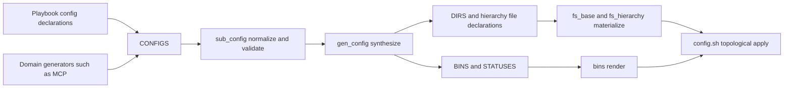

# Separate drop-in materialization from config assembly

## Revision

[`draft1.gpt56t.md`](/.design/config-mcp/draft1.gpt56t.md) made individual
`gen_config.tasks` calls repeatable, but deferred the older hierarchy `_D`
model. That leaves two competing ways to describe the same intent:

- config jobs with merge, toggle, status, and runtime commands;
- `ETC_D`, `FILES_D`, and custom `<HIERARCHY>_D` values assembled directly by
  filesystem tasks.

This revision replaces that split with two explicit concepts. `DROPINS` declares
named filesystem source sets. `CONFIGS` declares how those sets and other inputs
become outputs. Filesystem hierarchy tasks remain apply adapters: they create
drop-in directories and fragment files, but they no longer know how
configuration is assembled.

Legacy behavior does not need compatibility preservation. The few `_D`
consumers will migrate to the new interface, after which `_D` handling is
deleted.

## Current `_D` Behavior

There are three overlapping implementations:

- [`fs_hierarchy.tasks`](/tasks/compfuzor/fs_hierarchy.tasks) reads
  `<HIERARCHY>_D`, mixes those values into directory creation, and runs Ansible
  `assemble`.
- [`fs_d.tasks`](/tasks/compfuzor/fs_d.tasks) creates the same `.d` directories,
  preserves an existing output as `.orig`, and assembles again.
- [`fs_base_d.tasks`](/tasks/compfuzor/fs_base_d.tasks) separately assembles
  `FILES_D`.

The main include pipeline invokes hierarchy materialization and then a second
`fs_d` fanout. The implementation itself calls this duplicated work.

The declarations also carry less information than their implementation needs.
An `_D` entry says only “assemble `<output>.d` into `<output>`.” It cannot state:

- merge strategy;
- active extension;
- disabled state;
- ordered source layers;
- dependency ordering;
- status behavior;
- whether or how operators rebuild it later.

## Existing Consumers

The small consumer set reveals the actual requirements:

| Consumer | Declaration | Required shape |
|---|---|---|
| Dovecot | `ETC_D` | one concatenated config |
| Prometheus | `ETC_D` | nested three-job assembly graph |
| Locales | `FILES_D` | one external output assembled from a drop-in directory |
| Screen | `FILES_D` | one user config assembled from a drop-in directory |
| Clickpad | `XINITRC_D` | one custom-hierarchy user config |

Prometheus is decisive. It assembles `rules.d -> rules` and
`scrapes.d -> scrapes`, then includes both generated results while assembling
`prometheus.yml.d -> prometheus.yml`. Drop-in assembly is therefore a graph,
not a filesystem field.

## Broad Comparison

### Config owns one bespoke declaration

The first approach puts fragment directories, files, processors, outputs, and
dependencies under `CONFIGS`.

**Strengths:** one validated graph, straightforward generation, and no ambiguous
ownership of assembly behavior.

**Weaknesses:** config duplicates the hierarchy file interface and becomes a
large bespoke declaration language. A subsystem that merely contributes
drop-ins must know the host config instance that will eventually consume them.

### Hierarchy `_D` grows into the control model

The second approach enriches `ETC_D` and other `<HIERARCHY>_D` records with
processors, outputs, dependencies, and toggle behavior.

**Strengths:** drop-in declarations stay beside ordinary hierarchy files and
work uniformly across `ETC`, user paths, and custom hierarchy roots.

**Weaknesses:** filesystem tasks must understand config processors, DAGs,
runtime rebuilds, status, and CLI semantics. Assembly intent leaks into every
hierarchy adapter, making `_D` a second config subsystem under a filesystem
name.

### Favored: named drop-ins plus config assemblies

Keep the useful `_D` instinct, but make it explicit and composable:

- `DROPINS` is filesystem intent: named directories, active-file selection,
  suffix state, and fragment file declarations.
- `CONFIGS` is assembly intent: processors, ordered inputs, outputs, artifact
  references, and apply ordering.

This is the favored seam. It preserves locality for subsystem-produced
fragments without making filesystem code understand configuration. MCP can
publish an `opencode-mcp` drop-in set; OpenCode can combine it with an
`opencode-core` set; Prometheus can route three sets into different intermediate
and final outputs.

## Module Seam

### Config owns intent

The config module owns:

- assembly inputs and source ordering;
- merge strategy;
- output path;
- dependency validation and ordering;
- suffix-based enable/disable transitions;
- generated merge, toggle, and status commands;
- automatic apply ordering.

Its external interface is `CONFIGS`, which references named `DROPINS` records.
Domain generators contribute either concept as appropriate; callers do not
invoke `gen_config.tasks` recursively.

### Filesystem owns effects

Filesystem and hierarchy tasks own:

- normalizing and materializing named `DROPINS` records;
- creating source and output-parent directories;
- rendering authored fragment files;
- ownership and modes;
- links between hierarchy roots and package directories.

They do not receive merge strategies or dependency graphs. Config consumes the
normalized drop-in paths that filesystem synthesis publishes.

### Generated bins own assembly

Generated config bins read the materialized fragments and write outputs. A
generated orchestrator runs jobs in dependency order after filesystem and bin
materialization.

This creates a deep config module: deleting it would force graph validation,
toggle policy, assembly strategy, CLI generation, and status behavior back into
every caller. `fs_hierarchy` remains a smaller generic apply adapter rather
than becoming config-aware.

## Canonical Interface

`DROPINS` and `CONFIGS` are separate mappings connected by stable references:

```yaml
DROPINS:
  opencode-core:
    root: "{{ ETC }}"
    path: etc_d
    include: "*.json"
    disabled_suffix: .disabled
    files:
      - name: keybind-tabs.json
        json:
          keybinds:
            session_tab_previous: ctrl+h
            session_tab_next: ctrl+l

  opencode-mcp:
    root: "{{ ETC }}"
    path: mcp
    include: "*.json"
    disabled_suffix: .disabled

CONFIGS:
  opencode:
    root: "{{ ETC }}"
    assemblies:
      main:
        output: opencode.json
        processor: json-deep-merge
        inputs:
          - file: base.json
          - dropins: opencode-core
          - dropins: opencode-mcp
```

Mapping keys are stable identities, not filenames. A drop-in producer need not
know which config instance will consume it.

### Drop-in fields

| Field | Required | Meaning |
|---|---|---|
| `root` | yes | Base path for a relative drop-in path |
| `path` | yes | Directory relative to `root` unless absolute |
| `include` | yes | Active filename glob, such as `*.json` or `*.conf` |
| `disabled_suffix` | no | Fixed inactive suffix; `.disabled` for operator-managed sets |
| `files` | no | Hierarchy file declarations placed under this set's path |

`files` reuses the existing hierarchy file record shapes (`content`, `json`,
`yaml`, `src`, ownership, and mode). Drop-in synthesis derives ordinary
filesystem artifacts from them. A caller should not have to repeat the drop-in
path in both `DROPINS` and `ETC_FILES`.

### Config-instance fields

| Field | Required | Meaning |
|---|---|---|
| `root` | yes | Base path for relative file and output paths |
| `assemblies` | yes | Named output nodes forming the instance DAG |
| `apply` | no | Whether the package orchestrator applies this instance automatically; default true |

### Assembly fields

| Field | Required | Meaning |
|---|---|---|
| `output` | yes | Output path relative to `root` unless absolute |
| `processor` | yes | Finite processor name such as `concat`, `json-deep-merge`, or `block-in-file` |
| `inputs` | yes | Ordered typed inputs: `file`, `dropins`, or `artifact` |
| `validate` | no | Candidate validation command before atomic replacement |

An `artifact` input names another assembly in the same config instance and
creates a DAG edge. Inputs are never inferred from path coincidence. Duplicate
outputs, unknown references, and cycles are compile errors.

The interface deliberately separates drop-in identity, config identity,
assembly identity, and paths. Reusing `CONFIG_KEY` for all of them was
convenient for one simple job but cannot represent layered OpenCode inputs,
external outputs, or nested Prometheus assembly without caller conventions.

## Disabled State And Common CLI

Mutable fragment sets use the fixed state transition from draft 1:

```text
fragment.<ext> <-> fragment.<ext>.disabled
```

Processors consume only the fragment set's active `include` glob. Config emits
common commands for each instance that has at least one mutable fragment set:

```text
disable-<instance>.sh
enable-<instance>.sh
```

The commands:

- search only mutable fragment sets;
- accept `[<fragment-set>:]<pattern>` selectors;
- allow the set selector to be omitted only when the match is unambiguous;
- accept explicit paths and filename/stem patterns;
- preflight collisions before changing any file;
- rename all matches;
- invoke the package config orchestrator once.

Calling the instance orchestrator rather than only one assembly is intentional.
A fragment toggle can affect downstream assemblies, as in Prometheus;
rebuilding the small instance graph is simpler and safer than exposing reverse
dependency semantics through the CLI.

## Config Graph And Runtime Artifacts

For each assembly, config emits an internal leaf processor. For each instance,
it emits public apply, toggle, and status commands:

```text
config-<instance>.sh
disable-<instance>.sh
enable-<instance>.sh
status-config-<instance>.sh
```

It also emits one package orchestrator:

```text
config.sh
```

`config-<instance>.sh` invokes that instance's assemblies in stable topological
order. `config.sh` invokes all `apply: true` instances in declaration order.
It is marked for automatic execution after hierarchy files and bins have been
materialized, replacing Ansible's direct `_D` assembly pass.

The graph contract is:

- instance, fragment-set, and assembly IDs are unique within their maps;
- output paths are unique;
- artifact inputs reference existing assemblies;
- cycles fail during config normalization;
- declaration order breaks ties between otherwise independent assemblies;
- generated artifacts are passed by typed reference, not directory discovery;
- toggle commands manage fragment sets only, never generated artifacts.

The last rule prevents an operator from disabling a generated Prometheus child
output that will simply be recreated by its dependency job.

## Prometheus Example

Prometheus becomes one config instance with an explicit internal graph rather
than relying on `_D` list order:

```yaml
CONFIGS:
  prometheus:
    root: "{{ ETC }}"
    fragment_sets:
      global:
        path: prometheus.yml.d/global.d
        include: "*.yaml"
        disabled_suffix: .disabled
      rules:
        path: prometheus.yml.d/rules.d
        include: "*.yaml"
        disabled_suffix: .disabled
      scrapes:
        path: prometheus.yml.d/scrapes.d
        include: "*.yaml"
        disabled_suffix: .disabled
    assemblies:
      rules:
        output: generated/rules.yaml
        processor: concat
        inputs:
          - fragments: rules
      scrapes:
        output: generated/scrapes.yaml
        processor: concat
        inputs:
          - fragments: scrapes
      main:
        output: prometheus.yml
        processor: concat
        inputs:
          - fragments: global
          - artifact: rules
          - artifact: scrapes
```

Authored fragments gain explicit `.yaml` extensions. Dynamically generated
scrape fragments become `files` under the `scrapes` fragment set before the
generic filesystem/apply pipeline. Intermediate artifacts live outside mutable
fragment directories and enter `main` through typed references.

## MCP And OpenCode

MCP no longer needs to own a complete config instance when its fragments are one
fragment set of a client application's output. An MCP client contributes the
`mcp` fragment set and input reference to its host config instance; OpenCode
contributes `base.json`, the `core` fragment set (`etc_d`), and the main
assembly.

This resolves the earlier two-writers problem:

```text
base.json + etc_d/*.json + mcp/*.json -> opencode.json
```

MCP remains responsible for converting server package metadata into client
fragments through `mcp-install.ts`. Config owns merge, toggle, status, and
rebuild behavior.

Other MCP clients can declare their own host config instance with the processor,
input order, and wrapper appropriate to that client. A future config-like
subsystem can contribute another fragment set, assembly, or instance without
recursively invoking `gen_config.tasks`.

## Synthesis And Apply Flow



The current include ordering already places domain generators before the
central `gen_config.tasks` import. The MCP generator should contribute a config
record/source and stop importing `gen_config.tasks` itself. All config intent is
then synthesized once.

## `_D` Retirement

Migrate every real assembly declaration:

| Current consumer | Migration |
|---|---|
| Dovecot `ETC_D` | one `concat` job; move authored output content into its source directory |
| Prometheus `ETC_D` | three jobs with explicit dependencies |
| Locales `FILES_D` | one job rooted at `/etc/locale.gen.d` with absolute `/etc/locale.gen` output |
| Screen `FILES_D` | one user-rooted job from `~/.screenrc.d` to `~/.screenrc` |
| Clickpad `XINITRC_D` | one user-rooted job; remove custom hierarchy assembly includes |

`WWW_LINKS_D` is a path variable, not an assembly declaration, and is outside
this migration.

After migration:

- remove `d` lookup and `assemble` from `fs_hierarchy.tasks`;
- remove the `fs_d` fanout from `tasks/compfuzor.includes`;
- delete `fs_d.tasks`;
- delete `fs_base_d.tasks`;
- remove `_D` from hierarchy matching and documentation.

## Implementation Wave

### 1. Specify and normalize `CONFIGS`

Add `sub_config.tasks` to validate and normalize paths, sources, unique IDs,
outputs, and dependencies into `SUBSYSTEM.config.spec`. Unit-test graph errors
and stable topological ordering through this interface.

### 2. Synthesize filesystem and bin artifacts once

Rework `gen_config.tasks` into one pass over the normalized config spec. Emit
source directories, merger/toggle/status leaves, and the ordered `config.sh`
orchestrator. Resolve all per-job values before downstream rendering.

### 3. Implement common merge and suffix-toggle adapters

Adapt `concat`, `json-merge`, and existing block merge behavior to ordered
sources. Standardize active/disabled suffix handling and common toggle CLI
semantics.

### 4. Integrate automatic apply

Run the generated `config.sh` only after fragment files and bins exist. Test the
full compile -> filesystem materialization -> config apply lifecycle in a
temporary root.

### 5. Migrate MCP and OpenCode

Make MCP contribute its source layer and installer only. Define OpenCode's
single job from `base.json`, `etc_d`, and `mcp`; remove `mcp-disabled` and
MCP-specific toggle logic.

### 6. Migrate all `_D` consumers

Move Dovecot, Prometheus, Locales, Screen, and Clickpad to `CONFIGS`. Add the
nested Prometheus graph as the primary dependency-order integration test.

### 7. Delete `_D` assembly paths

Remove the three legacy assembly implementations and their fanout. Run syntax
checks for all migrated playbooks and focused config/filesystem integration
tests.

## Acceptance Criteria

- `CONFIGS` is the only public declaration for drop-in assembly.
- Filesystem tasks contain no merge strategy, dependency, toggle, or status
  behavior.
- Config emits ordinary filesystem artifacts consumed by existing materializers.
- Config jobs support ordered file and directory source layers.
- Suffix toggles are common across all mutable directory sources.
- Nested config jobs run in validated topological order.
- MCP and `etc_d` contribute to one OpenCode output without competing writers.
- Two unrelated config jobs retain independent paths, strategies, outputs, and
  status reporters.
- Dovecot, Prometheus, Locales, Screen, and Clickpad no longer use `_D`.
- `fs_d.tasks`, `fs_base_d.tasks`, and `_D` handling in `fs_hierarchy.tasks`
  are deleted.
- Tests exercise the config module through `CONFIGS`, not through its internal
  merge helpers.

## Risks And Decisions

- `CONFIGS` is a deliberate break from ambient `CONFIG_KEY` globals and repeated
  imports. The smaller interface and single synthesis pass justify the break.
- Automatic config apply changes generated bins from optional tooling into part
  of the filesystem apply lifecycle. Only the orchestrator is auto-run; leaf
  bins remain operator tools.
- Nested outputs inside mutable source directories require generated-output
  exclusion from toggle matching.
- Dynamic fragments added after the main include are outside automatic apply;
  migrate them into compile-time artifacts rather than adding hidden reruns.
- Absolute and `~` paths must be normalized consistently with hierarchy path
  rules before graph validation.

## Cross-References

- [`draft1.gpt56t.md`](/.design/config-mcp/draft1.gpt56t.md) introduced
  suffix-based toggles and per-instance records; this revision retains those
  ideas but replaces repeated imports with one `CONFIGS` graph.
- [`doc/arch.md`](/doc/arch.md#hierarchy-and-fanout-interaction) defines
  hierarchy as the bridge from synthesized intent to apply-time
  materialization. This proposal keeps that role and moves assembly intent into
  config synthesis.
- [`doc/subsys.md`](/doc/subsys.md#the-gen_tasks-pattern) describes shared
  artifact synthesis through `gen_*`; config follows that pattern by emitting
  filesystem, bin, and status contributions once.
- [`doc/intent-prefix-system.md`](/doc/intent-prefix-system.md#config) proposes
  a parameterized config seam. `CONFIGS` is the concrete deep interface for that
  seam.
- [`library/README.md`](/library/README.md#templates--rendering) explains why
  normalized paths and job values must be resolved before generated records
  leave config's task scope.
