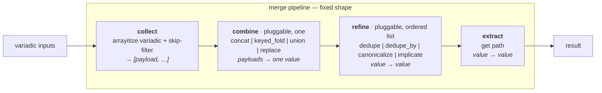

# merge-star — a fixed-step, pluggable merge pipeline

> **For reviewers:** this is `draft0`. The maps in §3–§5 are the load-bearing
> part and are explicitly up for critique — naming, slot boundaries, and which
> vocabulary item belongs in `combine` vs `refine` are all debatable. §6 is the
> staging we want all of, not a menu. Push back on any of it.

## 1. Situation — how we got here

This work grew out of the **bin helpers** decomposition
([`/.design/bin-helpers/init.glm52.md`](/.design/bin-helpers/init.glm52.md)).
To let each generated bin pull in only the template sections it needs (`env`,
`setopts`, `loud`, `report`, `guard`), we wrote a resolver (`resolve_helpers`)
that merges three layers — a global default, a subsystem contribution
(`base_helpers`), and an author add-on (`helpers`) — with implications
(`bypass → report+guard`, `report → loud`) and canonical reordering against a
registry.

Implementing that resolver forced three realizations:

1. **The layered union was already a merge primitive.** `resolve_helpers`'s
   hand-rolled dedupe + list-normalizer duplicated
   [`_dedupe_preserve`](/library/filter_plugins/merge.py) and
   [`_as_list`](/library/filter_plugins/merge.py). We refactored it to delegate
   to [`merge_list(strategy="append_unique")`](/library/filter_plugins/merge.py),
   and added a `skip=` kwarg (mirroring `merge_dict`) so a `False` layer
   suppresses itself.

2. **`arrayitize` is redundant.** 50 call sites, all single-input pipe form
   (`X | arrayitize`) — exactly `_as_list`. Its multi-arg variadic form has zero
   callers. We extracted [`_collect_payloads`](/library/filter_plugins/merge.py)
   as the shared collection step and made `merge_list` variadic — that *is* the
   arrayitize capability, now a named pre-pass shared by `merge_list` and
   `merge_dict`.

3. **`resolve_helpers` still hardcodes helpers-specific policy.** The
   `bypass → [report,guard]` field-trigger, the `report → loud` dep edge, and
   the canonical-reorder-to-`HELPERS` live as branches inside the resolver. A
   *general* helper combinator has no business knowing a behavior field's name.

This doc proposes the architecture those realizations point at: **one
fixed-shape pipeline with pluggable stages**, of which `resolve_helpers` is
merely one preset. The merge family collapses onto it; `merge_with_strategy`
composes on top of it; the duplication between `merge.py` and
`merge_strategy.py` dissolves.

## 2. The problem with the merge code today

Two modules, partly overlapping, each with a strategy switch:

### Duplication map

| thing | merge.py | merge_strategy.py | notes |
|---|---|---|---|
| `_merge_keyed` | [`merge.py:259`](/library/filter_plugins/merge.py) | [`merge_strategy.py:16`](/library/filter_plugins/merge_strategy.py) | defined **twice**, byte-near-identical |
| `append_unique_by` logic | [`_append_unique_by`](/library/filter_plugins/merge.py) | inline in `_apply_strategy_operation` | two implementations |
| `bins_generated` profile | concats `[early, generated, run_all]` | concats `[generated]` | **disagree** — latent bug |
| `_as_list`, `_dedupe_preserve` | defined | imported (good) | not duplicated |
| profile registries | `LIST/DICT_STRATEGY_PROFILES` | `STRATEGY_PROFILES` | two registries, overlapping names |

### Structural smells

- **Strategy = string-switch.** `_merge_list_values` / `_merge_dict_values` /
  `merge_with_strategy` each dispatch on a strategy string or `{op:…}` dict.
  The relationship between strategies is implicit (e.g. that `append_unique` is
  `append` + a dedupe is not visible anywhere).
- **`resolve_helpers` is special.** It reaches outside the merge primitive
  (knows `bypass`), and carries two helpers-specific transforms
  (`canonicalize`, `implicate`) as hardcoded branches rather than reusable
  steps.
- **`arrayitize` is a third list-normalizer** alongside `_as_list` and the
  `_arrayitize` copy in [`bin_composers.py`](/library/filter_plugins/bin_composers.py).
- **Combine vs refine is not separated.** `append_unique_by` is filed as a
  combine "op" but is really `concat + dedupe_by-key` — the dedupe is a
  post-combine transform, not a different way to combine.

## 3. Direction: fixed-step pluggable pipeline (not free-form passes)

The thesis: **constrain the design to a fixed pipeline shape with a bounded,
registered vocabulary at each pluggable stage.** Strategies become *presets*
over the shape — `(combine, refine[])` configurations — looked up by name.

We explicitly reject the "bag of composable passes, assemble your own chain"
alternative. Free-form pass-chains give infinite orderings, no shared shape,
and strategies stop being a meaningful concept. The fixed shape is the
discipline: every merge is `(skip, combine, refine[], get)`, no more, no less.



Why this shape wins:

- **Bounded design space.** A new use case asks two closed-vocabulary questions
  ("which combine?", "which refines?"), not "invent a pass-chain."
- **Strategies stay first-class.** `append_unique` is a named preset =
  `(concat, [dedupe])`. The switch becomes a lookup table that is *visibly*
  combine+refine.
- **`resolve_helpers` stops being special.** Its "specialness" was always just
  "concat plus some refines." Once `canonicalize`/`implicate` are registered
  refines, the resolver is a preset call — and PKGS-ordering, ENV-deps, future
  layered fields become presets too, same four stages.
- **The duplication dissolves.** One pipeline, one `_merge_keyed`, one
  `bins_generated` profile; `merge_with_strategy` becomes "run a preset per
  field."

## 4. The pipeline map (the core that stands alone)

This is the primitive, independent of helpers. Helpers is one (good) use case;
PKGS, ENV, future layered fields are others.

### Stage 1 — `collect` (mechanism fixed, skip policy pluggable)

| | |
|---|---|
| **role** | gather variadic inputs into a flat payload list; spread list/tuple/set sources, wrap scalars/dicts; drop skippable payloads/elements |
| **contract** | `(*inputs, single, skip) → [payload, …]` |
| **mechanism** | fixed — [`_collect_payloads`](/library/filter_plugins/merge.py) (done) |
| **pluggable: skip policy** | a set drawn from `{none, undefined, false, empty}` (default `{none, undefined}`); `False`-as-layer-suppress is `skip={…, false}` |
| **status** | ✅ done |

### Stage 2 — `combine` (fully pluggable, exactly one chosen)

| | |
|---|---|
| **role** | fold the payload list into a single combined value — *the strategy core* |
| **contract** | `(payloads, args…) → value` |
| **pluggable** | one of the registered combines below; selected by payload type + strategy preset |

**List combines** (payloads are lists):

| combine | description | today |
|---|---|---|
| `concat` | append payloads end-to-end | 🟡 inline in `_merge_list_values` |
| `keyed_fold` | merge dict records by a key field; on overlap, concat the fields named in `concat_fields`, incoming wins the rest | 🟡 `_merge_keyed` (duplicated) |

**Dict combines** (payloads are dicts):

| combine | description | today |
|---|---|---|
| `union` | left-to-right dict union, later wins | 🟡 inline in `_merge_dict_values` |
| `replace` | last non-None payload wins wholesale | 🟡 merge_strategy-only |

### Stage 3 — `refine` (pluggable, ordered list, empty by default)

| | |
|---|---|
| **role** | post-combine transforms applied to the single combined value, in order |
| **contract** | each: `(value, args…) → value`; the slot runs an ordered list of them |
| **pluggable** | ordered list drawn from the closed vocabulary below |

| refine | description | today |
|---|---|---|
| `dedupe` | stable first-seen dedupe of a list | 🟡 `_dedupe_preserve` exists, not registered as a refine |
| `dedupe_by` | dedupe a list by a key field, **last wins** | 🟡 mis-filed as the `append_unique_by` combine-op |
| `canonicalize` | reorder a list against a registry (drop unknowns) | ❌ hardcoded in `resolve_helpers` |
| `implicate` | pull in dependencies from a graph (`x → [deps]`) until stable | ❌ hardcoded in `resolve_helpers` |

### Stage 4 — `extract` (mechanism fixed)

| | |
|---|---|
| **role** | dotted-path `get` from the result |
| **contract** | `(value, path) → value` |
| **mechanism** | fixed — [`get_path`](/library/filter_plugins/get.py) (done) |
| **status** | ✅ done |

### Open critiques on the map

- **Is `skip` its own stage or part of `collect`?** Draft folds it into
  `collect` (it filters *during* gather). It could be promoted to a fixed stage
  (`collect → filter → combine → …`) if we want the skip policy to feel
  first-class. Lean: keep folded.
- **Is `dedupe_by` a refine or a combine variant?** Draft says refine
  (`concat + dedupe_by`). The current code files `append_unique_by` as a
  combine-op. Resolve in stage D.
- **Is `keyed_fold` a combine or `concat + refine:merge_keyed`?** Draft says
  combine — merging records field-by-field with `concat_fields` is a genuine
  fold, not a post-process on a concatenated list. Open.
- **One pipeline (type-aware) vs two (list/dict) sharing shape?** The combine
  vocabulary splits by type. Draft keeps `merge_list` and `merge_dict` as the
  two entry points (sharing collect/refine/extract, differing combine
  vocabulary) rather than one polymorphic entry. Open.
- **Where does `tool_versions_overlay`'s `dictify` step live?** It's a pre-step
  on each payload before `union`. Could be a combine-arg, a per-payload map in
  collect, or its own combine (`dictify_union`). Open.

## 5. Strategy map — every existing strategy as a preset

`combine` picks one; `refine` is an ordered list (possibly empty). "Status" is
the current implementation state.

### List strategies

| preset name | combine | refine | description | status |
|---|---|---|---|---|
| `append` | `concat` | `[]` | payloads end-to-end, dupes kept | 🟡 inline |
| `append_unique` | `concat` | `[dedupe]` | end-to-end, first-seen-wins dedupe | 🟡 inline + `_dedupe_preserve` |
| `append_unique_by` (`{op, key}`) | `concat` | `[dedupe_by(key)]` | end-to-end, last-per-key wins | 🟡 mis-filed as combine-op |
| `merge_keyed` (`{op, key, concat_fields}`) | `keyed_fold` | `[]` | records by key, concat overlapped fields | 🟡 `_merge_keyed` (duplicated) |
| **helpers** (new) | `concat` | `[dedupe, implicate(DEPS), canonicalize(HELPERS)]` | layered helper resolution | 🟡 partial — `resolve_helpers` |

### Dict strategies

| preset name | combine | refine | description | status |
|---|---|---|---|---|
| `overlay` / `dict_overlay` | `union` | `[]` | later payload wins each key | 🟡 inline |
| `tool_versions_overlay` | `union` (with `dictify` pre) | `[]` | parse `.tool-versions`/`mise.toml` shape, then union | 🟡 inline |
| `replace` | `replace` | `[]` | last non-None payload wholesale | 🟡 merge_strategy-only |

### Named profiles (preset bundles)

| profile | what it bundles | status |
|---|---|---|
| `bins_generated` | BINS = `merge_keyed` by name | 🟡 **defined twice, disagree** (`[early,generated,run_all]` vs `[generated]`) |
| `subsystem_contrib` | per-field: ETC_FILES/BINS append, ENV dict_overlay, ENV_LIST/PKGS append_unique | 🟡 merge_strategy-only |
| `subsystem_artifacts` | per-field: ETC_FILES/LINKS append | 🟡 merge_strategy-only |
| `env_overlay` / `tool_versions_overlay` | dict profile aliases | 🟡 merge.py-only |

## 6. Helpers as the example use case

`resolve_helpers` becomes a preset invocation, not a special function. Its
helpers-specific data is just *arguments* to general refines:

```
combine = concat
refine  = [
    dedupe,
    implicate(graph={"report": ["loud"]}),     # report funcs read _cf_loud
    canonicalize(registry=("env","setopts","loud","report","guard")),
]
skip    = "false,none,undefined"               # base_helpers: False suppresses its layer
```

The `bypass → [report, guard]` field-trigger **moves out of the resolver
entirely**. It lives in [`files/_bin`](/files/_bin), next to the bypass block
that consumes those primitives — the bypass *mechanism* contributes its own
helper layer when active, exactly like a subsystem contributes `base_helpers`.
The resolver no longer knows any field name; it only knows layers + the preset.

This is the pattern for every future consumer: declare layers, pick a preset
(or pass combine+refine explicitly), done.

## 7. Staged plan

All stages are intended. The order is load-bearing (each unblocks the next);
within a stage, steps can reshuffle.

### Stage D — the pipeline core

Stand up the fixed shape and register the vocabularies. `merge_list`/`merge_dict`
keep their public signatures (back-compatible) but dispatch through the pipeline
internally.

1. Register **combine** impls as named functions: `concat`, `keyed_fold` (one
   `_merge_keyed`, delete the duplicate), `union`, `replace`.
2. Register **refine** impls as named functions: `dedupe`, `dedupe_by` (moved
   out of the `append_unique_by` combine-op), `canonicalize`, `implicate`
   (moved out of `resolve_helpers`, each taking a registry / deps-graph arg).
3. **Preset table**: `{append: (concat,[]), append_unique: (concat,[dedupe]),
   append_unique_by: (concat,[dedupe_by]), merge_keyed: (keyed_fold,[]),
   overlay: (union,[]), replace: (replace,[])}`. The strategy-string switch
   becomes a preset lookup.
4. Recast `resolve_helpers` → preset call (`combine=concat, refine=[dedupe,
   implicate(DEPS), canonicalize(HELPERS)]`); move the `bypass → [report,guard]`
   contribution into `files/_bin`.
5. Tests stay green (behavioral equivalence); add tests for each combine/refine
   impl in isolation.

**Exit criteria:** no strategy switch remains; `resolve_helpers` carries no
field-name knowledge; one `_merge_keyed`.

### Stage E — `merge_with_strategy` on top of the pipeline

Reimplement [`merge_with_strategy`](/library/filter_plugins/merge_strategy.py)
as *per-field preset dispatch* over the new pipeline. This kills the
module-level duplication.

1. Delete `merge_strategy._merge_keyed` and its inline `append_unique_by` — use
   the registered combines/refines.
2. `merge_with_strategy` = "for each field in the strategy-map, run that field's
   preset through the pipeline." Nested strategy maps recurse.
3. **Resolve the `bins_generated` disagreement** — pick one `concat_fields`
   (likely `[early, generated, run_all]`, the superset, verifying no caller
   relied on the narrower merge_strategy behavior) and define it once.
4. Unify the profile registries into one place (see stage G).

**Exit criteria:** one merge module surface; `merge_with_strategy` composes on
the pipeline; no duplicated op logic; one `bins_generated`.

### Stage F — `arrayitize` retirement

Now that `collect` *is* the arrayitize capability:

1. Migrate the 50 `X | arrayitize` call sites. Most become
   `X | merge_list(single=True)`; a few want a thin `as_list` alias for
   readability (open: keep `as_list` as the documented single-input normalizer,
   retire `arrayitize`).
2. Delete the `_arrayitize` copy in [`bin_composers.py`](/library/filter_plugins/bin_composers.py).
3. Decide `arrayitize.py`'s fate: thin compat shim over `_collect_payloads`, or
   removal.

**Exit criteria:** one list-normalizer in the codebase.

### Stage G — profile registry consolidation

1. One profile registry (not two): `{bins_generated, subsystem_contrib,
   subsystem_artifacts, env_overlay, tool_versions_overlay}`.
2. Profiles are preset bundles referencing the pipeline vocabularies — a profile
   is just a `{field: preset}` map.
3. Cross-module: `merge_list('bins_generated')` and
   `merge_with_strategy(records, 'bins_generated')` resolve to the *same*
   definition.

**Exit criteria:** single source of truth for every named strategy/profile.

### Stage H — `subsys_publish` / `merge_*_subsys` alignment (optional)

[`subsys_publish`](/library/filter_plugins/merge.py) and the
[`merge_list_subsys`](/library/filter_plugins/merge.py)/[`merge_dict_subsys`](/library/filter_plugins/merge.py)
family are the subsystem-readers built on merge. Once the pipeline is clean,
verify they ride it naturally; tighten their shared "read SUBSYSTEM through a
raw-copy boundary" pre-pass into one helper if it isn't already.

## 8. Cleanup / optimization notes (collected, not all staged)

- **`_positional_strategy` back-compat shim** — needed because callers pass
  strategy as the 2nd positional (`X | merge_list('append_unique')`). Once
  callers migrate to keyword `strategy=`, the shim can retire and the
  string-payload ambiguity goes with it. Track separately.
- **`_raw_copy_template_data` boundaries** — every merge entry wraps inputs in
  raw-copy. Worth verifying the pipeline stages don't re-copy redundantly once
  composed.
- **`_collect_payloads` element-level skip** — currently filters elements while
  spreading. Confirm this is the right granularity vs a separate filter pass.
- **Validation** — `_validate_list_strategy` / `_validate_dict_strategy` /
   merge_strategy's `_validate_strategies` should collapse into one preset
   validator once the vocabulary is registered.

## 9. Explicitly open for critique

- **Slot names** (`collect/combine/refine/extract`) and the split between
  `combine` (one) vs `refine` (list). Alternative: `gather → fold → shape →
  pick`. Alternative: fold `refine` into `combine` as "a combine is a list of
  ops" (rejected here — loses the "one core op + optional polish" clarity).
- **`dedupe_by` residence** (refine vs combine).
- **`keyed_fold` residence** (combine vs concat+refine).
- **One vs two entry points** (`merge_list`/`merge_dict` vs one type-aware
  `merge`).
- **`tool_versions_overlay`'s dictify step** — where it belongs.
- **Profile registry location and shape.**
- **Whether `skip` deserves to be its own stage.**

## 10. References

- [`/library/filter_plugins/merge.py`](/library/filter_plugins/merge.py) —
  `merge_list`, `merge_dict`, `merge_*_subsys`, `subsys_publish`,
  `_collect_payloads`, `_merge_list_values`, `_merge_dict_values`,
  `_merge_keyed`, `_append_unique_by`, `_dedupe_preserve`.
- [`/library/filter_plugins/merge_strategy.py`](/library/filter_plugins/merge_strategy.py) —
  `merge_with_strategy` (per-field multi-strategy), duplicate `_merge_keyed`.
- [`/library/filter_plugins/helpers.py`](/library/filter_plugins/helpers.py) —
  `resolve_helpers`, `HELPERS`, `HELPERS_DESCRIPTIONS`.
- [`/library/filter_plugins/arrayitize.py`](/library/filter_plugins/arrayitize.py) —
  the redundant normalizer (50 sites).
- [`/library/filter_plugins/bin_composers.py`](/library/filter_plugins/bin_composers.py) —
  local `_arrayitize` copy.
- [`/.design/bin-helpers/init.glm52.md`](/.design/bin-helpers/init.glm52.md) —
  prior wave; the helpers decomposition that surfaced this architecture.
- [`/files/_bin`](/files/_bin) — the bypass-block home; where the
  `bypass → [report,guard]` contribution moves in stage D.
