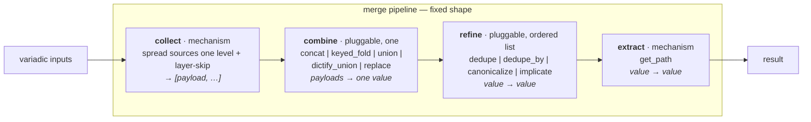

# merge-star draft1 — a fixed-step, pluggable merge pipeline (consistency-first)

> **For reviewers:** my (ds4f) full revision of
> [`draft0`](/.design/merge-star/draft0.md). It integrates the three
> review0s and syn0, and applies one new governing principle (§1) that the
> user set explicitly after reviewing the synthesis: **explicitness and
> consistency over backwards compatibility** — do the migration work, don't
> keep shims. My own commentary on the design is §13. Read that last.

## 1. Guiding principles

P1. **Fixed shape over free-form.** Every merge is
`(skip, collect, combine, refine[], extract)`. Strategies are presets
looked up by name. No pass-chains.

P2. **Explicitness and consistency over backwards compatibility.** No
back-compat shims, no aliases, no dual call-forms. Where a call form is
ambiguous, **migrate the call sites and remove the shim.** This is the
governing principle of draft1, set by the user (it reverses syn0's
"bless `_positional_strategy`" recommendation). Concretely: every string
that names a strategy must arrive through a `strategy=` keyword, every
alias has one canonical name, every normalizer has one home.

P3. **Bounded vocabulary.** New use cases ask "which combine / which
refines?" from a closed set — never "invent a pass-chain."

P4. **Presets are the only name.** No strategy name is interpreted
outside the preset tables.

P5. **Type is *folds-over*, not entry point.** Combines group by what
they fold over (list-scalar / list-record / dict / any). draft0's
list-vs-dict combine split was decorative: `keyed_fold` is list-of-dicts
and `replace` is any-type.

P6. **`False` is an explicit signal, distinct from absence.** Skip has
three operation classes; only two are skip. `false` is `v is False` —
strict identity, never falsy (§4).

P7. **Contracts before extraction.** Current behavior is pinned by a
characterization suite (Stage 0) before anything is refactored (§11).

## 2. Situation — how we got here

The merge family is more spread out than draft0's "two modules" framing:

- [`merge.py`](/library/filter_plugins/merge.py) — `merge_list` /
  `merge_dict` (string-switch strategies), `merge_*_subsys` /
  `subsys_publish` adapters, `_merge_keyed`, `_append_unique_by`,
  `_collect_payloads`, the `skip` machinery.
- [`merge_strategy.py`](/library/filter_plugins/merge_strategy.py) —
  `merge_with_strategy` (per-field dispatch), a **second** `_merge_keyed`
  (tag-dropping), its own `STRATEGY_PROFILES`, its own validator.
- [`mergeKeyed.py`](/library/filter_plugins/mergeKeyed.py) — a **third**
  `merge_keyed` surface, a public filter wrapping `merge_with_strategy`.
- [`merge_subsys.py`](/library/lookup_plugins/merge_subsys.py) — the
  **live consumer**; its `ARTIFACT_DEFAULTS` table
  ([`merge_subsys.py:111`](/library/lookup_plugins/merge_subsys.py)) is a
  third strategy registry and the one playbooks actually hit via
  `lookup('merge_subsys', id=…, contrib=…)`. **This was the missing piece
  in draft0's duplication map — my review0.ds4f catch.**
- [`helpers.py`](/library/filter_plugins/helpers.py) — `resolve_helpers`,
  the motivating use case.
- [`arrayitize.py`](/library/filter_plugins/arrayitize.py),
  [`listify.py`](/library/filter_plugins/listify.py),
  [`bin_composers._arrayitize`](/library/filter_plugins/bin_composers.py)
  — the list-shape helpers (see §10.4/§10.5 for the corrected inventory).

Three realizations drove this design (draft0 §1, confirmed by review):

1. The layered union was already a merge primitive (`resolve_helpers`
   delegates to `merge_list(strategy='append_unique', skip=…)`).
2. `arrayitize` is a redundant normalizer — but `listify` is **not** a
   normalizer duplicate (my review0.ds4f got this wrong; §10.5 corrects
   it: only `listify.concat` is redundant).
3. `resolve_helpers` still hardcodes helpers policy — a general
   combinator shouldn't know a behavior field's name.

## 3. The pipeline — fixed shape, mechanism fixed at the edges



| stage | contract | pluggable? | role |
|---|---|---|---|
| `collect` | `(*inputs, single, skip) → [payload, …]` | **mechanism fixed**; skip policy is the knob | spread sources one level into payloads; layer-skip per payload (§4) |
| `combine` | `(payloads, args…) → value` | **pluggable, exactly one** | fold payloads into one value (§5) |
| `refine` | `(value, args…) → value` | **pluggable, ordered list**, empty by default | post-combine transforms (§6) |
| `extract` | `(value, path) → value` | **mechanism fixed** — [`get_path`](/library/filter_plugins/get.py) | dotted-path get |

Shape notes:

- **`skip` stays inside `collect`.** It filters during gather; a separate
  `filter` stage would be empty for every preset except the helpers one.
- **No per-payload `map=` slot in `collect`.** Per-payload transforms
  belong to the combine (§5 `dictify_union`). This resolves draft0's
  "where does dictify live": a fold that parses-first is still a fold.
  (I argued in my review0.ds4f for `dictify_union`; the discussion and
  syn confirmed it over the `collect.map=` alternative.)
- **`_as_list` / `_as_dict` / `dictify` are combine-internal**, as today.
  They are not collect stages.

## 4. Skip semantics — three operation classes, layer-only

`skip` carries three distinct operation classes. Only two are skip; the
third is a caller-side guard. This naming resolves gpt56t's "layer vs
element" concern and my own "`helpers: False` nuclear" catch.

| class | example | predicate | meaning | where it lives |
|---|---|---|---|---|
| **absence** | `item.base_helpers` unset | `undefined` / `none` | noise; the layer wasn't provided | **skip**, default-on (`skip="none,undefined"`) |
| **suppress** | `base_helpers: False` | `false` = `v is False` | **explicit signal**: this layer contributes nothing | **skip**, opt-in (`skip="…,false"`) |
| **nuclear** | `helpers: False` (helpers.py:68) | n/a | a sentinel that **aborts the whole merge** | **NOT skip.** caller-side guard, before the pipeline runs |

Verified facts:

- **`false` is `v is False`, not falsy.** `0`, `""`, `[]`, `{}`, `None`
  are not matched ([`merge.py:113`](/library/filter_plugins/merge.py)).
  This is P6.
- **`False`-layer and `[False]`-layer are distinguishable.** Verified by
  executing `_collect_payloads`/`merge_list`: `merge_list([a, False, b],
  skip="false")` → `[a, b]`; `merge_list([a, [False], b], skip="false")`
  → `[a, [False], b]`; a `False` *inside* a list-layer survives one-level
  spread. gpt56t's claimed conflation does not occur under the current
  one-level spread. This is the finding that turned the scariest review
  item into a documentation question rather than a refactor.
- **Skip is layer-only.** Spread is exactly one level: each element of a
  spread list-source *is* a payload; a payload that is itself a list is
  admitted whole. We document this as the contract.

**Contract (for Stage 0):** skip predicates apply to each payload as it
is admitted from a source, never to elements inside a payload. Default
`{none, undefined}`; `false` and `empty` are opt-in. Nuclear is never
modeled by the pipeline.

## 5. Combines — one per merge, grouped by *folds-over*

| combine | folds-over | contract | today |
|---|---|---|---|
| `concat` | list-scalar | append payloads end-to-end (each via `_as_list`) | 🟡 inline in `_merge_list_values` |
| `keyed_fold` | list-record | merge dict records by a key field; on overlap concat `concat_fields` (**tag-preserving**), incoming wins the rest; keyed records keep first-key position, non-keyed move to last occurrence | 🟡 `_merge_keyed` **defined three times** |
| `union` | dict | left-to-right `\|`, later wins | 🟡 inline in `_merge_dict_values` |
| `dictify_union` | dict | `dictify` each payload, then `union` | 🟡 inline in the `tool_versions_overlay` branch |
| `replace` | any | last non-`None` payload wins wholesale | 🟡 merge_strategy-only |

Carried decisions:

- **`keyed_fold` is a combine**, not `concat + refine` (all three
  reviews): pairwise record merging with `concat_fields` can't be
  reproduced by a post-combine whole-value transform.
- **`replace` is `any`-type** (all three reviews): not a dict combine.
  The list/dict table split is gone.
- **`dictify_union` is a named combine** (my review0.ds4f + gpt56t):
  `tool_versions_overlay = (dictify_union, [])`. One consumer today; add
  a named combine per future parse-then-merge rather than generalizing
  prematurely.
- **One `keyed_fold`, the tag-preserving one.** `merge.py`'s uses
  `_concat_strings_preserving_tags` ([`merge.py:296`](/library/filter_plugins/merge.py));
  `merge_strategy.py`'s drops datatags ([`merge_strategy.py:46`](/library/filter_plugins/merge_strategy.py)).
  Unifying onto merge.py's is a **fix**, with an explicit
  tag-propagation test.

## 6. Refines — closed vocabulary, pinned contracts

| refine | contract | today |
|---|---|---|
| `dedupe` | stable first-seen dedupe; identity is `str(value)` (documented wart, §13) | 🟡 `_dedupe_preserve`, unregistered |
| `dedupe_by` | dedupe a list of records by key; **first-key position retained, last occurrence's value wins** | 🟡 mis-filed as the `append_unique_by` combine-op |
| `canonicalize` | reorder a list against a registry, drop unknowns | ❌ hardcoded in `resolve_helpers` |
| `implicate` | close a deps graph `x → [deps]` to fixpoint; **cycles = error; unknown node = ignored; non-mutating** | ❌ hardcoded in `resolve_helpers` |

Pinned contracts (gpt56t's contribution, adopted):

- `dedupe_by` asymmetry is deliberate: `dedupe` first-seen-wins, `dedupe_by`
  last-value-at-first-position. Both tested.
- `implicate` gets an explicit spec: transitivity, cycle → error,
  unknown → ignore, copy-not-mutate. Output must remain a valid
  `canonicalize` input.
- Per-combine identities and leniency stated in Stage 0: `concat` /
  `keyed_fold` coerce via `_as_list`; `union` / `dictify_union` via
  `_as_dict`; `replace` = latest non-`None`, not last payload.

## 7. Registries — value presets vs field profiles

Two typed registries, one module. This resolves draft0's Stage G "same
definition" problem (syn0 D1): a value preset and a field profile are
different kinds of thing and can't literally be "the same definition."

```python
VALUE_PRESETS: dict[str, Preset] = {
    #   name:                 (combine,            refine,             folds-over)
    "append":                 ("concat",           [],                 "list-scalar"),
    "append_unique":          ("concat",           ["dedupe"],         "list-scalar"),
    "append_unique_by":       ("concat",           ["dedupe_by"],      "list-record"),
    "merge_keyed":            ("keyed_fold",       [],                 "list-record"),
    "bins_generated":         ("keyed_fold",       [],                 "list-record"),
    "overlay":                ("union",            [],                 "dict"),
    "tool_versions_overlay":  ("dictify_union",    [],                 "dict"),
    "replace":                ("replace",          [],                 "any"),
    "helpers":                ("concat",           ["dedupe", "implicate", "canonicalize"], "list-scalar"),
}

FIELD_PROFILES: dict[str, dict[str, str]] = {
    #   name                → {field: VALUE_PRESET name}   (references, never re-defines)
    "bins_generated":         {"BINS": "bins_generated"},
    "subsystem_contrib":      {"ETC_FILES": "append", "BINS": "append",
                               "ENV": "overlay", "ENV_LIST": "append_unique",
                               "PKGS": "append_unique"},
    "subsystem_artifacts":    {"ETC_FILES": "append", "LINKS": "append"},
}
```

- **`bins_generated` lives once** as a value-preset with
  `concat_fields=[early, generated, run_all]` (the superset — low-risk:
  only `merge_subsys` names it live, confirmed). The field-profile
  `bins_generated` references it. The old two-definition disagreement was
  a value-preset and a field-profile wearing one name; typed registries
  dissolve it.
- **`ARTIFACT_DEFAULTS` (`merge_subsys.py:111`) is the live projection.**
  It is already a `{artifact: {kind, strategy, …}}` table dispatching
  through `merge_list`/`merge_dict`. Stage G promotes it: its `strategy`
  values reference `VALUE_PRESETS`. Playbooks must keep resolving.
- **`subsystem_contrib` / `subsystem_artifacts` are re-derived** into the
  single `FIELD_PROFILES` registry (P2 consistency) and corrected: their
  `ENV` becomes `overlay` (alias dies, §10.3), and their `BINS` no longer
  disagrees with `ARTIFACT_DEFAULTS`. My review0.ds4f found these two
  have **no internal `.tasks`/`.pb` callers** — re-derivation preserves
  their documented public surface (README/arch.md) while ending the
  second-registry drift.
- **One validator** (Stage G): the three existing validators collapse
  into one preset validator over both registries.

## 8. Preset map — every existing strategy as a preset

### List presets

| preset | combine | refine | description | status |
|---|---|---|---|---|
| `append` | `concat` | `[]` | end-to-end, dupes kept | 🟡 inline |
| `append_unique` | `concat` | `[dedupe]` | end-to-end, first-seen dedupe | 🟡 inline + `_dedupe_preserve` |
| `append_unique_by` | `concat` | `[dedupe_by(key)]` | end-to-end, last-per-key at first position | 🟡 mis-filed combine-op |
| `merge_keyed` | `keyed_fold` | `[]` | records by key, concat overlapped fields | 🟡 three copies |
| `bins_generated` | `keyed_fold` | `[]` | `key=name`, `concat_fields=[early,generated,run_all]` | 🟡 two defs, disagree |
| `helpers` | `concat` | `[dedupe, implicate(DEPS), canonicalize(HELPERS)]` | layered helper resolution (§9) | 🟡 partial — `resolve_helpers` |

### Dict / any presets

| preset | combine | refine | description | status |
|---|---|---|---|---|
| `overlay` | `union` | `[]` | later payload wins each key | 🟡 inline (was `overlay`/`dict_overlay`) |
| `tool_versions_overlay` | `dictify_union` | `[]` | `dictify` each payload, then union | 🟡 inline in merge.py |
| `replace` | `replace` | `[]` | last non-`None` payload wholesale, any type | 🟡 merge_strategy-only |

### Field profiles

| profile | bundles | status |
|---|---|---|
| `bins_generated` | `{BINS: bins_generated}` (references the value-preset) | 🟡 **was** two defs; now one |
| `subsystem_contrib` | per-field appends / `overlay` | 🟡 merge_strategy-only, re-derived |
| `subsystem_artifacts` | per-field appends | 🟡 merge_strategy-only, re-derived |
| `ARTIFACT_DEFAULTS` | the lookup's `{artifact: …}` table | 🟡 **live**; promoted in G |

## 9. Helpers as the example use case

`resolve_helpers` becomes a preset invocation over the generic pipeline;
it knows **no field names**.

```python
preset = "helpers"                     # (concat, [dedupe, implicate(DEPS), canonicalize(HELPERS)])
skip   = "false,none,undefined"        # absence + layer-suppress (P6)
```

Responsibilities land where they belong:

- **`bypass → [report, guard]` — a layer contributed by `_bin`, before
  resolution.** `files/_bin` builds a template-local `helper_layers` list
  that appends `["report", "guard"]` when the bypass block will render,
  then calls `resolve_helpers(layers, preset="helpers")`. This satisfies
  gpt56t's template-ordering constraint: helper selection precedes the
  bypass block, so `_bin` must contribute the layer up front.
- **`report → loud` — the `implicate` refine** with `DEPS={report:[loud]}`.
- **`canonicalize(HELPERS)` — reorder-to-registry.**

**Nuclear opt-out is caller-side, not skip.** `helpers: False` empties
the *entire* result, not one layer — per §4 a pre-pipeline guard. `_bin`
skips helper resolution when `item.helpers is False`. The pipeline never
models poison. (This is my review0.ds4f catch: draft0's §6 preset as
sketched silently downgraded nuclear to layer-suppress.)

`resolve_helpers` shrinks to: `guard(nuclear) → run(layers,
preset="helpers", skip=…)`. The `bypass` field name exists only in
`files/_bin`, never in the merge family.

## 10. The consistency cleanup — "do the work" (P2)

Sized against the live tree.

| # | remove | why (P2) | live call sites | migration |
|---|---|---|---|---|
| 10.1 | `_positional_strategy` shim | `X \| merge_list('append_unique')` makes a bare string payload ambiguous — exactly what P2 exists to kill | **14** `merge_list('…')` in tasks/, **0** `merge_dict('…')`, **0** op-dict positional | rewrite to `merge_list(strategy='…')`; bare string payloads already documented to be wrapped |
| 10.2 | `no_header` legacy alias | back-compat alias for `helpers: False` | **3** (`pw-surround.etc.pb:38,46`, `vars_systemd_unit.tasks:208`) | `no_header: true` → `helpers: False` |
| 10.3 | `dict_overlay` alias | `dict_overlay` ≡ `overlay`; one name only | **1** (`vars/template-strategy-vars.yaml:35`) + `subsystem_contrib.ENV` | → `overlay` |
| 10.4 | `arrayitize` + `bin_composers._arrayitize` | redundant normalizer, superseded by `as_list`/collect | **45** pipe-form sites (37 yaml) + 2 python callers | → `as_list` (new public normalizer) or `merge_list(single=True)` where a merge is wanted |
| 10.5 | `listify.concat` filter | *literally* the `concat` combine in a filter costume | **1** (`k3s.srv.pb`) | → `merge_list(…, strategy='append')` |
| 10.6 | (keep) `listify` itself | **not** a normalizer duplicate — converts dict → list of `{key,value}` (`listify.py:10-11`), a distinct shape-transform | 3 | leave; out of merge scope |

Corrections carried from the wave:

- **`listify` is not the "4th list normalizer"** my review0.ds4f (and
  syn0, which repeated it) called it. Only `listify.concat` is redundant.
- The **`as_list` normalizer has an explicit contract**: `None`/undefined
  → `[]`; list/tuple/set → `list(…)`; scalar → `[scalar]`. It does **not**
  reproduce `arrayitize`'s silent `True → []` / `False → []`
  ([`arrayitize.py:16`](/library/filter_plugins/arrayitize.py)) — under
  P6, `False` is an explicit value. Stage 0 per-site characterization
  guards sites that relied on the old dropping.

**Guiding-principle consequence:** syn0 recommended blessing
`_positional_strategy` as permanent (cheap, bang 6.0). P2 overrides:
14 sites is bounded, mechanical work, and killing the string-payload
ambiguity removes a real footgun. This is the trade the user chose.

## 11. Staged plan

Order is load-bearing. Exit criteria are **invariants**, not "no switch
remains" (registry lookup still dispatches — the invariant is *only the
preset tables interpret names*).

### Stage 0 — contracts & characterization tests (new)

Pin current behavior before refactoring. Adopt gpt56t's matrix:
normalizer (None/undefined/True/False/string/dict/tuple/set/
non-list-Sequence), skip layer-vs-`[False]`-content, `dedupe_by`
first-position/last-value, `keyed_fold` list/string concat + order + tag
propagation, refines (transitivity/cycles/unknown/copy), profiles
(list- and field-level `bins_generated`), helpers (bypass,
`helpers: False`, nuclear).

Exit: green suite captures today's behavior; every later change asserted
against it.

### Stage D — pipeline core

Register §5 combines and §6 refines as named functions; one
tag-preserving `keyed_fold` (delete two copies); confirm `collect` is
layer-skip-only (§4); `_as_list`/`_as_dict`/`dictify` stay
combine-internal.

Exit: only the preset tables interpret strategy names; one `keyed_fold`;
skip contract matches §4.

### Stage E — `merge_with_strategy` + `mergeKeyed` on the pipeline

Reimplement `merge_with_strategy` as per-field dispatch over
`VALUE_PRESETS`. Its `into`/`single`/`aggregate`/`payload_path` kwargs
are a *record*-level collect analog — keep them in the adapter, not the
pipeline. `mergeKeyed.py` becomes a one-line field-profile dispatch
(public name preserved). Resolve `bins_generated` to the superset.

Exit: one merge surface; `merge_with_strategy` composes on the pipeline;
`mergeKeyed` dispatches one preset.

### Stage F — the consistency cleanup (P2)

Execute §10: migrate 14 positional `merge_list` sites; remove the
`_positional_strategy` shim; `no_header` (3) → `helpers: False`;
`dict_overlay` (1) → `overlay`; ship `as_list`, migrate 45 `arrayitize`
sites + 2 python callers, delete `arrayitize.py` and
`bin_composers._arrayitize`; retire `listify.concat` (1 site).

Exit: zero positional strategy forms; zero `no_header`; zero
`dict_overlay`; one list normalizer; no migrated site changes behavior on
`False`/`None`/undefined.

### Stage G — registry consolidation

One module hosting `VALUE_PRESETS` + `FIELD_PROFILES`; promote
`ARTIFACT_DEFAULTS` to the live projection; re-derive
`subsystem_contrib`/`subsystem_artifacts`; collapse three validators into
one preset validator.

Exit: single source of truth per name across `merge_list`, `merge_dict`,
`merge_with_strategy`, `mergeKeyed`, and the `merge_subsys` lookup.

### Stage H — helpers end-to-end + subsys alignment

Rework `files/_bin` to build `helper_layers` (§9); generic
`resolve_helpers(layers, preset="helpers")`; nuclear guard in `_bin`.
Liveness-check `subsys_publish`/`merge_*_subsys` (my review0.ds4f:
possibly dead internally — confirm, then align or delete). `_deep_merge_dicts`
stays internal to `subsys_publish` and is **explicitly excluded** (§12).

Exit: `resolve_helpers` knows no field names; every public merge surface
rides the pipeline or is documented excluded.

## 12. Explicit exclusions / non-goals

- **`subsys_publish` + `_deep_merge_dicts` are NOT merges.** They mutate
  the `SUBSYSTEM` global with a recursive deep-union no listed combine
  expresses, and they're the *publish* half of the family. Excluded;
  kept internal to `merge.py`. Liveness-checked in H.
- **Free-form pass-chains** — rejected by P1.
- **Deep-union combine** — not added; no consumer.
- **A polymorphic `merge` entry point** — not adopted. Two entry points
  stay; combines group by folds-over, so the entry point only dispatches
  type.
- **`dictify` as a `collect` map slot** — rejected (§3).
- **`as_list` reproducing `arrayitize`'s `True/False → []`** — rejected
  (§10.4).

## 13. Author's commentary — where I'd push back on my own design

The user asked for honest self-critique. Here it is.

**Confident in:** the fixed shape, the three-class skip model (§4), the
folds-over combine grouping (§5), and Stage 0 before D. The verified
skip behavior (`False`-layer vs `[False]`-layer distinguishable) turned
gpt56t's scariest finding into a documentation question — that
simplifies the design more than anything else in the wave.

**What P2 costs, honestly.** Stage F is *bigger* for this principle, not
smaller, and syn0 explicitly rated "bless the shim" as the cheap path.
14 + 3 + 1 + 45 sites is real, mostly-mechanical work, and "mostly" is
the risk: `as_list` changing `arrayitize`'s `False/True → []` behavior
means per-site verification, not a sed. Right trade for a <1.0 project,
but draft1 inherits the cost the synthesis once deferred.

**Least sure of myself:**

- **`dedupe` identity on `str(value)`.** I kept and documented the wart
  rather than fix it, because equality-based dedupe on unhashable dicts
  needs a canonical key — real work for zero current breakage. But
  "document the wart" sits awkwardly under P2. I lean pragmatic; the
  tension is flagged, not hidden.
- **`empty` skip predicate.** Nothing in the live tree uses it. P2 says
  drop it; I kept it because dropping a predicate is its own behavior
  decision. If Stage 0 shows no caller, cut it.
- **`mergeKeyed` kept as a public name.** Strict P2 would rename it
  pipeline-native. I kept it because it's a public filter with real
  playbook callers; "thin preset dispatch under a stable public name" is
  consistent without being a hack. Conscious trade of a little naming
  purity for no public-API churn.
- **Removing `dict_overlay`.** Trivial migration, but it has a real
  (small) footprint in docs/README. Low stakes either way; P2 says yes.

**What I'd want attacked in review:** (1) That `ARTIFACT_DEFAULTS` can be
promoted to the projection without changing lookup semantics — needs a
trace of every `contrib=` in the tree, not just my grep. (2) The
`implicate` cycle→error choice: a loud error could break a playbook that
resolves cyclically by accident today; cycle→ignore may be safer. (3)
Whether `subsystem_contrib` re-derivation belongs in Stage G or dies in
Stage F (its `BINS: append` vs `bins_generated` is one more place truth
needs a single owner).

**Net:** draft1 trades draft0's caution (keep shims, keep aliases, leave
questions open) for decisiveness (resolve everything, remove the cruft,
do the migration). That is right for a <1.0 project and it is what the
user asked for. The risk is Stage F churn, which Stage 0's
characterization tests exist to catch.

## References

- [`draft0.md`](/.design/merge-star/draft0.md) — the design this revises
- [`review0.glm52.md`](/.design/merge-star/review0.glm52.md),
  [`review0.ds4f.md`](/.design/merge-star/review0.ds4f.md),
  [`review0.gpt56t.md`](/.design/merge-star/review0.gpt56t.md) — the review wave
- [`review0-syn0.glm52.md`](/.design/merge-star/review0-syn0.glm52.md) — the synthesis
- [`merge.py`](/library/filter_plugins/merge.py) — `_merge_keyed:259`, `_concat_strings_preserving_tags:242`/`:296`, `_collect_payloads:425`, `_positional_strategy:411`, `_SKIP_CHECKS:113`, `_dedupe_preserve:37`
- [`merge_strategy.py`](/library/filter_plugins/merge_strategy.py) — duplicate `_merge_keyed:16` (untagged concat `:46`), `STRATEGY_PROFILES:70`, `replace:301`
- [`mergeKeyed.py`](/library/filter_plugins/mergeKeyed.py) — third `merge_keyed` surface
- [`merge_subsys.py`](/library/lookup_plugins/merge_subsys.py) — `ARTIFACT_DEFAULTS:111` (the live registry)
- [`helpers.py`](/library/filter_plugins/helpers.py) — `resolve_helpers:40`, nuclear guard `:68`, bypass-as-layer `:78`
- [`arrayitize.py`](/library/filter_plugins/arrayitize.py) — `_normalize_single:15`, `True/False→[]:16`
- [`listify.py`](/library/filter_plugins/listify.py) — dict→list-of-{key,value} (`:10-11`), redundant `concat` (`:17`)
- [`bin_composers.py`](/library/filter_plugins/bin_composers.py) — Python-internal `_arrayitize:23`
- [`files/_bin`](/files/_bin) — where `helper_layers` is built (§9, Stage H)
