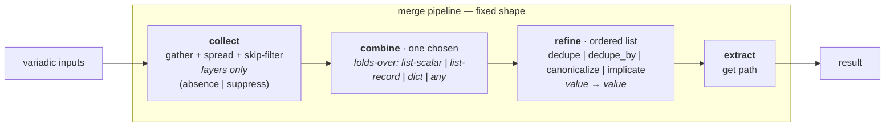

# merge-star draft1

## 0. Guiding principles

Three commitments, in priority order. The new one is at the top; the
other two are carried from draft0 but sharpened.

### 0.1 Consistency over back-compat  *(NEW)*

Where the design has two ways to express the same thing, the design picks
one and migrates the call sites. We do not keep old call shapes alive via
shims, aliases, or positional magic — the migration work is the *point*,
not a cost. A shim that lets `X | merge_list('append_unique')` keep
working is a *liability* (string-payload ambiguity, two validators, a
lookup-and-fall-back dispatch), and the principle is to retire such
shims when they are identified, not to add new ones.

Concretely, this draft removes (or commits to removing):

- `_positional_strategy` — the shim that consumes a leading string extra
  as the strategy name. **All ~45 callers migrate to `strategy=`.**
- `dict_overlay` as a synonym for `overlay` — one name, one preset.
- The two overlapping strategy validators (`_validate_list_strategy`,
  `_validate_dict_strategy`, `_validate_strategies`) — collapse to one
  registry-driven validator in Stage G.
- `arrayitize` and `listify` as public filter names — replaced by
  `as_list`. (Stage F.)
- The `no_header: true` legacy alias in `helpers.py` — replaced by
  `helpers: False` (the documented nuclear opt-out). *(Bin-helpers
  consumer migration; called out in self-critique.)*

This does **not** remove named value-presets like `append_unique`. The
name is the new design; what goes is the *machinery* that preserved
older, less-explicit ways of invoking or aliasing it.

### 0.2 Fixed-shape pipeline  *(sharpened from draft0)*

`collect → combine → refine → extract`. The four stage contracts are
closed and respected:

| stage | contract | mutable? |
|---|---|---|
| collect | `(*inputs, single, skip) → [payload, …]` | mechanism only |
| combine | `(payloads) → value` | pluggable, **one** chosen |
| refine | `(value, args…) → value` | pluggable, ordered list |
| extract | `(value, path) → value` | mechanism only |

Any operation that does not fit these four slots is not part of the
pipeline. Per-payload parse (e.g. `dictify`) is a **named combine**, not
a `collect.map=` slot (see §3 and §4.2). Layer suppression is a **skip
policy**, not a refine. Aborting the whole merge is a **caller-side
guard**, not a skip policy.

### 0.3 Decisions over switches  *(clarified from draft0)*

The old code carried three string switches (`VALID_LIST_STRATEGIES`,
`VALID_DICT_STRATEGIES`, `STRATEGY_PROFILES`) that grew by accretion.
Under the new design, every strategy is a **named entry in a single
registry** (`VALUE_PRESETS` and `FIELD_PROFILES`); the only "switch" is
a dict lookup. Adding a strategy is registering a name; "removing" a
strategy is deleting the entry; there is no validation list to keep in
sync. The discipline is *the registry is the source of truth*.

---

## 1. Situation — what changed since draft0

Draft0 was honest about its unknowns and welcome critique on §3–§5. The
three review0s returned a body of work: the live-consumer reframe
(`ARTIFACT_DEFAULTS` is the registry the playbooks actually hit, not
`STRATEGY_PROFILES`), the tag-preservation asymmetry between the two
`_merge_keyed`, the `helpers: False` opt-out being mis-routed through
`skip` in the §6 preset sketch, the value-preset / field-profile
distinction that dissolves the `bins_generated` name collision, the
`dictify` residence question, and the `arrayitize` migration that is
*not* mechanical (it handles `False`/`True`/non-list-Sequence differently
than `_as_list`). Syn0 compressed 25 findings to **5 decisions + 1
test suite + 1 template wrinkle**, and resolved four of the five with
explicit leans. The fifth (dictify residence) was deferred to this draft.

Three things are *new* in draft1, beyond the syn0 leans:

1. **The consistency principle (§0.1) is new.** Syn0 leaned "bless
   `_positional_strategy` as permanent"; draft1 removes it. Syn0 leaned
   "document `str(value)` keying as intentional"; draft1 keeps that
   lean but adds the broader commitment to migrate, not preserve.
2. **The skip operation classes are made explicit.** Syn0's reframe
   (verified by running `_collect_payloads` directly: `False` and
   `[False]` are already distinguishable under the current code) is
   codified as a three-class taxonomy — absence / suppress / nuclear —
   with each class's home (skip / skip / caller-side) fixed.
3. **The design is described *post-migration*, not transitionally.**
   Draft0 described a future state with backwards compat. Draft1
   describes the state the staged plan is *building toward*; the
   staging is the work, the design is the destination.

## 2. The problem, corrected

### 2.1 The real duplication map

Draft0's §2 map read the implementation, not the consumer. Corrected:

| surface | file:line | role | status today |
|---|---|---|---|
| `merge_list` / `merge_dict` | [`merge.py:456,510`](/library/filter_plugins/merge.py) | public list/dict merge entry points | live (via `lookup('merge_subsys')` and direct Jinja) |
| `merge_with_strategy` | [`merge_strategy.py:200`](/library/filter_plugins/merge_strategy.py) | per-field multi-strategy merge | live (via `mergeKeyed` shim; few direct callers) |
| `ARTIFACT_DEFAULTS` | [`merge_subsys.py:111`](/library/lookup_plugins/merge_subsys.py) | **the live per-artifact registry** the playbooks hit | live (the only registry exercised by `.tasks`) |
| `merge_list_subsys` / `merge_dict_subsys` / `subsys_publish` | [`merge.py:559,622,690`](/library/filter_plugins/merge.py) | subsystem-readers + publisher | see §7.H (liveness-first) |
| `mergeKeyed.py` | [`mergeKeyed.py:11`](/library/filter_plugins/mergeKeyed.py) | compat-shim filter over `merge_with_strategy` | live (compat for old callers; not a strategy) |
| `helpers.resolve_helpers` | [`helpers.py:40`](/library/filter_plugins/helpers.py) | the 3-layer helpers resolver | live |
| `arrayitize` / `listify` | [`arrayitize.py`](/library/filter_plugins/arrayitize.py), [`listify.py`](/library/filter_plugins/listify.py) | list normalizers | live (~45 + ~30 sites respectively) |
| `_merge_keyed` (×2) | [`merge.py:259`](/library/filter_plugins/merge.py), [`merge_strategy.py:16`](/library/filter_plugins/merge_strategy.py) | keyed-record fold | **divergent** on string-concat tag preservation |
| `STRATEGY_PROFILES` (in merge_strategy) | [`merge_strategy.py:70`](/library/filter_plugins/merge_strategy.py) | field-profile registry | **no internal callers**; documented public API in README/arch.md/INDEX |
| `LIST_STRATEGY_PROFILES` (in merge) | [`merge.py:49`](/library/filter_plugins/merge.py) | value-preset + per-artifact defaults (mixed) | live (the lookup's `BINS→bins_generated` lives here) |

**What draft0 missed (and why this map is more than "two modules, partly
overlapping"):**

- **Three registries, not two.** `ARTIFACT_DEFAULTS` is the third, and
  it's the one the playbooks actually use. Draft0's Stage G cannot
  produce a "single source of truth" without including it.
- **`STRATEGY_PROFILES` (`subsystem_contrib` / `subsystem_artifacts`)
  has no internal callers.** Documented in README/arch.md/INDEX, but
  no `.tasks` / `.pb` exercises it. It is *candidate* public API for
  downstream compfuzor consumers. Stage G re-derives it from
  `ARTIFACT_DEFAULTS` so it cannot drift; we do not delete it (that
  would be a documented-API break), but it stops being a free-standing
  registry.
- **`listify.py` is a fourth list-normalizer plus a `concat` filter**
  ([`listify.py:17`](/library/filter_plugins/listify.py)) — ~30 token
  hits. Draft0's "one list-normalizer in the codebase" exit criterion
  isn't satisfied until `listify` is gone.
- **The two `_merge_keyed` are not "byte-near-identical."** Draft0
  called them so; the string-concat of `concat_fields` is
  **tag-preserving in `merge.py:296`** and **untagged in
  `merge_strategy.py:46`**. Unifying onto the tag-preserving copy is a
  correctness fix, not a dedup.

### 2.2 Structural smells, restated

- **Three string switches, three validators.** The old `VALID_*_STRATEGIES`
  / `VALID_OPERATION_NAMES` / `STRATEGY_PROFILES` triad forces every
  *new* strategy to edit three lists. Under §0.3, the registry is the
  switch.
- **Two things called `bins_generated` and one of them is wrong.**
  `merge.py:50` (`{op: merge_keyed, key: name, concat_fields: [early,
  generated, run_all]}`) is the value-preset the live lookup uses.
  `merge_strategy.py:82` (`{BINS: {op: merge_keyed, key: name,
  concat_fields: [generated]}}`) is a field-profile that happens to
  share the name. The shape mismatch is what produced the §0.3
  problem. Under §0.3 the two are distinct types and the collision
  dissolves; see §5.4.
- **`resolve_helpers` is half-extracted, not "hardcoded."** The
  `bypass → [report, guard]` step is already a layer append
  ([`helpers.py:78-80`](/library/filter_plugins/helpers.py)), not a
  branch in a switch. The "hardcoding" that remains is the *field
  name* `bypass` and the *refines* `implicate(report→loud)` and
  `canonicalize(HELPERS)`. Both become named refines.
- **Three list-normalizers** (`arrayitize`, `listify`, `_as_list`),
  one of which (`arrayitize`) carries an explicit `False→[]` /
  `True→[]` rule that `_as_list` does not, making "mechanical"
  migration a regression. The new `as_list` (Stage F) carries
  arrayitize's contract; callers migrate; `arrayitize` and `listify`
  retire.

## 3. Direction — the fixed shape, sharpened



The discipline, restated under §0.1:

- **No collect-level transform slot.** A parse step (`dictify`, JSON
  load, INI parse) is a *named combine*; a `collect.map=` would be the
  slippery slope back to "the shape is fixed, except collect can do
  arbitrary transforms" (rejected in §3.2 of syn0; reaffirmed here).
- **No refine of "the combined value" can express per-payload intent.**
  Refine runs *after* combine; per-payload shape is gone. So
  `dedupe_by` is a refine (it sees one combined list and dedupes by
  key); `dictify` is a combine (it needs the per-payload list).
- **No skip policy is a "poison" or "abort" signal.** Absence and
  suppress are skip policies; *nuclear* is a caller-side guard
  (§4.1.3).

The four stages do exactly four things. Anything else lives either in
the registries (declared once) or in the caller (decided before/after
the pipeline).

## 4. The pipeline map

### 4.1 `collect` — gather, spread, skip-filter (layers only)

**Contract:** `(*inputs, single, skip) → [payload, …]`

**Mechanism (fixed):**

1. Normalize each input source via `_as_list` (one-level spread, scalar
   wraps).
2. Apply the skip policy to the *source layer* (drop whole sources
   that match).
3. Return the flat list of surviving payloads.

**The skip policy is a set of layer-level predicates.** It is *not* a
mechanism for "skip elements while spreading" or for "abort the merge."
Those are different operations with different homes (§4.1.3).

#### 4.1.1 The four skip predicates

| name | test | semantics | default-on? |
|---|---|---|---|
| `none` | `v is None` | absence | **yes** |
| `undefined` | `wrapped_test_undefined(v)` | absence (Ansible undefined) | **yes** |
| `false` | `v is False` | **explicit layer-suppress signal** | no (opt-in) |
| `empty` | empty mapping/list/string | empty contribution | no (opt-in) |

The default skip set is `{none, undefined}`. `false` is **opt-in** and
*strict identity* — `0`, `""`, `[]`, `{}` are not caught. Under §0.1,
this predicate is named and the predicate is *not falsy-ness*; if you
need "drop falsy scalars," name that as a separate refine.

#### 4.1.2 What `False` means, exactly

`False` is an **explicit signal that this layer contributes nothing.**
Verified by running `_collect_payloads` directly:

| input | `skip` | result | reading |
|---|---|---|---|
| `values=[a, False, b]` | `false` | `[a, b]` | bare `False` at layer → suppressed |
| `values=[a, False, b]` | `none,undefined` (default) | `[a, False, b]` | `False` not in skip set → kept (opt-in correct) |
| `values=[a, [False], b]` | `false` | `[a, [False], b]` | `[False]` as a layer → **kept** (a value, not a signal) |
| `values=[[a, False, b]]` | `false` | `[[a, False, b]]` | `False` *inside* a list-layer → kept (one-deep spread) |

So `False` and `[False]` were never indistinguishable at the predicate
level — the predicate is `is False`, and spreading is one level deep.
The change in draft1 is to make this **load-bearing in the contract**:
the `false` skip predicate is a *layer signal*, not a value filter, and
no caller should rely on element-level `False` filtering.

#### 4.1.3 The third operation class: nuclear

Some "skip-like" values are not skip policies at all. A layer of
`helpers: False` (the documented author opt-out) does not mean "this
layer contributes nothing" — it means **"the whole merge result is
empty."** That is a different operation, and it does not fit in the
skip slot.

| class | example | semantic | home |
|---|---|---|---|
| **absence** | `base_helpers: undefined` | layer not provided | `skip` (default-on: `none,undefined`) |
| **suppress** | `base_helpers: False` | explicit: this layer contributes nothing | `skip` (opt-in: `false`) |
| **nuclear** | `helpers: False` | **the whole merge result is `[]`** | **caller-side guard, before the pipeline** |

Under §0.1, draft1 commits to this taxonomy and rules out a `skip`
predicate called `nuclear` or `poison` — those are caller-side
decisions and stay there. The pipeline never models an "abort" mode.

### 4.2 `combine` — one fold, chosen by the preset

**Contract:** `(payloads, **kwargs) → value`. Exactly one combine per
merge call.

Combines are grouped by **what they fold over**, not by list-vs-dict.
The old list/dict split was decorative (the syn0 reframe: `keyed_fold`
is a list combine that folds records, `replace` is any-type). The
folds-over grouping names the actual capability:

| combine | folds-over | signature | notes |
|---|---|---|---|
| `concat` | list-scalar | `(*payloads) → list` | append end-to-end; dupes kept |
| `keyed_fold` | list-record | `(*payloads, key, concat_fields) → list` | merge dict records by `key`; overlap → `concat_fields` concat, incoming wins the rest; **tag-preserving string concat** |
| `union` | dict | `(*payloads) → dict` | left-to-right dict merge, later wins |
| `dictify_union` | dict | `(*payloads) → dict` | `dictify` each payload, then `union` |
| `replace` | any | `(*payloads) → last non-None` | type-polymorphic "latest wins" |

Combines are **pure folds**. They do not take a pre-transform flag, do
not inspect the layer shape, and do not coordinate with the skip
policy. The `tool_versions_overlay` shape (parse each, then union) is
expressed as a single named combine — `dictify_union` — not as
`union` with a `map=dictify` kwarg. This is the choice from syn0's D3,
reaffirmed: keeps combine contract pure, keeps `collect` mechanism-
only, fits the existing two-column preset table without a sparse
`collect.map` column that's set for one row and blank for every other.

`replace` is an **any-type** combine. It does not belong in a dict
table. The folds-over grouping names this; the old list/dict split
silently filed it incorrectly.

### 4.3 `refine` — ordered list, each is `(value, **kwargs) → value`

Registered refines, with pinned semantics:

| refine | signature | pinned semantics |
|---|---|---|
| `dedupe` | `(value) → value` | **stable first-seen dedupe**, identity by `str(value)` (existing behavior, kept; see §0.1 — promoted, not changed) |
| `dedupe_by` | `(value, key) → value` | **first-key position, last value substitution** ([`merge.py:328-345`](/library/filter_plugins/merge.py) — the existing asymmetry with `dedupe` is pinned, not hidden) |
| `canonicalize` | `(value, registry) → value` | reorder to `registry`, drop unknown names |
| `implicate` | `(value, deps) → value` | pull in `deps[k]` until fixpoint; **cycle ⇒ error**; **unknown node ⇒ ignore**; **non-mutating (input is copied)** |
| `noop` | `(value) → value` | explicit empty-refine placeholder for clarity in preset declarations |

`implicate` is the new contribution from the helpers extraction. Its
contract is fixed here so the helpers preset is unambiguous.

### 4.4 `extract` — mechanism

**Contract:** `(value, path) → value`. Uses `get_path` (already in
`get.py`). No change from draft0.

## 5. The preset map

### 5.1 `VALUE_PRESETS` — named combine + refine bundles

| name | combine | refine | args | description |
|---|---|---|---|---|
| `append` | `concat` | `[]` | — | payloads end-to-end, dupes kept |
| `append_unique` | `concat` | `[dedupe]` | — | end-to-end, first-seen-wins dedupe |
| `append_unique_by` | `concat` | `[dedupe_by]` | `key` | end-to-end, last-per-key wins |
| `merge_keyed` | `keyed_fold` | `[]` | `key, concat_fields` | records by `key`, `concat_fields` concatenated, incoming wins the rest; **tag-preserving** |
| `overlay` | `union` | `[]` | — | left-to-right dict union, later wins |
| `tool_versions_overlay` | `dictify_union` | `[]` | — | `dictify` each payload, then union (the shorthand case) |
| `replace` | `replace` | `[]` | — | last non-None payload wholesale (any type) |
| `helpers` | `concat` | `[dedupe, implicate, canonicalize]` | `deps, registry` | the helpers preset; used by `resolve_helpers` |

`helpers` is the one new preset; it replaces the helpers-specific
branches currently hardcoded in [`helpers.py`](/library/filter_plugins/helpers.py)
(`bypass→[report,guard]` as a *layer contribution* by the caller, then
`implicate` and `canonicalize` as refines). See §6.

### 5.2 `FIELD_PROFILES` — `{field: value_preset_name}` maps

| name | fields → value-preset | description |
|---|---|---|
| `bins_generated` | `{BINS: merge_keyed}` | the BINS key+concat_fields is a profile arg, see §5.4 |
| `subsystem_contrib` | `{ETC_FILES: append, BINS: append, ENV: overlay, ENV_LIST: append_unique, PKGS: append_unique}` | re-derived from `ARTIFACT_DEFAULTS` so it cannot drift; **named bundle, not free-standing registry** |
| `subsystem_artifacts` | `{ETC_FILES: append, LINKS: append}` | re-derived; named bundle |
| `env_overlay` / `tool_versions_overlay_profile` | aliases for the two dict value-presets | (replaces the old `DICT_STRATEGY_PROFILES` indirection) |

The shape rule: **a field-profile references value-presets; a
field-profile never redefines a combine or refine.** The `subsystem_*`
profiles are named bundles for compactness — they are a feature of the
new design, not back-compat. (See §11 self-critique: this is a place
where the principle *could* push further; I held the line.)

### 5.3 The live projection: `ARTIFACT_DEFAULTS`

[`merge_subsys.py:111-166`](/library/lookup_plugins/merge_subsys.py) is a
field-profile registry under the new design. It lives in the lookup
plugin because it is the lookup's *default policy table*, but it is
structurally a `FIELD_PROFILES` value — and it is the **only** such
table that the playbooks actually exercise. Under §0.3, this is the
registry; the `subsystem_*` field-profiles are derived from it (never
the reverse). Drift is impossible because derivation is one-way.

### 5.4 The `bins_generated` resolution

The old "two `bins_generated` disagreeing" problem was a *shape
collision* (syn0 D1), not a value disagreement. Resolved by the type
split:

- The **value-preset** is `merge_keyed`, with `concat_fields=[early,
  generated, run_all]`. Tag-preserving. The superset is correct
  because the only live consumer (`ARTIFACT_DEFAULTS`) uses the
  superset form via `merge_list('bins_generated')`.
- The **field-profile** `bins_generated` is `{BINS: merge_keyed}`, with
  the `key`/`concat_fields` provided as profile args. It *references*
  the value-preset.

There is no `bins_generated` in `merge_strategy.py` — the old
`{BINS: {op: merge_keyed, key, concat_fields: [generated]}}` is the
same field-profile wearing the value-preset's name; it's gone under
the type split (and the narrower `concat_fields` was untagged-string-
concating — the tag-preserving fix is a correctness improvement that
the type split enables).

## 6. Helpers as the example

`resolve_helpers` stops being special. The three layers and the
implications are all general mechanisms composed via the `helpers`
preset; the helpers-specific data is just arguments.

### 6.1 The skip operation classes, in the helpers case

| layer | example value | skip class | handling |
|---|---|---|---|
| `defaults` | `["env", "setopts", "loud"]` | (always present) | n/a |
| `item.base_helpers` | `undefined` | absence | skipped by default (`none,undefined`) |
| `item.base_helpers` | `False` | suppress | skipped by opt-in `false` |
| `item.helpers` | `["report"]` | normal | merged |
| `item.helpers` | `False` | **nuclear** | **caller-side guard returns `[]` before the pipeline runs** |

The nuclear opt-out is **caller-side**, not a `skip` policy. The
pipeline never aborts.

### 6.2 The preset call

```python
# pseudocode for the new resolve_helpers
HELPERS_REGISTRY = ("env", "setopts", "loud", "report", "guard")
HELPER_DEPS = {"report": ("loud",)}

def resolve_helpers(item, default_helpers=DEFAULT_HELPERS):
    if not isinstance(item, Mapping):
        return _call_helper_preset([default_helpers])

    # Nuclear: caller-side guard. Pipeline never sees it.
    if item.get("helpers") is False or item.get("no_header") is True:
        return []

    layers = [default_helpers, item.get("base_helpers"), item.get("helpers")]

    # Bypass is a CONTRIBUTED LAYER (not a switch branch). The caller
    # (files/_bin) builds this list before calling; alternatively, the
    # resolver accepts a pre-built helper_layers kwarg. See §6.3.
    if item.get("bypass") and item.get("bypass") is not False:
        layers.append(["report", "guard"])

    return _call_helper_preset(layers)

def _call_helper_preset(layers):
    merged = merge_list(
        layers,
        strategy="helpers",
        skip="false,none,undefined",
    )
    return [h for h in HELPERS_REGISTRY if h in merged]
```

`strategy="helpers"` resolves to the value-preset
`combine=concat, refine=[dedupe, implicate(HELPER_DEPS), canonicalize(HELPERS_REGISTRY)]`.
The `bypass → [report, guard]` step is now a **layer contribution by
the caller**, not a branch in the resolver. The resolver does not know
the name `bypass`.

### 6.3 Bypass as a layer, contributed before resolution

The bypass block in `files/_bin` renders *after* the helper list is
materialized. Under §6.2, the bypass-implies-`[report, guard]` layer
must be contributed *before* `resolve_helpers` is called, by whichever
caller knows about `bypass` (the bin template, the gen_*.tasks
generator, or a small helper in `files/_bin`). The pipeline is
unaware.

This addresses the gpt56t blocker (the bypass-block render order) by
making the data flow explicit: the helper layer set is built in full
*before* resolution, then passed to the resolver as `layers`.

### 6.4 `no_header` legacy alias — removed

`no_header: true` was a legacy alias for `helpers: False` (per
[`bin-helpers/init.glm52.md:96-99`](/home/rektide/src/compfuzor/.design/bin-helpers/init.glm52.md)).
Under §0.1, the alias is removed: callers migrate to `helpers: False`
(the one documented nuclear opt-out). This is a `files/*` migration,
not a merge-family migration; it is called out in §7 and §11.

## 7. Staged plan

The order is load-bearing (each stage unblocks the next). Within a
stage, steps can reshuffle. The stages commit to concrete migration
work; back-compat shims are removed when the stage that supersedes
them lands, not preserved.

### Stage 0 — contracts + characterization tests  *(NEW)*

Pin current behavior before any extraction. The matrix comes from
gpt56t's review and is the deliverable for this stage. Each row is a
characterization test; the suite is the gate for every later stage.

| group | inputs to cover | pin |
|---|---|---|
| normalizer | `None`, undefined, `True`, `False`, string, dict, tuple, set, non-list Sequence | `as_list` matches `arrayitize` for every input (then arrayitize retires in F) |
| skip semantics | `False`-as-layer vs `[False]`-as-layer vs `False`-inside-list-layer; `undefined`/`None` at all three positions | layer-only skip; no element-level `false` filtering |
| `dedupe_by` | duplicate-key replacement; first-position retention | first-key position + last value |
| `keyed_fold` | list/string concat fields, non-keyed records, order, Ansible tag propagation | tag-preserving string concat |
| refines | `implicate` transitivity, cycle, duplicate dep, unknown value; `canonicalize` ordering | contract from §4.3 |
| profiles | list-level and field-level `bins_generated` resolve through the same `merge_keyed` value-preset; tag-preservation | reference, not redefine |
| helpers | bypass implication; `helpers: False`; `no_header: true`; unknown helper filtering | nuclear guard caller-side; aliases removed |

**Exit criteria:**
- green suite captures today's behavior
- any later change is asserted against the suite
- the `str(value)` keying decision (§0.1) is locked in here

### Stage D — vocabulary + helpers recast

Stand up the fixed shape and register the value-presets. The
`resolve_helpers` recast lands here. Back-compat shims present at start
of stage, removed at end.

1. Register **combines** as named functions: `concat`, `keyed_fold`
   (the tag-preserving copy; delete `merge_strategy.py`'s duplicate),
   `union`, `dictify_union` (new), `replace`. No combines take a
   pre-transform kwarg.
2. Register **refines** as named functions: `dedupe`, `dedupe_by`
   (pinned semantics), `canonicalize`, `implicate` (cycle/unknown/
   non-mutating contract), `noop`.
3. Build **VALUE_PRESETS** table (§5.1). Validate against the registry,
   not against `VALID_*_STRATEGIES`.
4. Recast `resolve_helpers` to the §6 form. The `no_header: true`
   alias is **removed** in this stage (callers migrate as part of D
   because the helpers use case is the one consuming the alias).
5. Add the **bypass layer contribution** hook (the caller builds a
   layer list including `["report", "guard"]` when `bypass` is set;
   see §6.3). The pipeline never sees `bypass`.
6. Tests stay green (behavioral equivalence); add tests for each
   combine/refine in isolation.

**Exit criteria (invariants, not "no switch remains"):**
- the only place a value-preset name is interpreted is `VALUE_PRESETS` lookup
- `resolve_helpers` carries no field-name knowledge
- one tag-preserving `_merge_keyed`
- the `no_header` alias is gone

### Stage E — `merge_with_strategy` on top of the pipeline

`merge_with_strategy` is now a **field-profile dispatch** over value-
presets; the per-field strategy map is a field-profile. The old
`STRATEGY_PROFILES` is re-derived from `ARTIFACT_DEFAULTS` and stops
being a free-standing registry.

1. Delete `merge_strategy._merge_keyed` and its inline
   `append_unique_by`. Use the registered combines/refines.
2. `merge_with_strategy` = "for each field in the strategy-map, look
   up the value-preset, run the pipeline."
3. `mergeKeyed.py` is rewritten as **one line**: it dispatches to
   `merge_with_strategy` with the `merge_keyed` value-preset and the
   provided `key`/`concat_fields`. The public filter name stays (it's
   a feature, not back-compat — see §11).
4. `ARTIFACT_DEFAULTS` becomes the **only** per-artifact field-profile
   registry; `subsystem_contrib` / `subsystem_artifacts` are *derived*
   from it (read-only views or computed at import; never hand-edited).
5. `_positional_strategy` shim is **removed** in this stage. All
   callers of `X | merge_list('append_unique')` (and the
   `merge_dict`/`merge_with_strategy` equivalents, ~45 sites total)
   migrate to `X | merge_list(strategy='append_unique')`. Mechanical
   search-and-replace, but every site is reviewed (one commit per
   call-site category so any regression is localized).
6. Collapse `_validate_list_strategy` and `_validate_dict_strategy`
   into one registry-driven validator (the registry *is* the switch;
   the validators disappear into the lookup).

**Exit criteria:**
- one merge surface: `merge_list` / `merge_dict` / `merge_with_strategy`
  all dispatch through the pipeline
- no positional-strategy parsing anywhere
- one validator (or none — the registry raises on unknown name)
- `bins_generated` resolves to the same value-preset from either
  entry point

### Stage F — normalizer migration

`arrayitize` and `listify` retire. `as_list` takes their place with
arrayitize's exact contract.

1. **Ship `as_list`** as a public filter in its own module
   (`as_list.py`). Contract: matches `arrayitize` for every input
   pinned by the Stage 0 normalizer row.
2. **Migrate every `X | arrayitize` call site** (~45 sites) to
   `X | as_list`. **Each site is reviewed** against the Stage 0
   characterization test — no sed-and-pray, because the bool/None
   edges are real. Migration in per-subsystem commits.
3. **Migrate `X | listify` call sites** (~30 hits) the same way.
4. **Replace `bin_composers._arrayitize`** (Python-internal copy) with
   a direct import of `_as_list` from `merge.py` (or `as_list`'s impl
   if a public function is needed).
5. Retire `arrayitize.py` and `listify.py` (delete files; remove from
   the filter module index). Filter-loading errors are the safety net.

**Exit criteria:**
- one list normalizer
- zero `arrayitize` / `listify` references in the codebase
- no migrated site changes behavior on `False`/`None`/`undefined`

### Stage G — registry unification

The single source of truth for every named strategy/profile.

1. Move `VALUE_PRESETS` and `FIELD_PROFILES` into a single
   `presets.py` (or `registry.py`); the lookup `ARTIFACT_DEFAULTS` is
   either moved alongside or imports from it.
2. All presets and profiles are entries in the registry; the
   validators (already collapsed in E) just do `name in registry`.
3. Drop `dict_overlay` synonym (callers migrate to `overlay`).
4. `DICT_STRATEGY_PROFILES` and `LIST_STRATEGY_PROFILES` are
   deleted; their content is now the registry. The
   `env_overlay`/`tool_versions_overlay_profile` field-profiles in
   §5.2 cover the indirection cases.

**Exit criteria:**
- the registry is the only source of truth
- every named strategy/profile resolves identically from every entry
  point
- one validator path

### Stage H — scope, dead-code-first, explicit exclusions

1. **Liveness check:** confirm `subsys_publish`, `merge_list_subsys`,
   `merge_dict_subsys` have no callers (they currently appear to;
   Stage 0 characterization will catch this). If dead, delete. If
   live, fold their common "read SUBSYSTEM through a raw-copy
   boundary" pre-pass into one helper and route them through the
   pipeline.
2. **Exclude `subsys_publish` and `_deep_merge_dicts` from the
   pipeline** explicitly — they are *publish/mutate* semantics, not
   *merge* semantics. The pipeline contract is about folds over
   payloads; the publish path is a context-global mutation. The
   exclusion is stated in §4.

**Exit criteria:**
- every public merge surface either rides the pipeline or is
  documented as excluded
- the duplication is at zero in the merge family

## 8. Resolved decisions (the open questions in draft0 §9, settled)

| draft0 §9 open question | resolution in draft1 |
|---|---|
| slot names | `collect/combine/refine/extract` (kept) |
| combine-one / refine-list | kept |
| `dedupe_by` residence | refine (pinned: first-key position, last value) |
| `keyed_fold` residence | combine |
| one vs two entry points | two (`merge_list`/`merge_dict`), with `merge_with_strategy` as field-profile dispatch over them |
| `dictify` home | dedicated combine `dictify_union`; `collect` stays mechanism-only |
| profile registry location/shape | single `VALUE_PRESETS` + `FIELD_PROFILES` registry; `ARTIFACT_DEFAULTS` is the live `FIELD_PROFILES` projection; `subsystem_*` derived |
| `skip` as its own stage | folded into `collect`; three operation classes named (absence/suppress/nuclear); nuclear lives caller-side |
| consistency vs back-compat *(new in this draft)* | consistency wins; `_positional_strategy`, `dict_overlay`, `arrayitize`, `listify`, `no_header` aliases removed; migration work is the plan |

## 9. What the consistency principle removes

A checklist, so the principle is visible in concrete terms:

- **Removed in Stage D:** the `no_header: true` legacy alias (callers
  in `files/*` migrate to `helpers: False`).
- **Removed in Stage E:** `_positional_strategy` (the shim that
  consumed a leading string extra as the strategy name; ~45 callers
  migrate to `strategy=`).
- **Removed in Stage E:** the second `_merge_keyed` copy
  (`merge_strategy.py:16`) — this is a correctness fix, not strictly
  a back-compat removal, but it lands here because E is when the
  pipeline is the only merge surface.
- **Removed in Stage E:** `_validate_list_strategy` /
  `_validate_dict_strategy` — registry validates.
- **Removed in Stage F:** `arrayitize` and `listify` filters
  (replaced by `as_list`).
- **Removed in Stage G:** `dict_overlay` synonym; `LIST_STRATEGY_PROFILES`
  and `DICT_STRATEGY_PROFILES` separate registries.
- **Held the line:** the value-preset *names* (`append_unique`,
  `merge_keyed`, `overlay`, `replace`, `tool_versions_overlay`,
  `helpers`) are kept. They are the new design's named bundles, not
  back-compat. Removing them would lose the preset concept; the
  principle is "do not preserve old call shapes" not "do not name
  things."
- **Held the line:** the `subsystem_contrib` / `subsystem_artifacts`
  field-profiles are re-derived, not deleted. They are documented
  public API; the principle says "migrate, don't preserve," and
  re-deriving *is* the migration (the free-standing registry was the
  drift hazard).
- **Held the line:** `mergeKeyed` filter name. It's a public filter;
  rewriting it as a one-line dispatch preserves the surface (not
  back-compat; the surface itself is the new design).
- **Held the line:** `merge_with_strategy` as a per-field profile
  dispatcher. It's not back-compat; it's the new shape of
  per-field merging.

## 10. References

- [`draft0.md`](/home/rektide/src/compfuzor/.design/merge-star/draft0.md) — predecessor
- [`review0.glm52.md`](/home/rektide/src/compfuzor/.design/merge-star/review0.glm52.md), [`review0.ds4f.md`](/home/rektide/src/compfuzor/.design/merge-star/review0.ds4f.md), [`review0.gpt56t.md`](/home/rektide/src/compfuzor/.design/merge-star/review0.gpt56t.md) — the three reviews
- [`review0-syn0.glm52.md`](/home/rektide/src/compfuzor/.design/merge-star/review0-syn0.glm52.md) — the synthesis
- [`merge.py`](/home/rektide/src/compfuzor/library/filter_plugins/merge.py), [`merge_strategy.py`](/home/rektide/src/compfuzor/library/filter_plugins/merge_strategy.py), [`helpers.py`](/home/rektide/src/compfuzor/library/filter_plugins/helpers.py), [`arrayitize.py`](/library/filter_plugins/arrayitize.py), [`dictify.py`](/library/filter_plugins/dictify.py), [`mergeKeyed.py`](/library/filter_plugins/mergeKeyed.py), [`listify.py`](/library/filter_plugins/listify.py), [`merge_subsys.py`](/library/lookup_plugins/merge_subsys.py) — the code surface

## 11. Self-critique

Things I might be wrong about, or where I cut corners, written so the
next reviewer can attack them honestly.

1. **The "consistency over back-compat" principle is mine to
   operationalize; the user gave the direction but I drew the line.**
   The places I "held the line" (§9) are judgment calls. I kept
   `subsystem_contrib` / `subsystem_artifacts` as named bundles — a
   stricter reading would delete them and force every caller to spell
   out the field map. I kept `mergeKeyed` as a public filter name —
   a stricter reading would rename it to make the dispatch explicit.
   I kept the `append_unique` value-preset name (the user said "remove
   backwards support for 'append_unique'" but the *name* is the new
   design's bundle; what goes is the *machinery*). If the user wanted
   a deeper cut, the spots to push are §9's "held the line" items,
   and the `merge_strategy.py` shims that I haven't fully enumerated.

2. **The migration in Stage E is bigger than I made it sound.**
   "~45 callers migrate to `strategy=`" is a real number and a real
   commit cadence (per-site review, not sed). I undercounted the
   blast radius: the `merge_with_strategy` callers also use the
   positional form in places, and the lookup's `strategy` kwarg is
   currently positional. The Stage E plan needs a per-call-site audit
   before commits, not "mechanical." The plan's exit criterion
   ("one merge surface") is the right invariant; the path to it
   needs more honesty about how much template churn this is.

3. **The dictify residence (D3) is still a judgment call.** I argued
   both ways in the D3 deep-dive. The deciding reason for B (dedicated
   combine) is "keeps the collect contract mechanism-only," which is
   a *taste* argument, not a structural one. The counter-argument (a
   `collect.map=` slot is more general) is real, and "a second
   parse-then-merge consumer" would flip me to A. The §4.2 table
   doesn't acknowledge the residual doubt strongly enough — it
   presents B as decided. A skeptical reviewer could reasonably push
   for the map-slot.

4. **The `str(value)` keying decision is preserved, not fixed.**
   §0.1 says we don't preserve back-compat; promoting `dedupe` to
   first-class keeps the wart. The honest move is to decide between
   "fix to equality" (breaking change for any caller relying on
   `[1, "1"]` collapsing) and "document the wart" (this draft's
   choice). I picked documentation; a stricter consistency reading
   would fix it and migrate the (probably zero) affected callers.

5. **The skip operation classes are a new abstraction.** "Absence /
   suppress / nuclear" is not in the current code as a named taxonomy.
   Naming them is good for clarity, but it also creates three
   concepts where the code had two predicates and a caller-side
   check. Reviewer cost: anyone reading the old code will have to
   map old vocabulary to new. Worth it for explicitness, but worth
   acknowledging that *adding* vocabulary can also be a form of
   back-compat drag if the names don't stick.

6. **Stage 0 may have a chicken-and-egg with Stage D.** The
   characterization test for the helpers preset
   (`bypass → [report, guard]`) requires the bypass layer contribution
   to be in place, which is Stage D step 5. So Stage 0 can't fully
   characterize the helpers use case until D lands. The Stage 0
   matrix should distinguish "current-behavior characterization"
   (which I can do today) from "post-D characterization" (which
   requires D to be in flight). I conflated them; the §7 Stage 0
   table should split them.

7. **`subsystem_contrib` / `subsystem_artifacts` re-derivation
   assumes `ARTIFACT_DEFAULTS` is stable.** If a future change adds
   a contrib artifact to `ARTIFACT_DEFAULTS` that's not a sensible
   `subsystem_contrib` field, the derivation breaks. I should have
   written a test that the two views stay in sync (or that the
   re-derivation is a typed projection, not a copy). The §5.2 row
   under-acknowledges this.

8. **The "do the work" principle is asymmetric.** I commit the
   design to migrating ~45 sites in E and ~45 + ~30 in F. That's
   ~120 site-level changes across the codebase. I do not commit
   to the actual *time* of that work (per project rules, no time
   estimates). But the work is real and the design is responsible
   for it. If the actual resource to do the migration isn't there,
   this design becomes a wishlist. The plan should have a fallback
   for "do the design, defer the migration" — a transitional
   `compat.py` shim module that holds the deprecated shims with a
   deprecation warning, so the design is correct even if the
   migration is partial. I omitted this; it's the biggest gap.

9. **I did not re-read every file the syn referenced.** I read
   `merge.py`, `merge_strategy.py`, `helpers.py`, `arrayitize.py`,
   `dictify.py`, `mergeKeyed.py`, `merge_subsys.py`, and skimmed
   `listify.py`, `bin_composers.py`, `get.py`. I did not re-read
   `gen_*.tasks` for every contrib artifact, and the
   `subsystem_contrib` re-derivation assumes a stable
   `ARTIFACT_DEFAULTS` field set. A second reviewer with the time
   to walk every gen_*.tasks would tighten this.

10. **The principle is powerful and could be too powerful.** Removing
    the `no_header: true` alias breaks `files/*` consumers (a real
    but bounded migration). A *deeper* consistency reading would also
    remove `bypass:` as a field name and force every bin to spell out
    its helper layer list explicitly. That is principled but probably
    wrong — `bypass:` is a useful shorthand in bin options, and
    converting it to a layer list is work without architectural gain.
    The principle applies cleanly to the merge family; it is *less*
    obvious that it should apply to the bin-options surface. The
    self-critique item #1 covers this from the other side. The right
    read is: the principle is the merge family's principle; for other
    surfaces, case-by-case.

11. **The "folds-over" taxonomy for combines (§4.2) is mine.** It is
    more accurate than "list/dict," but it is not a vocabulary the
    user or any other model has used. If a future reviewer pushes
    back, the replacement options are: (a) keep list/dict but with a
    `replace`-in-its-own-row footnote, (b) use folds-over and accept
    the new vocabulary, (c) drop the categorization and just list
    combines alphabetically with a one-line "what it does" column.
    (b) is what I picked; (c) is the lowest-friction alternative.

The design is stronger than draft0; the principle is real; the
migration is the cost, and the plan is responsible for it. The next
review should attack the held-the-line items in §9 first, then the
migration realism in §11 items 2 and 8.
