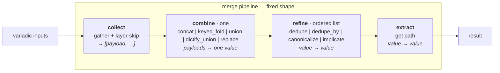
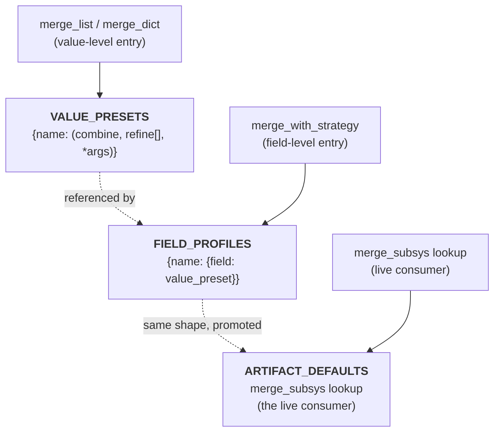

# merge-star draft1 — fixed pipeline, no back-compat, explicit signals

## 0. What changed since draft0

draft0 got the architecture right and the inventory leaky. Three reviews
([glm52](/home/rektide/src/compfuzor/.design/merge-star/review0.glm52.md),
[ds4f](/home/rektide/src/compfuzor/.design/merge-star/review0.ds4f.md),
[gpt56t](/home/rektide/src/compfuzor/.design/merge-star/review0.gpt56t.md))
+ the [synthesis](/home/rektide/src/compfuzor/.design/merge-star/review0-syn0.glm52.md)
found ~25 issues, which compress to 5 decisions + one test suite. draft1
integrates them and adds two principles draft0 under-stated. Concretely
new in this revision:

- **Two guiding principles** (§2) that resolve a cluster of items at
  once: *no back-compat shims*, and *explicit signals over fuzzy falsy*.
- **A Stage 0** (contract tests) in front of the staging — the thing
  gpt56t correctly said gates everything.
- **A two-registry model** (value-presets vs field-profiles) so
  `bins_generated` stops being two shapes wearing one name.
- **A resolved skip semantics** with three named operation classes
  (absence / suppress / nuclear) — the skip pushback dissolved the
  hardest item in the syn.
- **A corrected inventory**: `mergeKeyed.py`, `listify.py`,
  `ARTIFACT_DEFAULTS`, and the `_merge_keyed` tag asymmetry are now on
  the map.
- **Migration counts** measured from the actual tree, not guessed
  (§7/§8): the no-back-compat lift is ~60–70 bounded sites.

draft0's §3 thesis (fixed shape, bounded vocabulary, strategies-as-presets)
is **unchanged**. This revision fixes §2's map, §4's combine grouping,
§5's registry shape, §6's preset sketch, and §7's staging.

## 1. Situation (unchanged from draft0, abbreviated)

The bin-helpers decomposition
([`/.design/bin-helpers/init.glm52.md`](/home/rektide/src/compfuzor/.design/bin-helpers/init.glm52.md))
forced `resolve_helpers` to merge three layers with implications and a
canonical reorder. Implementing it surfaced that the merge family
(`merge.py` + `merge_strategy.py` + `arrayitize` + `listify` +
`mergeKeyed.py`) was four partly-overlapping implementations with two
strategy switches and three registries. This doc proposes the fixed-shape
pipeline those implementations are all reaching for.

## 2. Guiding principles

draft0 had one principle (fixed shape) implicit in §3. draft1 makes the
principles explicit — they do most of the resolving work.

### P1 — Fixed shape, bounded vocabulary

Every merge is `(collect, combine, refine[], extract)`, no more, no
less. A new use case asks two closed-vocabulary questions ("which
combine?", "which refines?"), not "invent a pass-chain." Free-form
composable passes are explicitly rejected (draft0 §3). The discipline is
the value: the shape is what makes strategies legible as presets.

### P2 — No back-compat shims. Migrate callers.

> Compfuzor is pre-1.0 with a small, known consumer set. We prefer
> **one consistent vocabulary** over carrying shims for old call shapes.
> When a feature exists only to keep an old spelling working, we remove
> it and migrate the callers (the work is bounded and mechanical; tests
> guard it). A string is always a payload; a strategy is always a keyword
> argument.

This resolves, in one stroke:

| shim / alias | fate | sites |
|---|---|---|
| `_positional_strategy` (string-as-2nd-positional) | **remove**; callers migrate to `strategy=` | ~14 |
| `dict_overlay` (alias for `overlay`) | **collapse to `overlay`** | 1 |
| `arrayitize` (redundant normalizer) | **retire**; callers migrate to `as_list` | ~37–45 |
| `listify` / `concat` filter | **retire**; `concat`→`merge_list(strategy='append')`, `listify`→`as_list` | ~8 |
| `mergeKeyed.py` (compat-shim filter) | **retire**; 2 callers migrate to `merge_list(strategy='merge_keyed')` | 2 |
| `_dedupe_preserve` `str(value)` keying | **fix to equality** (behavior change, intentional) | tests |

The principle's payoff: after migration, **a strategy name is only ever
a keyword argument and only ever interpreted by the preset table.** The
string-payload ambiguity (`merge_list('foo', 'bar')` — is `'foo'` a
strategy or a payload?) disappears, because positional strings are
always payloads.

### P3 — Explicit signals over fuzzy falsiness

> `False` is an **explicit signal**, distinct from undefined/falsy.
> `undefined`/`None` is **absence** (noise). A sentinel that aborts the
> whole merge is **nuclear** — a caller decision, not a skip policy. We
> never collapse these three into "is it falsy?"

The skip predicate `false` is **`v is False`** (strict identity, already
true in [`merge.py:116`](/library/filter_plugins/merge.py)), so `0`,
`""`, `[]` are NOT caught — only the boolean. Verified behavior:

| input layer | default skip (`none,undefined`) | opt-in `false` | meaning |
|---|---|---|---|
| `False` (bare, at layer position) | kept | suppressed | explicit suppress signal |
| `[False]` (a list containing False) | kept | **kept** (a value, not a signal) | one-deep spread; inner False is a value |
| `undefined` / `None` | suppressed | suppressed | absence |
| `0` / `""` / `[]` | kept | kept | falsy ≠ False |

This is already the system's behavior. draft1 names it so the §6 preset
stops being misread (review0.ds4f's catch).

### P4 — Tests before extraction

Stage 0 pins current behavior with a characterization-test suite
(gpt56t's matrix) *before* any function extraction. Any later change is
asserted against it; a regression is a red light, not a silent render
change.

## 3. The problem with the merge code today (corrected map)

draft0's duplication map missed three surfaces and mis-described the
`_merge_keyed` pair. Corrected:

| thing | merge.py | merge_strategy.py | other | notes |
|---|---|---|---|---|
| `_merge_keyed` | [`:259`](/library/filter_plugins/merge.py) (tag-preserving via `_concat_strings_preserving_tags:296`) | [`:16`](/library/filter_plugins/merge_strategy.py) (**drops tags**, bare `+ "\n"` `:46`) | — | **not** byte-identical; unify onto tag-preserving as a *fix* |
| `mergeKeyed.py` | — | wraps `merge_with_strategy` ([`mergeKeyed.py:11`](/library/filter_plugins/mergeKeyed.py)) | public filter | 3rd `merge_keyed` surface; 2 live callers |
| `bins_generated` | list-strategy profile `concat_fields=[early,generated,run_all]` (`:50`) | field-strategy-map `BINS.concat_fields=[generated]` (`:82`) | — | **shape mismatch**, not a concat_fields disagreement |
| `append_unique_by` | [`_append_unique_by:313`](/library/filter_plugins/merge.py) | inline in `_apply_strategy_operation:161` | — | two impls; mis-filed as combine-op (it's `concat + dedupe_by` refine) |
| profile registries | `LIST/DICT_STRATEGY_PROFILES` | `STRATEGY_PROFILES` | **`ARTIFACT_DEFAULTS`** ([`merge_subsys.py:111`](/library/lookup_plugins/merge_subsys.py)) | **three** registries; `ARTIFACT_DEFAULTS` is the *live* one (the lookup every playbook hits) |
| `subsystem_contrib` / `subsystem_artifacts` | — | defined `:70-88` | only in docs/INDEX + tests | documented public API, **zero internal callers** |
| list normalizers | `_as_list` | — | `arrayitize.py`, `listify.py`, `bin_composers._arrayitize` | **four** normalizers |

The merge family is therefore *five* modules (`merge.py`,
`merge_strategy.py`, `arrayitize.py`, `listify.py`, `mergeKeyed.py`) +
one lookup (`merge_subsys.py` carrying `ARTIFACT_DEFAULTS`). draft1's
scope is all six.

## 4. Direction: the fixed-step pipeline



The split: `combine` is exactly one (the fold); `refine` is an ordered
list (polish). Rejecting "a combine is a list of ops" (draft0 §9) keeps
the "one core op + optional polish" clarity.

### Why a fixed shape, not free-form passes

- **Bounded design space.** New use case → "which combine? which
  refines?" — not "invent a pass-chain."
- **Strategies stay first-class.** `append_unique` = `(concat, [dedupe])`
  — the switch becomes a visible lookup table.
- **`resolve_helpers` stops being special.** Its specialness was always
  just "concat plus some refines."
- **The duplication dissolves.** One `_merge_keyed`, one
  `bins_generated`, one normalizer.

## 5. The pipeline map

### Stage 1 — `collect` (mechanism fixed)

| | |
|---|---|
| **role** | gather variadic inputs into a flat payload list; spread list/tuple/set sources one level deep; drop skippable **layers** |
| **contract** | `(*inputs, single, skip) → [payload, …]` |
| **mechanism** | [`_collect_payloads`](/library/filter_plugins/merge.py) (exists) |
| **skip** | operates on **layers (sources)** only. Three operation classes (P3): absence → default skip; suppress (`False`) → opt-in `false`; nuclear → caller-side guard, **never** a skip policy |
| **status** | ✅ exists; one clarification — element-level spread-filter is one-deep and only ever hits bare values at layer position (verified), so it's effectively layer-only already. Document as such. |

### Stage 2 — `combine` (pluggable, exactly one)

Grouped by **what they fold over**, not list-vs-dict (the draft0
list/dict split was decorative — review0.glm52 §4, review0.gpt56t):

| combine | folds over | description | identity |
|---|---|---|---|
| `concat` | lists | append payloads end-to-end | `[]` |
| `keyed_fold` | list-of-records | merge dict records by key; on overlap, concat `concat_fields`, incoming wins the rest | `[]` |
| `union` | dicts | left-to-right dict union, later wins | `{}` |
| `dictify_union` | dicts-or-shorthand | `dictify` each payload, then `union` (D3 decision, §9) | `{}` |
| `replace` | **any** | latest non-None payload wholesale | `None` |

**`replace` is type-agnostic** (review0.glm52 §3.4, ds4f #8, gpt56t) — it
applies to any field. Filing it under dict combines was a category error.

**String-concat in `keyed_fold` preserves Ansible datatags** — the one
`_merge_keyed` we keep is `merge.py`'s (review0 all-three). A test
asserts `AnsibleTagHelper` propagation on `concat_fields` joins.

### Stage 3 — `refine` (pluggable, ordered list, empty by default)

| refine | contract | notes |
|---|---|---|
| `dedupe` | `(value) → value` | **identity = Python equality** (P2 fix; was `str(value)`). `[1,"1"]` no longer collapses. |
| `dedupe_by(key)` | `(value, key) → value` | first-key position retained, **last** value substituted (current behavior, now pinned) |
| `canonicalize(registry)` | `(value, registry) → value` | reorder against registry, drop unknowns |
| `implicate(graph)` | `(value, graph) → value` | transitive closure to fixpoint; **cycle = error**; unknown node = ignored; non-mutating (copy) |

All four refines are pure `(value, args) → value`. They receive an
immutable copy; they do not mutate.

### Stage 4 — `extract` (mechanism fixed)

| | |
|---|---|
| **role** | dotted-path `get` from the result |
| **contract** | `(value, path) → value` |
| **mechanism** | [`get_path`](/library/filter_plugins/get.py) ✅ |

## 6. Strategy map — two registries

draft0's "one registry" was impossible because `bins_generated` is a
*value-preset* in one module and a *field-profile* in another
(review0.gpt56t). draft1 splits them: **value-presets** describe a merge
of values; **field-profiles** describe which value-preset to run for each
field. A field-profile *references* value-presets by name.



### VALUE_PRESETS

| preset | combine | refine | args | today |
|---|---|---|---|---|
| `append` | `concat` | `[]` | | 🟡 inline |
| `append_unique` | `concat` | `[dedupe]` | | 🟡 inline + `_dedupe_preserve` |
| `append_unique_by` | `concat` | `[dedupe_by]` | `key` | 🟡 mis-filed as combine-op |
| `merge_keyed` | `keyed_fold` | `[]` | `key, concat_fields` | 🟡 `_merge_keyed` (duplicate) |
| `overlay` | `union` | `[]` | | 🟡 inline |
| `tool_versions_overlay` | `dictify_union` | `[]` | | 🟡 inline |
| `replace` | `replace` | `[]` | | 🟡 merge_strategy-only |
| **`bins_generated`** | `keyed_fold` | `[]` | `key=name, concat_fields=[early,generated,run_all]` | 🟡 list-strategy profile |
| **`helpers`** | `concat` | `[dedupe, implicate(HELPERS_DEPS), canonicalize(HELPERS)]` | | 🟡 `resolve_helpers` |

`bins_generated` (value-preset) lives **once**, with the superset
`concat_fields` — low-risk: only `merge_subsys` names it live
(review0.ds4f). The field-profile of the same name references it.

### FIELD_PROFILES

| profile | shape | status |
|---|---|---|
| `bins_generated` | `{"BINS": "bins_generated"}` (refs the value-preset) | 🟡 merge_strategy's nested version, deleted |
| `subsystem_contrib` | `{ETC_FILES: append, BINS: append, ENV: overlay, ENV_LIST: append_unique, PKGS: append_unique}` | ⚠️ **zero internal callers** — re-derive from `ARTIFACT_DEFAULTS` or deprecate (open) |
| `subsystem_artifacts` | `{ETC_FILES: append, LINKS: append}` | ⚠️ same |

### ARTIFACT_DEFAULTS (the live third registry)

[`merge_subsys.py:111`](/library/lookup_plugins/merge_subsys.py) — a
field-profile registry (`{BINS: bins_generated, ETC_FILES: append, …}`),
exercised by every `lookup('merge_subsys', …)` call. **Promote to
first-class** in the unified registry; it is the projection consumers
actually hit. draft0's Stage G promise ("`merge_list('bins_generated')`
and `merge_with_strategy(_,'bins_generated')` resolve to the same
definition") holds because both resolve through `VALUE_PRESETS`.

## 7. Helpers as the example use case (corrected §6)

draft0's §6 preset sketch silently broke the `helpers: False` nuclear
opt-out (review0.ds4f #2). draft1 separates the three operation classes
(P3) and keeps nuclear as a caller-side guard:

```python
# files/_bin builds helper_layers BEFORE calling resolve_helpers:
#   helper_layers = [["report", "guard"]] if bypass else []
# the resolver no longer reads item.bypass — the bypass block, which
# consumes report+guard, contributes its own layer (like any subsystem).

def resolve_helpers(item, default_helpers=DEFAULT_HELPERS, extra_layers=()):
    # NUCLEAR — caller-side guard, NOT a skip policy (P3)
    if item.get("helpers") is False or item.get("no_header") is True:
        return []
    layers = [default_helpers, item.get("base_helpers"), item.get("helpers"), *extra_layers]
    return merge_list(layers, strategy="helpers", skip="false,none,undefined")
    # preset "helpers" = (concat, [dedupe, implicate(HELPERS_DEPS), canonicalize(HELPERS)])
```

The bypass layer must be contributed **before** resolution
(review0.gpt56t #7) — `_bin` renders helpers before the bypass block, so
it builds `helper_layers` first, then calls the resolver. The resolver
knows no field names (`bypass`, `helpers`, `base_helpers` move to the
caller); it only knows layers + the `helpers` preset.

## 8. Staged plan

Load-bearing order: **0 → D → E → F → G → H.** Stage 0 gates all
extraction; D registers the vocabulary E composes over; F removes the
shims G consolidates; H scopes the remainder.

### Stage 0 — contracts + characterization tests (NEW)

Pin current behavior before any extraction. Adopt gpt56t's matrix:

- **normalizer**: `None`, undefined, `True`, `False`, string, dict,
  tuple, set, non-list Sequence
- **skip layer-vs-element**: `False`-layer vs `[False]`-content vs
  `False`-inside-a-list-layer
- **dedupe_by**: duplicate key, value replacement, first-position
  retention
- **keyed_fold**: list/string concat fields, non-keyed records, order,
  **Ansible-tag propagation**
- **refines**: implicate transitivity/cycles/unknowns; canonicalize
  ordering
- **helpers**: bypass implication, `helpers: False`, `no_header`,
  narrowed defaults, unknown-helper filtering
- **profiles**: list-level and field-level `bins_generated` resolve
  through one value-preset

Decide here: `dedupe` identity → **equality** (P2 fix). Exit: green suite
captures today's behavior (with the one intentional identity change
flagged).

### Stage D — pipeline core + helpers

1. Register VALUE_PRESETS combines (`concat`, `keyed_fold`, `union`,
   `dictify_union`, `replace`) and refines (`dedupe`, `dedupe_by`,
   `canonicalize`, `implicate`).
2. **One tag-preserving `_merge_keyed`** (keep merge.py's, delete
   merge_strategy's copy — tag-drop is a latent bug being fixed).
3. Recast `resolve_helpers` (§7): nuclear guard caller-side; bypass layer
   from `_bin`; resolver knows no field names.
4. Document skip as three operation classes (P3).

**Exit criteria (invariants, not "no switch"):**
- *Only the preset table interprets strategy names.*
- `resolve_helpers` carries no field-name knowledge.
- One `_merge_keyed`; tag-propagation test green.

### Stage E — merge_with_strategy + shims

1. `merge_with_strategy` = field-profile dispatch over value-presets.
   Nested strategy maps recurse.
2. `bins_generated` resolves to the superset (one definition).
3. Migrate `mergeKeyed.py`'s 2 live callers
   ([`vars_mcp.tasks:48`](/tasks/compfuzor/vars_mcp.tasks),
   [`vars_nvim.tasks:4`](/tasks/compfuzor/vars_nvim.tasks)) to
   `merge_list(strategy='merge_keyed', …)`. **Delete `mergeKeyed.py`**
   (P2).

**Exit:** one merge surface; `merge_with_strategy` composes on the
pipeline; no duplicated op logic.

### Stage F — normalizers + positional-strategy removal (P2)

1. Ship public `as_list` normalizer with `arrayitize`'s exact contract
   (`False`/`True`/`None`/undefined/Sequence/string/number → list). This
   is the keystone — no migration until it exists.
2. Migrate `arrayitize` (~37–45 sites) and `listify`/`concat` (~8 sites)
   individually against the characterization tests. `concat` filter →
   `merge_list(strategy='append')`; `listify` → `as_list`.
3. **Remove `_positional_strategy`** — migrate ~14 positional-strategy
   calls to `strategy=` keyword:
   `[a,b] | merge_list('bins_generated')` →
   `[a,b] | merge_list(strategy='bins_generated')`. After removal a
   positional string is always a payload.
4. **Collapse `dict_overlay` → `overlay`** (1 site).
5. Retire `arrayitize.py`, `listify.py`.

**Exit:** one normalizer; strategy kwarg-only; no string-payload
ambiguity; no migrated site changes behavior on `False`/`None`/`undefined`.

### Stage G — registries + validators

1. Unify `VALUE_PRESETS` + `FIELD_PROFILES` + `ARTIFACT_DEFAULTS` (as the
   live field-profile projection) in one module.
2. Collapse the three validators into one preset validator.
3. Decide `subsystem_contrib`/`subsystem_artifacts` fate (lean: re-derive
   from `ARTIFACT_DEFAULTS`, preserving the documented public API while
   removing the BINS-strategy disagreement).

**Exit:** single source of truth per name across both entry points and
the lookup.

### Stage H — scope + liveness

1. Liveness-check `subsys_publish`, `merge_list_subsys`,
   `merge_dict_subsys` (review0.ds4f: possibly zero live callers).
2. **Explicitly EXCLUDE `_deep_merge_dicts`/`subsys_publish` from the
   pipeline** — it's a publish/mutate semantic (mutates the `SUBSYSTEM`
   context global with a recursive deep merge), not a merge semantic.
   Keep `_deep_merge_dicts` as a `subsys_publish`-internal helper.
3. Any other public surface either rides the pipeline or is documented
   excluded.

**Exit:** every public merge surface accounted for as "preset" /
"combine/refine" / "compat alias removed" / "explicitly excluded."

## 9. Resolved decisions (the D1–D5 of the synthesis, now integrated)

| id | decision | resolved how | was |
|---|---|---|---|
| **D1** | two registries: value-presets + field-profiles (references) | §6 | draft0's impossible "one registry" |
| **D2** | skip = three operation classes; nuclear = caller-side guard | P3 + §5 + §7 | draft0 §6 silently broke nuclear |
| **D3** | `dictify_union` dedicated combine | §5 combine table | glm52 flipped from collect-map to ds4f+gpt56t |
| **D4** | no back-compat: `as_list` normalizer + migrate all shims | P2 + §8 Stage F | syn's "bless the shim" reversed by the human |
| **D5** | one tag-preserving `_merge_keyed` | §5 + Stage D | draft0's "byte-identical" corrected |

**The one open architectural choice left to the human** (§6): re-derive
or deprecate `subsystem_contrib`/`subsystem_artifacts`. Lean: re-derive.

## 10. Author commentary

I want to be honest about what this draft is and where my confidence
wobbles.

**The reviews were more right than draft0, and draft1 is mostly theirs.**
The pipeline thesis is draft0's; nearly everything else — the two
registries (gpt56t), `ARTIFACT_DEFAULTS` (ds4f), the test matrix
(gpt56t), the tag asymmetry (all three), the §6 nuclear bug (ds4f+gpt56t)
— came from the review wave. draft1's job was to integrate, not invent. I
flag this because the "author commentary" should not be read as claiming
credit; the design is a synthesis and the synthesis is mostly citation.

**The skip pushback was the most important moment.** syn0 rated the
skip-layer/element conflation the hardest item in the whole sheet
(0.95/0.50). When you pushed back — *False is an explicit signal* — I ran
the code and found gpt56t's specific claim (`[False]` indistinguishable
from `False`) was wrong: they're cleanly distinguishable, because the
`false` predicate is `is False` and spread is one-deep. The hardest item
mostly dissolved into "name the three operation classes in a doc." That
changed the morale math of the whole plan, and it changed my confidence
in the reviews: three careful passes still produced a load-bearing
factual error on the single hardest item. The lesson I take: *run the
code on any claim rated difficulty ≥ 0.5 before believing it.*

**The no-back-compat principle (P2) is the human's contribution and it
does more work than its billing.** Every LLM in the wave hedged on the
shims — glm52 leaned "bless `_positional_strategy` as permanent,"
ds4f/gpt56t didn't prioritize it. That's the LLM-default conservatism of
"don't break callers." You correctly noted that for a pre-1.0 project
with ~14 positional-strategy sites and ~2 `mergeKeyed` callers,
consistency is cheap and shims are debt. P2 flipped three "bless/hedge"
items into "migrate and delete," and it forced the `dedupe` identity
decision (a shim of its own kind). I'd generalize the lesson: *LLMs
under-weight migration work as a resolution strategy because migration
reads as effort; humans correctly read bounded mechanical migration as
cheap.*

**Where I'm least sure.** The two-registry model (D1) is the most
"designed" part of draft1 — it's gpt56t's proposal, not something
extracted from existing behavior. I find the argument (value-preset vs
field-profile are genuinely different shapes) convincing, and the
`bins_generated` case proves it: the same name really is two different
things in the current code. But it's the part most worth a human's design
review, because if it's wrong it's the one piece that adds rather than
removes structure. If you want to simplify, the fallback is: one
registry, typed entries (`{kind: value|field, …}`), which is a flatter
version of the same idea.

**Where I flip-flopped, and why I'm now OK with it.** dictify residence
(D3): I leaned collect-map in my review, then flipped to
`dictify_union` in the syn, then defended the flip to you, and I still
think B is right — but it's the closest call in the doc. The deciding
reason is contract discipline (P1): the fixed shape is the thesis, and
punching a `map=` into collect to avoid naming one combine is exactly the
compromise that blurs the boundary. If a second parse-then-merge
consumer ever appears, I'd revisit.

**What still worries me, briefly.** The migration total (~60–70 sites
across arrayitize/listify/positional-strategy/mergeKeyed/dict_overlay) is
the real effort in the plan; everything else is doc edits or
single-function extractions. It's bounded and LLM-amenable and Stage 0
makes it safe, but it's where the hours are. I'd want a human to
double-check two things before Stage E: (a) does any rendered bin rely on
the *narrow* `bins_generated` concat_fields from merge_strategy? (the
superset is low-risk per ds4f, but a render-diff on actual BINS output
would confirm); (b) are `subsystem_contrib`/`subsystem_artifacts` used by
any consumer downstream of compfuzor that the in-repo grep can't see?

**One thing I'd change about the wave process.** The three reviews
partitioned the system almost perfectly (inside / outside / edges) and
that's why the union looked huge and the intersection small. For future
waves, asking one reviewer to *specifically run the code* on the
highest-difficulty claims before synthesis would have caught the skip
error a round earlier. The synthesis step is where that kind of
verification is cheapest.

## 11. References

- [`draft0.md`](/home/rektide/src/compfuzor/.design/merge-star/draft0.md) — prior revision
- [`review0-syn0.glm52.md`](/home/rektide/src/compfuzor/.design/merge-star/review0-syn0.glm52.md) — the synthesis this integrates
- [`review0.glm52.md`](/home/rektide/src/compfuzor/.design/merge-star/review0.glm52.md) /
  [`review0.ds4f.md`](/home/rektide/src/compfuzor/.design/merge-star/review0.ds4f.md) /
  [`review0.gpt56t.md`](/home/rektide/src/compfuzor/.design/merge-star/review0.gpt56t.md) — the review wave
- [`merge.py`](/home/rektide/src/compfuzor/library/filter_plugins/merge.py) —
  `_merge_keyed:259`, `_concat_strings_preserving_tags:296`,
  `_collect_payloads:425`, `_positional_strategy:411`,
  `_deep_merge_dicts:725`
- [`merge_strategy.py`](/home/rektide/src/compfuzor/library/filter_plugins/merge_strategy.py) —
  duplicate `_merge_keyed:16` (untagged concat `:46`), `bins_generated:82`
- [`merge_subsys.py`](/home/rektide/src/compfuzor/library/lookup_plugins/merge_subsys.py) —
  `ARTIFACT_DEFAULTS:111` (the live third registry)
- [`mergeKeyed.py`](/home/rektide/src/compfuzor/library/filter_plugins/mergeKeyed.py),
  [`arrayitize.py`](/home/rektide/src/compfuzor/library/filter_plugins/arrayitize.py),
  [`listify.py`](/home/rektide/src/compfuzor/library/filter_plugins/listify.py),
  [`dictify.py`](/home/rektide/src/compfuzor/library/filter_plugins/dictify.py),
  [`helpers.py`](/home/rektide/src/compfuzor/library/filter_plugins/helpers.py)
- [`/.design/bin-helpers/init.glm52.md`](/home/rektide/src/compfuzor/.design/bin-helpers/init.glm52.md) — prior wave
