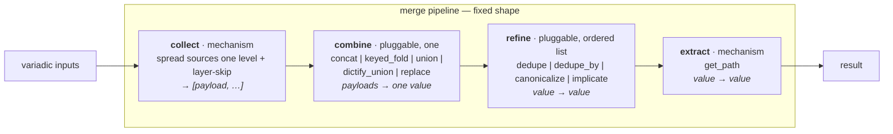

# merge-star draft1 — a fixed-step, pluggable merge pipeline (consistency-first)

> **For reviewers:** draft1 is a full revision of
> [`draft0`](/.design/merge-star/draft0.md), not a delta. It integrates
> three independent reviews
> ([glm52](/.design/merge-star/review0.glm52.md),
> [ds4f](/.design/merge-star/review0.ds4f.md),
> [gpt56t](/.design/merge-star/review0.gpt56t.md)) and the synthesis
> ([review0-syn0](/.design/merge-star/review0-syn0.glm52.md)), and applies
> one new governing principle (§1) that overrides a recommendation in the
> synthesis. My own critique of this design is in §13 — read it last.

## 1. Guiding principles

P1. **Fixed shape over free-form.** Every merge is
`(skip, collect, combine, refine[], extract)`, no more, no less. Strategies
are *presets* over that shape, looked up by name. We reject "bag of
composable passes."

P2. **Explicitness and consistency over backwards compatibility.** No
back-compat shims, no aliases, no dual call-forms. Where a call form is
ambiguous or redundant, **do the migration work** — remove the shim, fix
the call sites. This is the governing principle of draft1 (user directive;
see §10 for the concrete removals). It reverses the syn's "bless the
`_positional_strategy` shim" recommendation (§syn D4).

P3. **Bounded vocabulary.** A new use case asks two closed-vocabulary
questions ("which combine?", "which refines?"), never "invent a
pass-chain."

P4. **Presets are the only name.** Every strategy string and profile
resolves through a preset table. No strategy name is interpreted anywhere
else.

P5. **Type is expressed by *folds-over*, not by entry point.** Combines
are grouped by what they fold over (list-scalar / list-record / dict /
any), not by a list-vs-dict partition (draft0's split was decorative —
`keyed_fold` is list-of-dicts, `replace` is any-type).

P6. **`False` is an explicit signal, distinct from absence.** Skip has
three operation classes (absence / suppress / nuclear) and only the first
two are skip. `false` means `v is False` — strict identity, not falsy
(§4).

P7. **Contracts before extraction.** Current behavior is pinned by a
characterization test matrix (Stage 0) before any refactor runs (§11).

## 2. Situation — how we got here

The merge family today is two partly-overlapping modules plus helpers glue:

- [`merge.py`](/library/filter_plugins/merge.py) — `merge_list` /
  `merge_dict` (string-switch strategies), the `merge_*_subsys` /
  `subsys_publish` adapters, `_merge_keyed`, `_append_unique_by`,
  `_collect_payloads`, and the `skip` machinery.
- [`merge_strategy.py`](/library/filter_plugins/merge_strategy.py) —
  `merge_with_strategy` (per-field strategy dispatch), a **second**
  `_merge_keyed`, its own `STRATEGY_PROFILES`, its own validator.
- [`mergeKeyed.py`](/library/filter_plugins/mergeKeyed.py) — a third
  `merge_keyed` surface (public filter, wraps `merge_with_strategy`).
- [`helpers.py`](/library/filter_plugins/helpers.py) — `resolve_helpers`,
  the use case that surfaced the pipeline.
- [`arrayitize.py`](/library/filter_plugins/arrayitize.py) /
  [`listify.py`](/library/filter_plugins/listify.py) / the
  [`bin_composers._arrayitize`](/library/filter_plugins/bin_composers.py)
  copy — three list-shape helpers.
- [`merge_subsys.py`](/library/lookup_plugins/merge_subsys.py) — the
  **live consumer**; its `ARTIFACT_DEFAULTS` table
  ([`merge_subsys.py:111`](/library/lookup_plugins/merge_subsys.py)) is a
  third per-artifact strategy registry, and the one playbooks actually
  hit via `lookup('merge_subsys', id=…, contrib=…)`.

Three realizations drove this design (from draft0 §1, confirmed by the
reviews):

1. **The layered union was already a merge primitive.** `resolve_helpers`
   delegates to `merge_list(strategy='append_unique')` with a `skip=`.
2. **`arrayitize` is a redundant normalizer** — but see the correction in
   §10.4: `listify` is *not* a normalizer duplicate; only its `concat`
   filter is.
3. **`resolve_helpers` still hardcodes helpers policy** (`report → loud`
   implication, `HELPERS` reordering). A general combinator shouldn't know
   a behavior field's name.

## 3. The pipeline — fixed shape, mechanism fixed at the edges



| stage | contract | pluggable? | role |
|---|---|---|---|
| `collect` | `(*inputs, single, skip) → [payload, …]` | **mechanism fixed**; skip policy is the only knob | spread sources one level into payloads; apply layer-skip per payload (§4) |
| `combine` | `(payloads, args…) → value` | **pluggable, exactly one** | fold payloads into one value (§5) |
| `refine` | `(value, args…) → value` | **pluggable, ordered list**, empty by default | post-combine transforms (§6) |
| `extract` | `(value, path) → value` | **mechanism fixed** — [`get_path`](/library/filter_plugins/get.py) | dotted-path get |

Notes on the shape:

- **`skip` stays inside `collect`, not a stage.** It filters *during*
  gather; a separate `filter` stage would be empty for every preset that
  isn't `resolve_helpers`.
- **No per-payload `map=` slot in `collect`.** Per-payload transforms
  belong to the combine (see §5 `dictify_union`). This is the resolved
  answer to draft0's "where does dictify live" (§3 of the syn): a combine
  that parses-first is still a fold; collect stays mechanism-only.
- **`_as_list` / `_as_dict` / `dictify` are combine-internal concerns,**
  exactly as today — `concat` calls `_as_list`, `union` calls `_as_dict`,
  `dictify_union` calls `dictify`. They are not collect stages.

## 4. Skip semantics — three operation classes, layer-only

The skip concept carries **three distinct operation classes**. Only two of
them are skip; the third is a caller-side guard. This naming is the fix
for gpt56t's "layer vs element" concern and ds4f's "`helpers: False`"
catch.

| class | example | predicate | meaning | where it lives |
|---|---|---|---|---|
| **absence** | `item.base_helpers` unset | `undefined` / `none` | noise; the layer wasn't provided | **skip**, default-on (`skip="none,undefined"`) |
| **suppress** | `base_helpers: False` | `false` = `v is False` | **explicit signal**: this layer contributes nothing | **skip**, opt-in (`skip="…,false"`) |
| **nuclear** | `helpers: False` (helpers.py:68) | n/a | a sentinel that **aborts the whole merge** | **NOT skip.** caller-side guard, before the pipeline runs |

Key facts, verified against the running code:

- **`false` is `v is False`, not falsy.** `0`, `""`, `[]`, `{}`, `None`
  are *not* matched. (`_SKIP_CHECKS` in
  [`merge.py:113`](/library/filter_plugins/merge.py).) This is P6.
- **`False`-layer and `[False]`-layer are distinguishable.** Verified:
  `merge_list([a, False, b], skip="false")` → `[a, b]` (suppressed), but
  `merge_list([a, [False], b], skip="false")` → `[a, [False], b]` (kept
  whole), and a `False` *inside* a list-layer survives one-deep spread.
  gpt56t's claimed conflation does not occur under the current one-level
  spread.
- **Skip is layer-only.** Spreading is exactly one level: each element of
  a spread list-source *is* a payload. A payload that is itself a list is
  admitted whole — there is no deeper element filter. This is the current
  behavior; we **document it as the contract** rather than change it.

**Contract statement (for the Stage 0 test matrix):** skip predicates
apply to each payload as it is admitted from a source; never to elements
inside a payload. Default `{none, undefined}`; `false` and `empty` are
opt-in. Nuclear opt-out is never modeled by the pipeline.

## 5. Combines — one, chosen by preset, grouped by *folds-over*

Every payload list is folded by exactly one combine. `_as_list` /
`_as_dict` / `dictify` normalization happens inside the combine, not in
collect.

| combine | folds-over | contract | today |
|---|---|---|---|
| `concat` | list-scalar | append payloads end-to-end (each via `_as_list`) | 🟡 inline in `_merge_list_values` |
| `keyed_fold` | list-record | merge dict records by a key field; on overlap, concat `concat_fields` (**tag-preserving**) and let incoming win the rest; keyed records follow first-key position, non-keyed items move to last occurrence | 🟡 `_merge_keyed` **defined three times** (merge.py / merge_strategy.py / mergeKeyed.py) |
| `union` | dict | left-to-right `\|`, later wins | 🟡 inline in `_merge_dict_values` |
| `dictify_union` | dict | `dictify` each payload, then `union` | 🟡 inline in the `tool_versions_overlay` branch |
| `replace` | any | last non-`None` payload wins wholesale | 🟡 merge_strategy-only, type-agnostic |

Decisions carried into these rows:

- **`keyed_fold` is a combine, not `concat + refine`** (all three reviews):
  merging overlapping records field-by-field with `concat_fields` is a
  genuine pairwise fold a post-combine refine can't reproduce.
- **`replace` is `any`-type** (all three reviews): it is not a dict
  combine. The list/dict table split is gone; grouping is by folds-over.
- **`dictify_union` is a named combine** (ds4f + gpt56t; my flipped
  lean, §3 of the syn): `tool_versions_overlay = (dictify_union, [])`.
  One consumer today; if a second parse-then-merge appears, add another
  named combine — premature generalization is the more expensive mistake.
- **One `keyed_fold`, the tag-preserving one.** `merge.py`'s
  `_merge_keyed` uses `_concat_strings_preserving_tags`
  ([`merge.py:296`](/library/filter_plugins/merge.py)); the
  `merge_strategy.py` copy drops datatags ([`merge_strategy.py:46`](/library/filter_plugins/merge_strategy.py)).
  Keep merge.py's; deleting the duplicate is a **fix**, not a dedupe, with
  an explicit tag-propagation test.

## 6. Refines — closed vocabulary, pinned contracts

Applied to the single combined value, in order. Empty by default.

| refine | contract | today |
|---|---|---|
| `dedupe` | stable first-seen dedupe; identity is `str(value)` (documented wart, see §13) | 🟡 `_dedupe_preserve` exists, unregistered |
| `dedupe_by` | dedupe a list of records by a key field; **first-key position retained, last occurrence's value wins** | 🟡 mis-filed as the `append_unique_by` combine-op |
| `canonicalize` | reorder a list against a registry, drop unknowns | ❌ hardcoded in `resolve_helpers` |
| `implicate` | pull in dependencies from a graph `x → [deps]`; transitive to fixpoint; **cycles = error; unknown node = ignored; non-mutating** | ❌ hardcoded in `resolve_helpers` |

Contract pinning (gpt56t's contribution, adopted):

- **`dedupe_by` ordering is asymmetric on purpose**: `dedupe` is
  first-seen-wins, `dedupe_by` is last-value-at-first-position-wins. Both
  are tested.
- **`implicate` gets an explicit spec**: transitivity, cycle policy
  (error), unknown-node policy (ignore), and copy-not-mutate semantics.
  Its output must remain a valid `canonicalize` input.
- **Combine identities and leniency are stated per combine** (Stage 0
  tests): `concat`/`keyed_fold` coerce non-lists via `_as_list`;
  `union`/`dictify_union` coerce non-dicts via `_as_dict`; `replace`
  means *latest non-`None`*, not last payload.

## 7. Registries — value presets vs field profiles

Two typed registries, one module. This is the resolved answer to
draft0's Stage G "same definition" problem (§syn D1): a value preset and
a field profile are *different kinds of thing* and cannot be "the same
definition."

```python
VALUE_PRESETS: dict[str, Preset] = {
    #   name:                 (combine,            refine,             folds-over)
    "append":                 ("concat",           [],                 "list-scalar"),
    "append_unique":          ("concat",           ["dedupe"],         "list-scalar"),
    "append_unique_by":       ("concat",           ["dedupe_by"],      "list-record"),
    "merge_keyed":            ("keyed_fold",       [],                 "list-record"),
    "bins_generated":         ("keyed_fold",       [],                 "list-record"),
    "overlay":                ("union",            [],                 "dict"),
    "tool_versions_overlay":  ("dictify_union",    [],                 "dict"),
    "replace":                ("replace",          [],                 "any"),
    "helpers":                ("concat",           ["dedupe", "implicate", "canonicalize"], "list-scalar"),
}

FIELD_PROFILES: dict[str, dict[str, str]] = {
    #   name                → {field: VALUE_PRESET name}   (references, never re-defines)
    "bins_generated":         {"BINS": "bins_generated"},
    "subsystem_contrib":      {"ETC_FILES": "append", "BINS": "append",
                               "ENV": "overlay", "ENV_LIST": "append_unique",
                               "PKGS": "append_unique"},
    "subsystem_artifacts":    {"ETC_FILES": "append", "LINKS": "append"},
}
```

- **`bins_generated` lives once** as a value-preset with
  `concat_fields=[early, generated, run_all]` (the superset — low-risk:
  only `merge_subsys` names it live, ds4f confirmed). The *field-profile*
  `bins_generated` references it. The old two-definition disagreement
  was a value-preset and a field-profile wearing the same name; with typed
  registries it dissolves.
- **`ARTIFACT_DEFAULTS` (`merge_subsys.py:111`) is the live projection.**
  It is already a `{artifact: {kind, strategy, …}}` table dispatching
  through `merge_list`/`merge_dict`. Stage G promotes it: it either
  *is* `FIELD_PROFILES` (the lookup's `strategy` values reference
  `VALUE_PRESETS`) or is derived from it. Playbooks must keep resolving.
- **`subsystem_contrib` / `subsystem_artifacts` are re-derived** into the
  single `FIELD_PROFILES` registry (P2 consistency: no second registry),
  and corrected: `subsystem_contrib.ENV` becomes `overlay` (the
  `dict_overlay` alias dies, §10.3), and their `BINS` no longer disagrees
  with `ARTIFACT_DEFAULTS`.
- **One validator** (Stage G): `_validate_list_strategy`,
  `_validate_dict_strategy`, `_validate_strategies` collapse into a
  single preset validator over `VALUE_PRESETS` + `FIELD_PROFILES`.

## 8. Preset map — every existing strategy as a preset

Combines and refines pick from §5/§6. "status" is the current
implementation state.

### List presets

| preset | combine | refine | description | status |
|---|---|---|---|---|
| `append` | `concat` | `[]` | payloads end-to-end, dupes kept | 🟡 inline |
| `append_unique` | `concat` | `[dedupe]` | end-to-end, first-seen-wins dedupe | 🟡 inline + `_dedupe_preserve` |
| `append_unique_by` | `concat` | `[dedupe_by(key)]` | end-to-end, last-per-key at first-key position | 🟡 mis-filed as combine-op |
| `merge_keyed` | `keyed_fold` | `[]` | records by key, concat overlapped fields | 🟡 three copies |
| `bins_generated` | `keyed_fold` | `[]` | `key=name`, `concat_fields=[early,generated,run_all]` | 🟡 two defs, disagree |
| `helpers` | `concat` | `[dedupe, implicate(DEPS), canonicalize(HELPERS)]` | layered helper resolution (§9) | 🟡 partial — `resolve_helpers` |

### Dict / any presets

| preset | combine | refine | description | status |
|---|---|---|---|---|
| `overlay` | `union` | `[]` | later payload wins each key | 🟡 inline (was `overlay`/`dict_overlay`) |
| `tool_versions_overlay` | `dictify_union` | `[]` | `dictify` each payload, then union | 🟡 inline in merge.py |
| `replace` | `replace` | `[]` | last non-`None` payload wholesale, any type | 🟡 merge_strategy-only |

### Field profiles (preset bundles)

| profile | bundles | status |
|---|---|---|
| `bins_generated` | `{BINS: bins_generated}` (references the value-preset) | 🟡 **was** two defs; now one |
| `subsystem_contrib` | per-field appends / `overlay` | 🟡 merge_strategy-only, re-derived |
| `subsystem_artifacts` | per-field appends | 🟡 merge_strategy-only, re-derived |
| `ARTIFACT_DEFAULTS` | the lookup's `{artifact: …}` table | 🟡 **live**; promoted in G |

## 9. Helpers as the example use case

`resolve_helpers` becomes a preset invocation over the generic pipeline.
Its helpers-specific data is *arguments* to general refines; the resolver
knows **no field names**.

```python
preset = "helpers"                     # (concat, [dedupe, implicate(DEPS), canonicalize(HELPERS)])
skip   = "false,none,undefined"        # absence + layer-suppress (P6)
```

Three responsibilities land where they belong:

- **`bypass → [report, guard]` — a layer contributed by `_bin`, before
  resolution.** `files/_bin` builds a template-local `helper_layers` list
  that conditionally appends `["report", "guard"]` when the bypass block
  will be rendered, then passes it to the generic resolver
  (`resolve_helpers(layers, preset="helpers")`). This respects gpt56t's
  template-ordering constraint: helper selection happens before the bypass
  block renders, so `_bin` must contribute the layer *up front*.
- **`report → loud` — the `implicate` refine**, with `DEPS={report:[loud]}`.
- **`canonicalize(HELPERS)` — the reorder-to-registry step.**

**Nuclear opt-out is caller-side, not skip.** `helpers: False` (and the
legacy `no_header`, which we remove, §10.2) empties the *entire* result,
not one layer. Per §4 this is a pre-pipeline guard: `_bin` skips helper
resolution when `item.helpers is False`. The pipeline never models
"poison."

`resolve_helpers` therefore shrinks to: `guard(nuclear) → run
(layers, preset="helpers", skip=…)`. The `bypass` field name exists only
in `files/_bin`, never in the merge family.

## 10. The consistency cleanup — "do the work" (P2)

This is draft1's governing-principle stage: **remove every back-compat
shim and alias; migrate the call sites.** Sized against the live tree.

| # | remove | why (P2) | live call sites | migration |
|---|---|---|---|---|
| 10.1 | `_positional_strategy` shim | `X \| merge_list('append_unique')` (positional strategy) makes a bare string payload ambiguous — the ambiguity P2 exists to kill | **14** `merge_list('…')` in tasks/, **0** `merge_dict('…')`, **0** op-dict positional | rewrite to `merge_list(strategy='…')`; bare-string payloads already documented to be wrapped |
| 10.2 | `no_header` legacy alias | a back-compat alias for `helpers: False` | **3** (`pw-surround.etc.pb:38,46`, `vars_systemd_unit.tasks:208`) | `no_header: true` → `helpers: False` |
| 10.3 | `dict_overlay` alias | `dict_overlay` ≡ `overlay`; one name only | **1** (`vars/template-strategy-vars.yaml:35`) + `subsystem_contrib.ENV` | → `overlay` |
| 10.4 | `arrayitize` + `bin_composers._arrayitize` | redundant normalizer (draft0's point), superseded by `as_list`/collect | **45** pipe-form sites (37 in yaml) + 2 python callers | → `as_list` (new public normalizer) or `merge_list(single=True)` where a merge is wanted |
| 10.5 | `listify.concat` filter | *literally* the `concat` combine wearing a filter costume | **1** (`k3s.srv.pb`) | → `merge_list(…, strategy='append')` or `as_list`-then-append |
| 10.6 | (keep) `listify` itself | **not** a normalizer duplicate — converts dict → list of `{key,value}` (`listify.py:10-11`), a distinct shape-transform with ~3 callers | 3 | leave as a public filter; out of merge scope |

Corrections carried from the review wave:

- `listify` is **not** the "4th list normalizer" ds4f called it; only its
  `concat` filter is redundant (10.5). The syn repeated ds4f's error here.
- The `as_list` normalizer replaces `arrayitize` with an **explicit
  contract**: `None`/undefined → `[]`; list/tuple/set → `list(…)`;
  scalar → `[scalar]`. Notably it does **not** reproduce `arrayitize`'s
  silent `True → []` / `False → []` special-casing
  ([`arrayitize.py:16`](/library/filter_plugins/arrayitize.py)) — under
  P2, `False` is an explicit value, not absence. Per-site characterization
  (Stage 0) guards any site that relied on the old dropping.

**Guiding-principle consequence:** the syn recommended blessing
`_positional_strategy` as permanent (cheap, bang 6.0). P2 overrides that:
14 call sites is a bounded, mechanical migration, and killing the
string-payload ambiguity removes a real footgun. This is the "do the
work" trade the user chose.

## 11. Staged plan

All stages are intended; order is load-bearing. Exit criteria are stated
as **invariants**, not "no switch remains" (a registry lookup still
dispatches — the invariant is *only the preset table interprets names*).

### Stage 0 — contracts & characterization tests (new)

Pin current behavior before any refactor. Adopt gpt56t's test matrix
verbatim: normalizer (None/undefined/True/False/string/dict/tuple/set/
non-list-Sequence), skip layer-vs-`[False]`-content, `dedupe_by`
first-position/last-value, `keyed_fold` list/string concat + order + tag
propagation, refines (transitivity/cycles/unknown/copy), profiles
(list-level and field-level `bins_generated`), helpers (bypass,
`helpers: False`, nuclear).

Exit: a green suite that captures today's behavior; every later change is
asserted against it.

### Stage D — pipeline core

Register the §5 combines and §6 refines as named functions; one
tag-preserving `keyed_fold` (delete two copies); simplify/confirm
`_collect_payloads` is layer-skip-only (§4); `_as_list`/`_as_dict`/
`dictify` stay combine-internal.

Exit: only the preset table interprets strategy names; one `keyed_fold`;
skip contract matches §4.

### Stage E — `merge_with_strategy` + `mergeKeyed` on the pipeline

Reimplement `merge_with_strategy` as per-field dispatch over
`VALUE_PRESETS` (its `into`/`single`/`aggregate`/`payload_path`
record-gathering kwargs are a *record*-level collect analog — keep them
in the adapter, not the pipeline). `mergeKeyed.py` becomes a one-line
field-profile dispatch (public name preserved, §10). Resolve
`bins_generated` to the superset.

Exit: one merge surface; `merge_with_strategy` composes on the pipeline;
`mergeKeyed` dispatches one preset.

### Stage F — the consistency cleanup (P2)

Execute §10: migrate the 14 positional `merge_list` sites; remove the
`_positional_strategy` shim; `no_header` (3) → `helpers: False`;
`dict_overlay` (1) → `overlay`; ship `as_list`, migrate 45 `arrayitize`
sites + 2 python callers, delete `arrayitize.py` and
`bin_composers._arrayitize`; retire `listify.concat` (1 site).

Exit: zero positional strategy forms; zero `no_header`; zero
`dict_overlay`; one list normalizer; no migrated site changes behavior on
`False`/`None`/undefined.

### Stage G — registry consolidation

One module hosting `VALUE_PRESETS` + `FIELD_PROFILES`; promote
`ARTIFACT_DEFAULTS` to the live projection; re-derive
`subsystem_contrib`/`subsystem_artifacts`; collapse the three validators
into one preset validator.

Exit: single source of truth per name across `merge_list`, `merge_dict`,
`merge_with_strategy`, `mergeKeyed`, and the `merge_subsys` lookup.

### Stage H — helpers end-to-end + subsys alignment

Rework `files/_bin` to build `helper_layers` (bypass layer contributed
up front, §9); generic `resolve_helpers(layers, preset="helpers")`;
nuclear guard in `_bin`. Liveness-check `subsys_publish` /
`merge_*_subsys` (ds4f: possibly dead code — confirm, then align or
delete); `_deep_merge_dicts` stays internal to `subsys_publish` and is
**explicitly excluded** from the pipeline (§12).

Exit: `resolve_helpers` knows no field names; every public merge surface
rides the pipeline or is documented as excluded.

## 12. Explicit exclusions / non-goals

- **`subsys_publish` + `_deep_merge_dicts` are NOT merges.** They mutate
  a context global (`SUBSYSTEM`) with a recursive deep-union semantic that
  none of `concat / keyed_fold / union / dictify_union / replace`
  expresses, and they're the *publish* half of the family. Excluded; kept
  internal to `merge.py`. (Liveness-checked in H before any cleanup.)
- **Free-form pass-chains** — rejected by P1.
- **Deep-union combine** — not added; no consumer (see previous bullet).
- **A polymorphic `merge` entry point** — not adopted. Two entry points
  (`merge_list`/`merge_dict`) stay; combines group by folds-over so the
  entry point does *type dispatch* and nothing more.
- **`dictify` as a `collect` map slot** — rejected (§3); it's
  `dictify_union`'s job.
- **`as_list` reproducing `arrayitize`'s `True/False → []`** — rejected
  (§10.4); `False` is an explicit value under P6.

## 13. Author's commentary — where I'd push back on this design

The user asked for my honest self-critique. Here it is.

**What I'm most confident in.** The fixed shape, the three-class skip
model (§4), the folds-over combine grouping (§5), and Stage 0 before D.
Those four resolve the deepest review concerns and I don't see a cleaner
alternative. The verified skip behavior (`False`-layer vs `[False]`-layer
distinguishable) genuinely simplifies the design — gpt56t's scariest
finding turned out to be a documentation question, not a refactor.

**What P2 costs, honestly.** This design makes Stage F *bigger*, not
smaller, and the syn explicitly rated "bless the shim" as the cheap path.
The 14 positional sites + 3 `no_header` + 1 `dict_overlay` + 45
`arrayitize` are real, mostly-mechanical work, and the "mostly" is the
risk: `as_list` changing `arrayitize`'s `False/True → []` behavior means
per-site verification, not a sed. I'm convinced it's the right trade (the
string-payload ambiguity is a genuine footgun, and compfuzor is <1.0), but
I want the reader to see that draft1 inherits the cost it once deferred.

**Where I'm least sure of myself.**

- **`dedupe` identity on `str(value)`.** I kept the existing behavior and
  documented it as a wart, because fixing it (equality-based) is
  non-trivial for unhashable dicts — a canonical-key dedupe is real work
  for zero current breakage. But "document the wart" sits awkwardly under
  P2. A principled P2 read says fix it; a pragmatic one says it's out of
  scope. I lean pragmatic, and I flag the tension rather than hide it.
- **`empty` skip predicate.** I kept it in the vocabulary but nothing in
  the live tree uses it. P2 arguably says drop it. I left it because
  dropping a predicate is a separate behavior decision and `empty` has a
  clean meaning; if Stage 0 shows no caller, cut it.
- **Removing `dict_overlay`.** It's a real alias with a real (if small)
  public footprint in docs/README. The migration is trivial; the question
  is whether the churn to docs and downstream users outweighs the
  consistency. P2 says yes; I'd accept "no" if we ever get a downstream
  consumer who objects. Low stakes either way.
- **`mergeKeyed` kept as a public name.** Under a strict P2 I'd rename it
  to something pipeline-native. I kept it because it's a public filter
  with real playbook callers, and "thin preset dispatch under a stable
  public name" is consistent without being a hack. This is the one place
  I'm consciously trading a bit of naming purity for not churning public
  API. Flag it.

**What I'd like a reviewer to attack.** (1) The claim that
`ARTIFACT_DEFAULTS` can be promoted to the projection without changing
lookup semantics — that needs an actual trace of every `contrib=` in the
tree. (2) The `implicate` cycle-as-error choice — a *loud* error could
break playbooks that today resolve cyclically by accident; maybe
cycle→ignore is safer. (3) Whether `subsystem_contrib` re-derivation
should live in Stage G or die in Stage F (the `BINS: append` vs
`bins_generated` disagreement there is one more place the truth needs a
single owner).

**Net:** draft1 trades draft0's caution (keep shims, keep aliases, mark
open questions) for decisiveness (resolve everything, remove the cruft,
do the migration). That is the right direction for a <1.0 project and it
is what the user asked for. The risk it introduces is migration churn
(Stage F), which Stage 0's characterization tests are designed to catch.

## References

- [`draft0.md`](/.design/merge-star/draft0.md) — the design this revises
- [`review0.glm52.md`](/.design/merge-star/review0.glm52.md),
  [`review0.ds4f.md`](/.design/merge-star/review0.ds4f.md),
  [`review0.gpt56t.md`](/.design/merge-star/review0.gpt56t.md) — the review wave
- [`review0-syn0.glm52.md`](/.design/merge-star/review0-syn0.glm52.md) — the synthesis this integrates
- [`merge.py`](/library/filter_plugins/merge.py) — `_merge_keyed:259`, `_concat_strings_preserving_tags:242`/`:296`, `_collect_payloads:425`, `_positional_strategy:411`, `_SKIP_CHECKS:113`, `_dedupe_preserve:37`
- [`merge_strategy.py`](/library/filter_plugins/merge_strategy.py) — duplicate `_merge_keyed:16` (untagged concat `:46`), `STRATEGY_PROFILES:70`, `replace:301`
- [`mergeKeyed.py`](/library/filter_plugins/mergeKeyed.py) — third `merge_keyed` surface
- [`merge_subsys.py`](/library/lookup_plugins/merge_subsys.py) — `ARTIFACT_DEFAULTS:111` (the live registry)
- [`helpers.py`](/library/filter_plugins/helpers.py) — `resolve_helpers:40`, nuclear guard `:68`, bypass-as-layer `:78`
- [`arrayitize.py`](/library/filter_plugins/arrayitize.py) — the redundant normalizer (`_normalize_single:15`, `True/False→[]:16`)
- [`listify.py`](/library/filter_plugins/listify.py) — dict→list-of-{key,value} (`:10-11`) + the redundant `concat` filter (`:17`)
- [`bin_composers.py`](/library/filter_plugins/bin_composers.py) — Python-internal `_arrayitize:23`
- [`files/_bin`](/files/_bin) — the bypass-block home; where `helper_layers` is built (§9, Stage H)
- [`bin-helpers/init.glm52.md`](/.design/bin-helpers/init.glm52.md) — the prior wave this grew from
