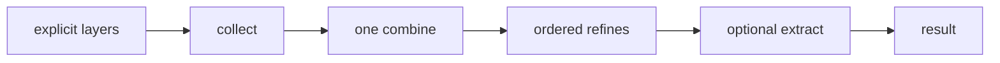
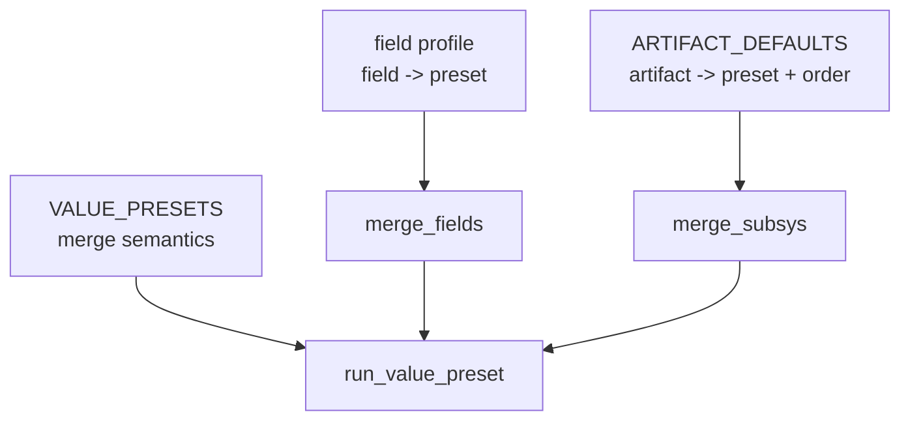

# merge-star draft1 — explicit layers, explicit presets, no compatibility surface

## 1. Decision

Draft0's core idea is correct: every value merge should have one fixed shape.



This revision makes the shape real instead of preserving the old API around
it. The old surface overloads:

- one input versus many inputs (`values`, `*extra`, `single`),
- a payload string versus a positional strategy string,
- a value preset versus a field-profile map,
- absence (`None`/undefined), suppression (`False`), and nuclear opt-out.

The governing decision is:

> **Pay the finite migration cost once. Do not preserve ambiguity forever.**
> A caller must declare layers and name a preset explicitly. Removed spellings
> fail loudly; they are not aliased, parsed, or silently reinterpreted.

This is intentionally breaking. It is a design simplification, not a
deprecation plan.

## 2. The target vocabulary

| term | definition | owns it |
|---|---|---|
| **layer** | one whole contribution to a merge. Its contents are opaque to collect. | caller |
| **combine** | one registered fold from surviving layers to one value. | merge core |
| **refine** | one registered transform over the combined value. | merge core |
| **value preset** | a name or configured spec selecting one combine and ordered refines. | merge core |
| **field profile** | a per-field map whose leaves name value presets. It is not itself a value preset. | caller |
| **artifact policy** | lookup-specific configuration of artifact order and value preset. | `merge_subsys` |
| **normalizer** | conversion of one ordinary value to a list. It is not a merge. | `as_list` |
| **nuclear opt-out** | caller-specific instruction to produce no result, before merge starts. | caller |

The ownership split is the central cleanup:



There is one central semantic registry, `VALUE_PRESETS`. A field profile and
`ARTIFACT_DEFAULTS` may reference a preset but may not restate its combine,
refines, `concat_fields`, kind, or identity. This absorbs the two competing
`bins_generated` definitions without pretending that a value merge and a
per-field policy are the same kind of object.

## 3. The public API

```python
merge_list(layers, *, preset="append", skip_layers=("none", "undefined"), get=None)
merge_dict(layers, *, preset="overlay", skip_layers=("none", "undefined"), get=None)
merge_fields(records, *, profile, get=None)
as_list(value)
```

### 3.1 Layers are always explicit

`layers` is one sequence. Each member is one layer. No entrypoint accepts
variadic payloads and no entrypoint has `single=`.

```jinja
{# three explicit helper layers #}
{{ [DEFAULT_HELPERS, item.base_helpers, item.helpers]
   | merge_list(
       preset='append_unique',
       skip_layers=['none', 'undefined', 'false']) }}

{# one list-valued layer, not three layers #}
{{ [item.helpers] | merge_list(preset='append') }}
```

`collect` does not flatten a layer. `concat` may normalize a surviving layer
as part of its own combine contract. This keeps collection and combination
separate, and removes the old `values` / `*extra` / `single` ambiguity.

### 3.2 Presets are keyword-only

`preset=`, not `strategy=`, selects a merge semantic. There is no positional
strategy support and no `op` envelope.

```jinja
{# removed: X | merge_list('append_unique') #}
{{ X | merge_list(preset='append_unique') }}

{# removed: merge_list(default, base, author, strategy='append_unique') #}
{{ [default, base, author] | merge_list(preset='append_unique') }}
```

The Python signatures have no positional `*extra`, so the removed spelling
raises an argument error instead of adding `'append_unique'` to output data.

A configurable value preset has an explicit shape:

```jinja
{{ [current_bins, incoming_bins]
   | merge_list(preset={
       'name': 'merge_keyed',
       'key': 'name',
       'concat_fields': ['early', 'generated', 'run_all'],
     }) }}
```

`dict_overlay`, `env_overlay`, positional strings, `strategy=`, and `op` are
removed. There are no aliases or deprecation shims.

### 3.3 Field merging is structurally explicit

`merge_with_strategy` becomes `merge_fields`. It receives fully prepared
records and an explicit field profile. The old record-gathering options
(`aggregate`, `include_aggregate`, `payload_path`, `into`, and `single`) are
removed; callers prepare records using ordinary data construction.

```jinja
{{ merge_fields(
     [base_contrib, incoming_contrib],
     profile={
       'BINS': {'preset': 'bins_generated'},
       'ENV': {'preset': 'overlay'},
       'PKGS': {'preset': 'append_unique'},
       'artifacts': {'fields': {
         'LINKS': {'preset': 'append'},
       }},
     }) }}
```

`{'preset': ...}` is a leaf. `{'fields': ...}` is a nested profile. The two
are intentionally non-overlapping, unlike the old ambiguous `{op: ...}` /
nested-map distinction.

`mergeKeyed` is deleted. Its callers use `merge_list` with an explicit
`merge_keyed` or `bins_generated` preset.

## 4. Collect: False is an explicit layer signal

```text
collect(layers, skip_layers) -> surviving layers
```

`skip_layers` applies only to top-level layers. It never examines the contents
of a surviving layer. Its predicates are exact, composable names:

| name | test | meaning |
|---|---|---|
| `none` | `value is None` | absent layer |
| `undefined` | Ansible undefined | absent layer |
| `false` | `value is False` | explicit layer-suppression signal |
| `empty` | empty text, sequence, or mapping | explicit empty-layer policy |

`false` means **literal `False` only**. It is not a truthiness test.

| layer | `skip_layers` includes `false` | result |
|---|---|---|
| `False` | yes | suppress that layer |
| `False` | no | keep `False` as a data layer |
| `[False]` | yes | keep a layer containing the data value `False` |
| `['env', False, 'loud']` | yes | keep the inner `False` as data |
| `None` / undefined | default | suppress as absence |

This is not hypothetical: it is the behavior of today's one-deep collection
when layers are represented correctly. Draft1 turns it into an explicit API
contract rather than calling all filtering "skip."

Three operations are distinct:

| operation | example | location |
|---|---|---|
| **absence** | missing `base_helpers` | default layer skip (`none`, `undefined`) |
| **suppression** | `base_helpers: False` | opt-in layer skip (`false`) |
| **nuclear opt-out** | `helpers: False`, `no_header: true` | caller-side guard before pipeline |

The nuclear condition is deliberately not a skip predicate. It would mean
"erase all layers," whereas suppression means "this one layer contributes
nothing." Keeping them separate resolves the actual helpers issue without
weakening the useful `False` signal.

## 5. Combine and refine vocabularies

### 5.1 Combines

Combines are classified by what they fold over, not by a leaky list/dict
partition:

| combine | layers accepted | identity | result |
|---|---|---|---|
| `concat` | scalars and list-like values | `[]` | list |
| `keyed_fold` | lists of keyed records | `[]` | list of records |
| `union` | mappings | `{}` | mapping |
| `dictify_union` | mappings or tool-version shorthand | `{}` | mapping |
| `replace` | any value | `None` | last surviving value |

`replace` is an any-type combine, chiefly used through `merge_fields`.
`merge_list` and `merge_dict` reject presets whose declared result kind does
not match the entrypoint.

`keyed_fold` has one implementation: the tag-preserving version currently in
[`merge.py`](/library/filter_plugins/merge.py). The untagged duplicate in
[`merge_strategy.py`](/library/filter_plugins/merge_strategy.py) is deleted.
The target contract pins:

- first appearance determines a keyed record's position;
- last matching record supplies ordinary fields;
- configured list fields concatenate;
- configured string fields newline-concatenate and preserve Ansible datatags;
- non-keyed values preserve their last occurrence.

### 5.2 `dictify_union`, not a collect map slot

`tool_versions_overlay` accepts both maps and shorthand:

```yaml
TOOL_VERSIONS: [go, {python: "3.13"}]
```

It needs `dictify` on *each layer* before union. A refine cannot do that,
because union needs mappings before refinement. The credible choices were:

| option | shape | decision |
|---|---|---|
| collect map slot | `collect(layers, map=dictify)` then `union` | reject: collect becomes a general transform stage for one consumer |
| dedicated combine | `dictify_union(layers)` | accept: explicit one-consumer fold, no new stage capability |
| refine | `union` then `dictify` | impossible: the raw layer boundaries are already gone |

`dictify_union` is deliberately small. A second real parse-then-merge
consumer is the threshold for reopening a generic pre-combine mapping slot.

### 5.3 Refines

| refine | target contract |
|---|---|
| `dedupe` | stable first-seen de-duplication; retain and document current `str(value)` identity in this work |
| `dedupe_by(key)` | first key position, last matching record value |
| `implicate(graph)` | transitive closure; registered graphs are acyclic; unknown selected values pass through |
| `canonicalize(registry, drop_unknown)` | canonical registry order; unknown-value policy is explicit |

Refines return new values; they do not mutate their input. Helpers use:

```text
helpers = concat
        + dedupe
        + implicate({report: [loud]})
        + canonicalize([env, setopts, loud, report, guard], drop_unknown=True)
```

`dedupe_by` is a refine because it sees the concatenated sequence; keyed
field merge is a combine because it needs pairwise fold state. This preserves

## 6. Value presets and consumers

```python
VALUE_PRESETS = {
    "append": {"combine": "concat", "result": "list"},
    "append_unique": {
        "combine": "concat",
        "refines": ["dedupe"],
        "result": "list",
    },
    "append_unique_by": {
        "combine": "concat",
        "refines": ["dedupe_by"],
        "result": "list-record",
    },
    "merge_keyed": {"combine": "keyed_fold", "result": "list-record"},
    "bins_generated": {
        "combine": "keyed_fold",
        "key": "name",
        "concat_fields": ["early", "generated", "run_all"],
        "result": "list-record",
    },
    "overlay": {"combine": "union", "result": "dict"},
    "tool_versions_overlay": {"combine": "dictify_union", "result": "dict"},
    "replace": {"combine": "replace", "result": "any"},
}
```

`bins_generated` exists once and includes the full `[early, generated,
run_all]` contract. The old reduced `generated`-only strategy is removed.

[`merge_subsys.py`](/library/lookup_plugins/merge_subsys.py)'s
`ARTIFACT_DEFAULTS` is the live consumer policy map. It remains local to the
lookup, but only references central presets:

```python
ARTIFACT_DEFAULTS = {
    "BINS": {"preset": "bins_generated", "order": "current-first"},
    "PKGS": {"preset": "append_unique", "order": "current-first"},
    "ENV": {"preset": "overlay", "order": "incoming-first"},
    "TOOL_VERSIONS": {
        "preset": "tool_versions_overlay",
        "order": "incoming-first",
    },
}
```

Preset metadata supplies identity and result kind, so policy does not repeat
`kind` and `default`. `merge_subsys` uses result kind to select list or dict
entrypoints and uses `order` to construct its explicit layers.

The unused named `subsystem_contrib` and `subsystem_artifacts` profiles are
removed. Their docs migrate to explicit profiles. The repository has no
internal playbook caller that justifies a second global profile registry.

## 7. Helpers: generic merge, local policy

[`files/_bin`](/files/_bin) decides nuclear opt-out and creates all helper
layers before it asks the generic merge core to resolve them:

```jinja



```

This preserves both desired behaviors:

- `base_helpers: False` suppresses only that layer;
- `helpers: False` and `no_header: true` produce no helpers at all.

The generic merge core has no knowledge of `bypass`, `report`, `guard`, or
the helper registry. `_bin` owns bypass policy because it owns the bypass
block and must select helpers before rendering it.

## 8. Normalization is deliberately strict

`arrayitize`, `listify`, and `bin_composers._arrayitize` are overlapping but
not equivalent. The replacement does not imitate their truthiness behavior:

```text
as_list(undefined or None) -> []
as_list(list / tuple / set / non-string Sequence) -> list(value)
as_list(any scalar, including False, True, 0, string, mapping) -> [value]
```

`False` is data in `as_list`. It becomes a suppression signal only when it
occupies a declared merge-layer position and the caller opts into `false`.

Migration is classification work, not a search-and-replace:

| old behavior needed | replacement |
|---|---|
| scalar/list normalization, preserving `False` | `as_list` |
| `False` means no value | explicit caller policy before `as_list` |
| mapping-to-record list from `listify` | explicit mapping transformation |
| concatenate normalized values | explicit `merge_list(layers, preset='append')` |

All `arrayitize`, `listify`, local `_arrayitize`, and legacy `concat` filter
calls migrate. Then the old filters are deleted; there is no compatibility
alias.

## 9. Delivery plan

### Stage 0 — target-contract tests

Write target tests before changing API or callers. They assert intended
semantics, not accidental legacy behavior:

1. top-level `False` layers versus `[False]` and inner `False` data;
2. `as_list` for undefined, None, False, True, zero, strings, mappings, and
   non-string sequences;
3. removed positional strategy, `strategy=`, aliases, `single`, and variadic
   forms fail;
4. combine identities, type validation, and `replace`'s last-surviving rule;
5. `dedupe`, `dedupe_by`, keyed-fold order, and tag propagation;
6. implication transitivity/cycles/unknowns and canonicalization policy;
7. `dictify_union` shorthand/mapping/error cases;
8. helper nuclear opt-out, layer suppression, bypass layer, and canonical
   helper order;
9. `merge_fields` leaf/nested profile syntax and any-type `replace`.

**Exit:** tests state the new contract and assert legacy forms are rejected.

### Stage 1 — value pipeline

1. Implement the fixed pipeline and `VALUE_PRESETS`.
2. Extract combines/refines as registered functions.
3. Move to the tag-preserving keyed fold and delete its duplicate.
4. Publish only the new `merge_list`, `merge_dict`, and `as_list` surface.

**Exit:** only the value-preset resolver interprets a preset name; no public
entrypoint parses positional strategy strings or variadic payloads.

### Stage 2 — repository cutover

Migrate all in-repository templates, playbooks, tests, docs, and lookup calls
to explicit layers and `preset=`. Representative rewrites:

| old | new |
|---|---|
| `X \| merge_list('append_unique')` | `X \| merge_list(preset='append_unique')` |
| `merge_list(a, b, strategy='append')` | `[a, b] \| merge_list(preset='append')` |
| `X \| merge_dict(strategy='overlay', single=true)` | `[X] \| merge_dict(preset='overlay')` |
| `mergeKeyed(a, b, key='name')` | `[a, b] \| merge_list(preset={'name': 'merge_keyed', 'key': 'name'})` |

Delete `_positional_strategy`, `mergeKeyed`, old aliases, `strategy=`, and
old docs in the same cutover. No shim survives it.

**Exit:** repository search finds no old spelling; rendering tests use only
the explicit API.

### Stage 3 — field and artifact consumers

1. Implement `merge_fields` over value presets; delete `merge_with_strategy`.
2. Migrate `ARTIFACT_DEFAULTS` to `preset + order` and derive kind/default
   from preset metadata.
3. Remove stale global field profiles; use explicit profile values where a
   field merge is still required.
4. Make `_bin` construct bypass helper layers before calling the helpers
   preset.

**Exit:** no consumer can fork merge semantics by restating an operation.

### Stage 4 — normalizer cutover

1. Classify every `arrayitize`, `listify`, and local normalizer use by its
   intended False semantics.
2. Migrate to strict `as_list` or spell the other transformation explicitly.
3. Delete the old normalizers and their documentation.

**Exit:** `as_list` is the one generic list normalizer and never contains
truthiness-driven omission.

### Stage 5 — subsystem-publish boundary

`subsys_publish` uses recursive `_deep_merge_dicts`; it publishes subsystem
state and is not a value merge. First verify liveness:

- unused: delete it and `merge_list_subsys` / `merge_dict_subsys` after any
  caller migration;
- used: move it behind a named subsystem-publish boundary and document it as
  outside merge-star.

**Exit:** every surviving public operation is either a pipeline entrypoint, a
normalizer, or a clearly separate publish operation.

## 10. Author's commentary

The review wave made this problem look larger by exposing real omissions:
the live `ARTIFACT_DEFAULTS` consumer, `mergeKeyed`, `listify`, the tag loss,
and helper nuclear opt-out. But the right response is not more layers of
compatibility. It is fewer interpretations:

- one declared layer shape;
- one named semantic registry;
- one explicit syntax for selecting a preset;
- `False` as an exact signal rather than a fuzzy truthiness convention;
- nuclear behavior visibly outside the value pipeline.

The deliberate break is the point. The old API forces every reader to wonder
whether a value is a layer, an element, a strategy, or a compatibility quirk.
The new API makes that answer visible at each call site. This repository has
a bounded call surface; doing the migration is cheaper than carrying those
questions indefinitely.

The restraint is equally important: do not make collect a general transform
stage for one `dictify` consumer, do not pull deep subsystem publishing into
the merge algebra, and do not opportunistically change dedupe identity while
extracting it. The design gets strict where the current surface is ambiguous
and stays narrow where no evidence demands more machinery.

## 11. References

- [`draft0.md`](/.design/merge-star/draft0.md)
- [`review0.glm52.md`](/.design/merge-star/review0.glm52.md)
- [`review0.ds4f.md`](/.design/merge-star/review0.ds4f.md)
- [`review0.gpt56t.md`](/.design/merge-star/review0.gpt56t.md)
- [`review0-syn0.glm52.md`](/.design/merge-star/review0-syn0.glm52.md)
- [`merge.py`](/library/filter_plugins/merge.py)
- [`merge_strategy.py`](/library/filter_plugins/merge_strategy.py)
- [`merge_subsys.py`](/library/lookup_plugins/merge_subsys.py)
- [`helpers.py`](/library/filter_plugins/helpers.py)
- [`dictify.py`](/library/filter_plugins/dictify.py)
- [`arrayitize.py`](/library/filter_plugins/arrayitize.py)
- [`listify.py`](/library/filter_plugins/listify.py)
