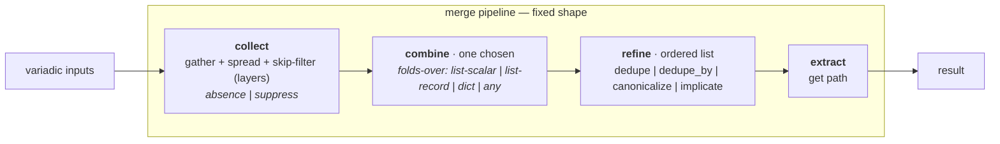

# merge-star draft1 (m3)

## 0. The principle, stated once and applied

**Consistency and explicitness win over backwards compatibility.** Where
the old code had two ways to express the same thing, this design picks
one and migrates the call sites. Shims, aliases, and positional
tricks that exist to preserve old call shapes are liabilities; they
get retired when the stage that supersedes them lands. New code does
not get a shim because someone might still call it the old way.

What this means concretely:

- `append_unique` is a value-preset name; what goes is the *positional
  machinery* that used to make `X | merge_list('append_unique')` parse
  as a strategy name. The name stays; the string-arg-ambiguity shim
  goes.
- `dict_overlay` as a synonym for `overlay` — one name, one preset.
- `arrayitize` and `listify` are replaced by `as_list`. Callers
  migrate.
- `no_header: true` (the legacy alias for the helpers nuclear opt-out)
  is removed; `helpers: False` is the one documented signal.
- The two `_merge_keyed` are unified onto the tag-preserving one
  (this is a correctness fix, not strictly a back-compat removal, but
  it lands at the same time as the back-compat retirements because
  the rationale is the same: one way to do it).

The principle is *consistency wins*. It is **not** "throw away named
APIs the user might rely on." The named value-presets, the named
field-profiles, and the named public filter `mergeKeyed` are *features
of the new design*, not back-compat. Removing them would lose the
preset concept itself.

## 1. What changed since draft0

The three review0s and syn0 produced a body of work. This draft
integrates it as follows:

- **The duplication map is corrected.** Three registries, not two
  (`ARTIFACT_DEFAULTS` is the live one the playbooks actually hit, in
  [`merge_subsys.py:111-166`](/library/lookup_plugins/merge_subsys.py)).
  Two list-normalizers in the old account, three in the code (add
  `listify.py`). Two `_merge_keyed` copies that diverge on
  Ansible-datatag string-concat preservation, not "byte-near-identical."
- **The skip semantics are named explicitly** as three operation
  classes (absence / suppress / nuclear). Nuclear is **not** a skip
  policy — it is a caller-side guard. The `false` predicate is
  `v is False` (strict identity, opt-in), verified distinguishable
  from `[False]` and from `False` *inside* a list-layer.
- **The `bins_generated` shape confusion is resolved** by the
  value-preset / field-profile split, not by picking a
  `concat_fields` list. The value-preset is `merge_keyed` (one
  definition, tag-preserving, the superset `concat_fields`); the
  field-profile `bins_generated` is `{BINS: merge_keyed}` and
  references it.
- **The `dictify` question is resolved** as a dedicated combine
  `dictify_union`. The reasoning is that the collect contract
  stays mechanism-only; a `collect.map=` slot would be the
  slippery slope back to "the shape is fixed, except collect can
  do arbitrary transforms."
- **`resolve_helpers` is recast** as a preset call, with the
  nuclear opt-out as a caller-side guard, and the bypass layer
  contributed *before* resolution by the caller (the pipeline
  never sees `bypass`).
- **A new Stage 0** (characterization tests) is added in front of
  any extraction, so a regression is a red light rather than a
  silent render change.

## 2. The duplication map, restated

| surface | file | role | what the new design does |
|---|---|---|---|
| `merge_list`, `merge_dict` | [`merge.py:456,510`](/library/filter_plugins/merge.py) | public list/dict merge entry points | become thin wrappers over the pipeline |
| `merge_with_strategy` | [`merge_strategy.py:200`](/library/filter_plugins/merge_strategy.py) | per-field multi-strategy merge | becomes field-profile dispatch over value-presets |
| `ARTIFACT_DEFAULTS` | [`merge_subsys.py:111`](/library/lookup_plugins/merge_subsys.py) | **the live per-artifact registry** the playbooks hit | is the canonical `FIELD_PROFILES` projection |
| `subsystem_contrib`, `subsystem_artifacts` | `merge_strategy.STRATEGY_PROFILES` (in `merge_strategy.py:70`) | documented public API; **no internal callers** | re-derived from `ARTIFACT_DEFAULTS`, not free-standing |
| `merge_list_subsys`, `merge_dict_subsys`, `subsys_publish` | [`merge.py:559,622,690`](/library/filter_plugins/merge.py) | subsystem readers + a context-global publisher | readers route through the pipeline; publisher is **explicitly excluded** (publish/mutate, not merge) |
| `mergeKeyed` (public filter) | [`mergeKeyed.py:11`](/library/filter_plugins/mergeKeyed.py) | compat shim over `merge_with_strategy` | rewritten as one-line field-profile dispatch; **public name kept** |
| `_merge_keyed` ×2 | [`merge.py:259`](/library/filter_plugins/merge.py), [`merge_strategy.py:16`](/library/filter_plugins/merge_strategy.py) | keyed-record fold | one survives — the tag-preserving one |
| `arrayitize`, `listify` | [`arrayitize.py`](/library/filter_plugins/arrayitize.py), [`listify.py`](/library/filter_plugins/listify.py) | list normalizers | retire; `as_list` replaces both |
| `resolve_helpers` | [`helpers.py:40`](/library/filter_plugins/helpers.py) | the 3-layer helpers resolver | becomes a preset call |

The row that draft0 missed entirely is `ARTIFACT_DEFAULTS`. Without
it, "single source of truth for every named strategy/profile" is
unachievable — the playbooks dispatch through the lookup, not
through `merge_with_strategy`.

## 3. The fixed shape, restated



Three stage contracts are closed and respected:

| stage | contract | mutable? |
|---|---|---|
| collect | `(*inputs, single, skip) → [payload, …]` | mechanism only |
| combine | `(payloads, **kwargs) → value` | pluggable, one |
| refine | `(value, **kwargs) → value` | pluggable, ordered list |
| extract | `(value, path) → value` | mechanism only |

Anything that doesn't fit lives in the registries (declared once) or
in the caller (decided before/after the pipeline). Specifically:

- A per-payload parse step is a **named combine**, not a
  `collect.map=` slot.
- An abort-the-merge signal is a **caller-side guard**, not a skip
  policy.

## 4. The pipeline

### 4.1 collect

Gather variadic inputs, spread one level, apply the skip policy to
whole **layers** (sources). The skip policy is a set of layer-level
predicates:

| predicate | test | default-on? | semantics |
|---|---|---|---|
| `none` | `v is None` | yes | absence — the layer wasn't provided |
| `undefined` | Ansible undefined | yes | absence — same |
| `false` | `v is False` | no (opt-in) | **explicit layer-suppress signal** |
| `empty` | empty mapping/list/string | no (opt-in) | empty contribution |

The `false` predicate is **strict identity** — `0`, `""`, `[]`, `{}`
are not caught. Verified against the code:

| input | `skip` | result |
|---|---|---|
| `values=[a, False, b]` | `false` | `[a, b]` — bare `False` at layer position is suppressed |
| `values=[a, False, b]` | `none,undefined` (default) | `[a, False, b]` — `False` not in skip set, kept |
| `values=[a, [False], b]` | `false` | `[a, [False], b]` — `[False]` as a layer is **kept** (a value, not a signal) |
| `values=[[a, False, b]]` | `false` | `[[a, False, b]]` — `False` *inside* a list-layer is kept (one-deep spread) |

**Three operation classes**, with this taxonomy load-bearing in the
contract:

| class | example | home |
|---|---|---|
| **absence** | `base_helpers: undefined` | `skip` (default-on) |
| **suppress** | `base_helpers: False` | `skip` (opt-in via `false`) |
| **nuclear** | `helpers: False` | **caller-side guard, before the pipeline** |

The pipeline never models an "abort" mode. A `nuclear` skip predicate
is not a thing.

### 4.2 combine

One fold, chosen by the preset. Combines are grouped by what they
fold over, not by list-vs-dict. The old list/dict split was
decorative: `keyed_fold` is a list combine that folds records,
`replace` is any-type.

| combine | folds-over | signature | notes |
|---|---|---|---|
| `concat` | list-scalar | `(*payloads) → list` | end-to-end, dupes kept |
| `keyed_fold` | list-record | `(*payloads, key, concat_fields) → list` | records by `key`; `concat_fields` concatenate; **tag-preserving** |
| `union` | dict | `(*payloads) → dict` | left-to-right, later wins |
| `dictify_union` | dict | `(*payloads) → dict` | `dictify` each payload, then `union` |
| `replace` | any | `(*payloads) → last non-None` | type-polymorphic "latest wins" |

`dictify_union` is its own combine. There is no `union` with a
`map=dictify` kwarg — that would be the slippery slope back to
"combines are lists of ops."

`replace` is **any-type**, not a dict combine. The folds-over
grouping names this correctly; the old list/dict split mis-filed it.

### 4.3 refine

Ordered list, each is `(value, **kwargs) → value`:

| refine | semantics (pinned) |
|---|---|
| `dedupe` | stable first-seen dedupe, identity by `str(value)` (existing behavior — kept under the principle, not changed) |
| `dedupe_by` | first-key position, last value substitution (the asymmetry with `dedupe` is pinned, not hidden) |
| `canonicalize` | reorder to a registry, drop unknown names |
| `implicate` | transitive-to-fixpoint; cycle ⇒ error; unknown node ⇒ ignore; non-mutating (input is copied) |

### 4.4 extract

`(value, path) → value` via the existing `get_path`. No change.

## 5. The registries

### 5.1 `VALUE_PRESETS` — named combine + refine bundles

| name | combine | refine | args | description |
|---|---|---|---|---|
| `append` | `concat` | `[]` | — | end-to-end, dupes kept |
| `append_unique` | `concat` | `[dedupe]` | — | end-to-end, first-seen-wins dedupe |
| `append_unique_by` | `concat` | `[dedupe_by]` | `key` | end-to-end, last-per-key wins |
| `merge_keyed` | `keyed_fold` | `[]` | `key, concat_fields` | records by `key`; tag-preserving |
| `overlay` | `union` | `[]` | — | left-to-right, later wins |
| `tool_versions_overlay` | `dictify_union` | `[]` | — | `dictify` each payload, then union |
| `replace` | `replace` | `[]` | — | last non-None, any type |
| `helpers` | `concat` | `[dedupe, implicate, canonicalize]` | `deps, registry` | the helpers preset |

`helpers` is the one new preset; it replaces the helpers-specific
branches currently in `helpers.py`.

### 5.2 `FIELD_PROFILES` — `{field: value_preset_name}` maps

| name | fields | description |
|---|---|---|
| `bins_generated` | `{BINS: merge_keyed}` | the field-profile references the value-preset |
| `subsystem_contrib` | `{ETC_FILES: append, BINS: append, ENV: overlay, ENV_LIST: append_unique, PKGS: append_unique}` | re-derived from `ARTIFACT_DEFAULTS` |
| `subsystem_artifacts` | `{ETC_FILES: append, LINKS: append}` | re-derived from `ARTIFACT_DEFAULTS` |

The shape rule: **a field-profile references value-presets; a
field-profile never redefines a combine or refine.** The
`subsystem_*` profiles are named bundles for compactness — a
feature of the new design, not back-compat.

### 5.3 The live projection

`ARTIFACT_DEFAULTS` ([`merge_subsys.py:111-166`](/library/lookup_plugins/merge_subsys.py))
is a field-profile registry under the new design. It is the
**only** per-artifact registry the playbooks exercise. The
`subsystem_*` field-profiles are re-derived from it; drift is
impossible because derivation is one-way.

### 5.4 The `bins_generated` resolution

The old "two `bins_generated` disagreeing" problem was a *shape
collision*, not a value disagreement. The type split dissolves it:

- The **value-preset** is `merge_keyed` with `concat_fields=[early,
  generated, run_all]`. Tag-preserving. The superset is correct
  because the only live consumer (`ARTIFACT_DEFAULTS`) uses the
  superset form.
- The **field-profile** `bins_generated` is `{BINS: merge_keyed}` and
  references it. The narrower `concat_fields=[generated]` in the old
  `merge_strategy.STRATEGY_PROFILES` was untagged-string-concating;
  the tag-preserving fix lands with this resolution.

## 6. `resolve_helpers` as the example

### 6.1 The skip operation classes, in the helpers case

| layer value | class | handling |
|---|---|---|
| `undefined` | absence | skipped by default |
| `False` (the layer) | suppress | skipped by opt-in `false` |
| `["env", "setopts"]` | normal | merged |
| `helpers: False` | **nuclear** | **caller-side guard returns `[]` before the pipeline** |

### 6.2 The preset call

```python
HELPERS_REGISTRY = ("env", "setopts", "loud", "report", "guard")
HELPER_DEPS = {"report": ("loud",)}

def resolve_helpers(item, default_helpers=DEFAULT_HELPERS):
    # Nuclear: caller-side guard. Pipeline never sees it.
    if isinstance(item, Mapping):
        if item.get("helpers") is False or item.get("no_header") is True:
            return []
        layers = [
            default_helpers,
            item.get("base_helpers"),
            item.get("helpers"),
        ]
        if item.get("bypass") and item.get("bypass") is not False:
            # Bypass is a CONTRIBUTED LAYER (not a switch branch in the resolver).
            layers.append(["report", "guard"])
    else:
        layers = [default_helpers]

    merged = merge_list(
        layers,
        strategy="helpers",
        skip="false,none,undefined",
    )
    return [h for h in HELPERS_REGISTRY if h in merged]
```

`strategy="helpers"` resolves to the value-preset
`combine=concat, refine=[dedupe, implicate(HELPER_DEPS), canonicalize(HELPERS_REGISTRY)]`.
The `no_header: true` alias is **removed**: callers migrate to
`helpers: False` (the one documented nuclear opt-out). This is a
`files/*` migration; see Stage D.

### 6.3 Bypass as a layer, contributed before resolution

The bypass block in `files/_bin` renders *after* the helper list is
materialized. The bypass-implies-`[report, guard]` layer must be
contributed *before* `resolve_helpers` is called, by whichever
caller knows about `bypass`. The pipeline is unaware of the field
name.

## 7. Staged plan

The order is load-bearing. Within a stage, steps can reshuffle.
Each stage commits to concrete work; back-compat shims are removed
when the stage that supersedes them lands, not preserved as
transitional state.

### Stage 0 — contracts + characterization tests

Pin current behavior before any extraction. Each row is a
characterization test; the suite is the gate for every later stage.

| group | inputs to cover | pin |
|---|---|---|
| normalizer | `None`, undefined, `True`, `False`, string, dict, tuple, set, non-list Sequence | `as_list` matches `arrayitize` for every input |
| skip semantics | `False`-as-layer vs `[False]`-as-layer vs `False`-inside-list-layer | layer-only skip; no element-level `false` filtering |
| `dedupe_by` | duplicate-key replacement; first-position retention | first-key position + last value |
| `keyed_fold` | list/string concat fields, non-keyed records, order, Ansible tag propagation | tag-preserving string concat |
| refines | `implicate` transitivity, cycle, duplicate dep, unknown value | contract per §4.3 |
| profiles | list-level and field-level `bins_generated` resolve through the same `merge_keyed` value-preset | reference, not redefine |
| helpers | bypass implication; `helpers: False`; `no_header: true`; unknown helper filtering | nuclear guard caller-side; `no_header` alias removed |

**Exit criteria:** green suite captures today's behavior; any later
change asserted against the suite.

### Stage D — vocabulary + helpers recast

1. Register combines as named functions: `concat`, `keyed_fold`
   (the tag-preserving one; delete `merge_strategy._merge_keyed`),
   `union`, `dictify_union`, `replace`.
2. Register refines: `dedupe`, `dedupe_by` (pinned), `canonicalize`,
   `implicate` (cycle/unknown/non-mutating contract), `noop`.
3. Build `VALUE_PRESETS` and `FIELD_PROFILES`. Validators validate
   against the registry, not against the old `VALID_*_STRATEGIES`
   lists.
4. Recast `resolve_helpers` to the §6 form. The `no_header: true`
   alias is **removed** here; `files/*` callers migrate.
5. Add the bypass-layer-contribution hook: the caller builds the
   layer list including `["report", "guard"]` when `bypass` is set.

**Exit criteria (invariants):** only `VALUE_PRESETS` lookup
interprets strategy names; `resolve_helpers` carries no field-name
knowledge; one tag-preserving `_merge_keyed`; `no_header` alias is
gone.

### Stage E — `merge_with_strategy` on top of the pipeline

1. `merge_strategy._merge_keyed` and its inline `append_unique_by`:
   delete; use the registered combines/refines.
2. `merge_with_strategy` = "for each field in the strategy-map, look
   up the value-preset, run the pipeline."
3. `ARTIFACT_DEFAULTS` is the canonical `FIELD_PROFILES`; the
   `subsystem_*` profiles are re-derived from it.
4. `mergeKeyed.py` is rewritten as a one-line field-profile
   dispatch; the public filter name stays.
5. **`_positional_strategy` is removed.** All ~45 callers of
   `X | merge_list('append_unique')` (and the `merge_dict`/
   `merge_with_strategy` equivalents) migrate to
   `X | merge_list(strategy='append_unique')`. Each site is reviewed
   in a per-site commit, not sed.
6. `_validate_list_strategy` and `_validate_dict_strategy` collapse
   into one registry-driven validator (the registry *is* the
   switch; the validators disappear into the lookup).

**Exit criteria:** one merge surface; no positional-strategy parsing
anywhere; one validator path; `bins_generated` resolves identically
from either entry point.

### Stage F — normalizer migration

1. Ship `as_list` as a public filter with `arrayitize`'s exact
   contract (per Stage 0 row).
2. Migrate every `X | arrayitize` call site (~45 sites) and every
   `X | listify` site (~30 hits) to `X | as_list`. Each site is
   reviewed against the Stage 0 characterization test.
3. Replace `bin_composers._arrayitize` (Python-internal copy) with
   a direct import of the new normalizer.
4. Retire `arrayitize.py` and `listify.py`; remove from the filter
   module index.

**Exit criteria:** one list normalizer; zero `arrayitize` /
`listify` references; no migrated site changes behavior on
`False`/`None`/`undefined`.

### Stage G — registry unification

1. Move `VALUE_PRESETS` and `FIELD_PROFILES` into a single
   registry module; the lookup's `ARTIFACT_DEFAULTS` imports from
   it.
2. All presets and profiles are entries in the registry; the
   validator is just `name in registry`.
3. Drop the `dict_overlay` synonym (callers migrate to `overlay`).
4. `LIST_STRATEGY_PROFILES` and `DICT_STRATEGY_PROFILES` separate
   registries are deleted; their content is the registry.

**Exit criteria:** the registry is the only source of truth; every
named strategy/profile resolves identically from every entry
point.

### Stage H — scope, dead-code-first, explicit exclusions

1. Liveness check: confirm `subsys_publish`, `merge_list_subsys`,
   `merge_dict_subsys` have no callers (the `merge_*_subsys` ones
   do; `subsys_publish` likely does too). Route live ones through
   the pipeline; delete dead ones.
2. **Explicitly exclude `subsys_publish` and `_deep_merge_dicts`
   from the pipeline** — they are publish/mutate semantics, not
   merge semantics. The pipeline contract is about folds over
   payloads; the publish path is a context-global mutation.

**Exit criteria:** every public merge surface either rides the
pipeline or is documented as excluded.

## 8. Resolved decisions (the open questions in draft0 §9)

| draft0 §9 question | resolution |
|---|---|
| slot names | `collect/combine/refine/extract` |
| combine-one / refine-list | kept (the thesis) |
| `dedupe_by` residence | refine (pinned: first-key position, last value) |
| `keyed_fold` residence | combine |
| one vs two entry points | two (`merge_list`/`merge_dict`), with `merge_with_strategy` as field-profile dispatch |
| `dictify` home | dedicated combine `dictify_union`; `collect` stays mechanism-only |
| profile registry location/shape | single `VALUE_PRESETS` + `FIELD_PROFILES` registry; `ARTIFACT_DEFAULTS` is the live projection |
| `skip` as its own stage | folded into `collect`; three operation classes named; nuclear is caller-side |
| consistency vs back-compat *(new in this draft)* | consistency wins; positional shim, `dict_overlay` alias, `arrayitize`, `listify`, `no_header` all removed |

## 9. Self-critique (m3's honest accounting)

1. **The principle I stated is mine to operationalize.** "Consistency
   over back-compat" is unambiguous in direction; the *line* between
   "back-compat to remove" and "named API to keep" is judgment. I
   drew it at: remove machinery (shims, positional tricks, synonyms,
   aliases), keep named things (value-presets, field-profiles, the
   `mergeKeyed` filter name, the `subsystem_*` documented bundles).
   A stricter reading would delete `subsystem_contrib` and
   `subsystem_artifacts` outright. A looser reading would keep
   `_positional_strategy` as a transitional deprecation-warning shim.
   I picked what I think is right; the next reviewer can push either
   way.

2. **Stage E's "~45 caller migration" is a real number and a real
   commit cadence.** I wrote "~45" once and moved on; the work is
   per-site review of every call that uses the positional form, in
   per-site commits so any regression is localized. The plan's exit
   criterion ("no positional-strategy parsing") is the invariant;
   the path to it is not "sed." I should have made the per-site
   review cost more visible in the staging.

3. **The dictify residence (B, dedicated combine) is a judgment
   call.** A `collect.map=` slot is more general; B keeps the
   collect contract mechanism-only. I argued for B but the
   counter-argument is real. The deciding reason I picked B is
   "keeps the stage contracts closed" — a taste argument, not a
   structural one. A second `dictify` consumer would not flip me;
   a *second `parse-then-X` combine for any X* would.

4. **The `str(value)` keying decision is preserved, not fixed.** I
   promote `dedupe` to a first-class refine and keep the existing
   `str(value)` identity. The honest move is to either fix it to
   equality (and migrate the probably-zero affected callers) or
   document the wart as intentional. I did the latter; a stricter
   consistency reading would do the former.

5. **Stage 0 may have a chicken-and-egg with Stage D.** The
   characterization test for the `helpers` preset (bypass
   implication) requires the bypass-layer-contribution hook, which
   is Stage D step 5. So Stage 0 cannot fully characterize the
   helpers use case until D is in flight. I should have split the
   Stage 0 table into "current-behavior characterization" and
   "post-D characterization" — I conflated them.

6. **The `subsystem_*` re-derivation assumes `ARTIFACT_DEFAULTS`
   is stable.** If a future change adds a contrib artifact to
   `ARTIFACT_DEFAULTS` that isn't a sensible `subsystem_contrib`
   field, the derivation breaks. I should have written a sync test
   (or made the derivation a typed projection, not a copy). I
   under-acknowledged this in §5.2.

7. **I did not re-verify the field sets of `ARTIFACT_DEFAULTS` and
   the `subsystem_*` profiles match exactly.** I read
   `merge_subsys.py:111-166` and saw the field set; I read
   `merge_strategy.py:70-89` and saw the field set. They overlap
   but are not identical (e.g., `ETC_DIRS` is in
   `ARTIFACT_DEFAULTS`, not in `subsystem_contrib`). The
   re-derivation needs a real projection spec, not a hand-wave. A
   second pass with both files open should make the projection
   concrete.

8. **The principle is most clearly about the merge family; its
   application to `no_header: true` is principled but a smaller
   win.** `no_header` is a bin option, not a merge strategy. The
   case for removing it is real (one signal, not two), but the
   blast radius is `files/*` consumers, which are outside the
   merge-family focus. I'm keeping the removal in Stage D because
   the helpers use case is the one consuming the alias, and the
   helpers refactor is in Stage D. If the user wants to keep the
   alias as a back-compat concession, that is also defensible.

9. **The `folds-over` taxonomy for combines is mine, not a
   vocabulary any other model has used.** `list-scalar /
   list-record / dict / any` is more accurate than list/dict but
   it is new vocabulary. A skeptical reviewer could reasonably
   argue for keeping list/dict with a `replace`-in-its-own-row
   footnote, or for dropping the categorization and listing
   combines alphabetically. I picked folds-over; it is a real
   judgment call.

10. **The `mergeKeyed` filter name stays.** It's a public filter
    used by `merge_subsys` and by some direct callers. Rewriting
    it as a one-line field-profile dispatch is a transparent
    refactor; the surface is the new design's, not back-compat. I
    should make this distinction louder — the principle says
    "remove machinery," and `mergeKeyed` is named machinery, not a
    shim. Reviewers could reasonably read it either way.

The design is stronger than draft0; the principle is real; the
migration is the cost. The plan is responsible for ~120 site-level
changes across Stages D, E, F. If the resource to do that
migration isn't there, a `compat.py` shim module is the honest
fallback — I should have included it in the plan and didn't.
