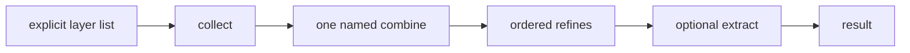
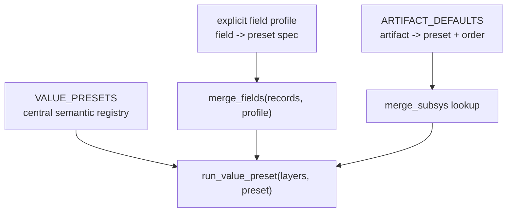

# merge-star draft2 — one explicit merge and normalization vocabulary

## 1. Decisions now locked

Draft0's fixed pipeline remains the right core. The design is now stricter:
we will migrate a finite repository surface rather than preserve alternate
spellings or half-overlapping helpers.



| decision | resolution |
|---|---|
| merge input shape | one explicit sequence of layers; no variadic payloads and no `single=` |
| merge selection | keyword-only `preset=`, not positional strategy strings, `strategy=`, aliases, or `{op: ...}` |
| `False` | explicit no-contribution signal: `as_list(False) -> []`; a top-level `False` layer suppresses only when caller opts into `false` skip |
| absence | `None` / undefined means missing contribution and is skipped by default |
| nuclear helpers opt-out | only `helpers: False`; remove `no_header: true` |
| local normalizers | one: `as_list`; delete `arrayitize`, `listify`, custom `concat`, and local copies |
| mapping-to-records | use Ansible built-in `dict2items`, not a Compfuzor filter |
| generic `dedupe` | stable Python equality, not `str(value)` identity |
| tool versions | dedicated `dictify_union` combine, not a general collect transform slot |
| compatibility | migrate all repository callers; removed API forms fail loudly |

The point is not to make every value look identical. It is to give each
operation exactly one named home:

- merge semantics belong to a named value preset;
- field selection belongs to an explicit field profile;
- artifact ordering belongs to the lookup's artifact policy;
- list presence normalization belongs to `as_list`;
- mapping-to-record conversion belongs to Ansible `dict2items`.

## 2. Ownership and the one central semantic registry

| concept | owner | rule |
|---|---|---|
| value preset | merge core | owns one combine, refines, result kind, and configured defaults |
| field profile | caller | `{field: preset-spec}`; can recurse via `{'fields': ...}`; never redefines merge semantics |
| artifact policy | `merge_subsys` | `{artifact: preset + order}`; references value presets and owns only lookup concerns |
| helper policy | `files/_bin` | decides nuclear opt-out and whether bypass contributes helper requirements |
| normalizer | `as_list` | turns one optional value into a list; does not merge |



`ARTIFACT_DEFAULTS` is not a field profile. It additionally owns lookup
order and was historically responsible for kind/default decisions. Draft2
moves kind/default into preset metadata, but keeps ordering and artifact
identity in the lookup policy where they belong.

The old named `subsystem_contrib` and `subsystem_artifacts` profiles have no
internal call sites. Remove them as runtime registry entries. Their docs may
show the same explicit profile data where it remains useful; a documented
example does not require a second global registry.

## 3. Public surface: deliberate break

```python
merge_list(layers, *, preset="append", skip_layers=("none", "undefined"), get=None)
merge_dict(layers, *, preset="overlay", skip_layers=("none", "undefined"), get=None)
merge_fields(records, *, profile, get=None)
as_list(value)
```

### 3.1 Explicit layers

`layers` is one sequence. Every member is one whole contribution. Collect
does not flatten a contribution; combines decide how to interpret it.

```jinja
{{ [DEFAULT_HELPERS, item.base_helpers, item.helpers]
   | merge_list(
       preset='append_unique',
       skip_layers=['none', 'undefined', 'false']) }}
```

There is no `*extra` and no `single=`. A one-payload merge uses `[value]`.
One-value normalization uses `as_list`.

### 3.2 Explicit presets

```jinja
{# removed: X | merge_list('append_unique') #}
{{ X | merge_list(preset='append_unique') }}

{# removed: merge_list(default, base, author, strategy='append_unique') #}
{{ [default, base, author] | merge_list(preset='append_unique') }}
```

The function signature rejects the removed positional spelling. It must not
silently append the old strategy name as data.

Configured presets use an explicit spec:

```jinja
{{ [existing, incoming]
   | merge_list(preset={
       'name': 'merge_keyed',
       'key': 'name',
       'concat_fields': ['early', 'generated', 'run_all'],
     }) }}
```

Remove `strategy=`, `_positional_strategy`, `dict_overlay`, `env_overlay`,
and `{op: ...}`. There is one name for each surviving preset.

### 3.3 Explicit field profiles

`merge_fields` replaces `merge_with_strategy`. It merges prepared records;
it does not also gather an aggregate, unwrap `into`, walk `payload_path`, or
interpret `single`. Those are ordinary caller-side record construction.

```jinja
{{ merge_fields(
     [base_contrib, incoming_contrib],
     profile={
       'BINS': {'preset': 'bins_generated'},
       'ENV': {'preset': 'overlay'},
       'PKGS': {'preset': 'append_unique'},
       'artifacts': {'fields': {
         'LINKS': {'preset': 'append'},
       }},
     }) }}
```

The leaf / nested distinction is structural: `{'preset': ...}` versus
`{'fields': ...}`. No dictionary must be inferred as either an operation
specification or a nested profile.

`mergeKeyed` is removed. It has a direct, clearer replacement through
`merge_list(..., preset={'name': 'merge_keyed', ...})`.

## 4. Collect and normalization: explicit absence, explicit False

### 4.1 Layer skip

```text
collect(layers, skip_layers) -> surviving layers
```

Skip applies to top-level layers only. It never scans the contents of a
surviving layer.

| predicate | exact test | default | meaning |
|---|---|---|---|
| `none` | `value is None` | yes | absent contribution |
| `undefined` | Ansible undefined | yes | absent contribution |
| `false` | `value is False` | no | explicit suppression of this layer |
| `empty` | empty text, sequence, or mapping | no | explicit empty-layer policy |

`false` is strict identity, not truthiness. The values below are distinct:

| layer | with `false` enabled | result |
|---|---|---|
| `False` | yes | layer suppressed |
| `False` | no | data layer retained |
| `[False]` | yes | one surviving layer containing `False` |
| `['env', False, 'loud']` | yes | inner `False` remains data |
| `None` / undefined | default | absent layer suppressed |

There are three classes, not one fuzzy "falsy" rule:

| class | example | handling |
|---|---|---|
| absence | missing `base_helpers` | default `none` / `undefined` skip |
| suppress | `base_helpers: False` | opt-in `false` skip |
| nuclear | `helpers: False` | caller-side branch before pipeline |

### 4.2 The one list normalizer

`as_list` is a **presence normalizer**. It unifies the valuable part of
`arrayitize` with Compfuzor's established `False` pattern:

```text
as_list(undefined | None | False) -> []
as_list(list | tuple | set | non-string Sequence) -> list(value)
as_list(any other scalar, including True, 0, string, mapping) -> [value]
```

This intentionally makes `False` a no-contribution signal in both common
contexts:

- as a normalizable optional value, it yields no list values;
- as an explicit merge layer with `false` enabled, it yields no layer.

The contexts remain distinguishable. `[False]` remains available whenever a
caller truly needs `False` as list data.

`listify` does not block this unification. Its only unique behavior was
mapping-to-`{key, value}` records, and the repository already uses Ansible
`dict2items` for that purpose. It has one active normalization call
([`k3s.srv.pb:186`](/k3s.srv.pb)) and its `concat` filter has six active
calls. Migrate them, then delete [`listify.py`](/library/filter_plugins/listify.py).

| old local behavior | target |
|---|---|
| `X | arrayitize` | `X | as_list` |
| `X | listify` | `X | as_list` for the one active scalar/list use |
| mapping → records | `mapping | ansible.builtin.dict2items` |
| `A | concat(B)` | `[A, B] | merge_list(preset='append')` |
| `bin_composers._arrayitize` | import/use `as_list` implementation |

There are no aliases for `arrayitize`, `listify`, or `concat` after cutover.

## 5. Value pipeline vocabulary

### 5.1 Combines

Combines are grouped by what they fold over, not by the public entrypoint.

| combine | layers accepted | identity | target behavior |
|---|---|---|---|
| `concat` | scalars and list-like layers | `[]` | append each layer after `as_list` normalization |
| `keyed_fold` | list-of-record layers | `[]` | keyed record fold with configured concatenated fields |
| `union` | mapping layers | `{}` | later mappings win |
| `dictify_union` | mappings or tool-version shorthand | `{}` | `dictify` each layer, then union |
| `replace` | any layers | `None` | last surviving layer wins |

`replace` is an any-type combine, primarily useful from `merge_fields`.
`merge_list` and `merge_dict` reject a preset whose declared result kind
does not fit the entrypoint.

There is one tag-preserving `keyed_fold`: retain
[`merge.py:_merge_keyed`](/library/filter_plugins/merge.py), delete the
untagged copy in [`merge_strategy.py`](/library/filter_plugins/merge_strategy.py),

### 5.2 Why `dictify_union` is its own combine

`tool_versions_overlay` must accept a mix of ordinary mappings and compact
tool-version shorthand. It requires `dictify` before union for every layer.

```text
[{'go': True}, ['node', {'python': '3.13'}]]
  -> dictify each layer
  -> {'go': True, 'node': True, 'python': '3.13'}
```

It cannot be a refine because union needs mappings first. It should not add
a generic `map=` capability to collect for one actual consumer. Therefore:

```text
tool_versions_overlay = (dictify_union, [])
```

Revisit a pre-combine mapping slot only after a second genuine
parse-then-merge family exists.

### 5.3 Refines

| refine | target contract |
|---|---|
| `dedupe` | stable first-seen Python equality; works for unhashable values by comparing against retained values |
| `dedupe_by(key)` | first key position remains; last record for the key supplies the value |
| `implicate(graph)` | transitive closure; registered cycles are rejected; unknown selected values pass through |
| `canonicalize(registry, drop_unknown)` | registry order; unknown-value policy explicit |

`dedupe` replaces `str(value)` identity with a direct, comprehensible rule:

```text
dedupe([1, '1']) -> [1, '1']
dedupe([{'a': 1, 'b': 2}, {'b': 2, 'a': 1}]) -> [{'a': 1, 'b': 2}]
dedupe([1, True]) -> [1]  # Python equality
```

This is intentionally simple. Merge artifact lists are small; a stable linear
equality scan is sufficient and avoids inventing a canonical serializer.

Refines return new values and do not mutate input.

## 6. Presets, artifact policy, and helpers

```python
VALUE_PRESETS = {
    "append": {"combine": "concat", "result": "list"},
    "append_unique": {
        "combine": "concat",
        "refines": ["dedupe"],
        "result": "list",
    },
    "append_unique_by": {
        "combine": "concat",
        "refines": ["dedupe_by"],
        "result": "list-record",
    },
    "merge_keyed": {"combine": "keyed_fold", "result": "list-record"},
    "bins_generated": {
        "combine": "keyed_fold",
        "key": "name",
        "concat_fields": ["early", "generated", "run_all"],
        "result": "list-record",
    },
    "overlay": {"combine": "union", "result": "dict"},
    "tool_versions_overlay": {"combine": "dictify_union", "result": "dict"},
    "replace": {"combine": "replace", "result": "any"},
    "helpers": {
        "combine": "concat",
        "refines": ["dedupe", "implicate", "canonicalize"],
        "result": "list",
    },
}
```

`bins_generated` exists once: `key=name` with
`concat_fields=[early, generated, run_all]`. The old narrower, untagged
definition is deleted.

The lookup retains its own artifact policy but references presets:

```python
ARTIFACT_DEFAULTS = {
    "BINS": {"preset": "bins_generated", "order": "current-first"},
    "PKGS": {"preset": "append_unique", "order": "current-first"},
    "ENV": {"preset": "overlay", "order": "incoming-first"},
    "TOOL_VERSIONS": {
        "preset": "tool_versions_overlay",
        "order": "incoming-first",
    },
}
```

Preset metadata supplies result kind and identity. Artifact policy supplies
only artifact-specific lookup order.

Helpers are the example of generic merge plus local policy:

```jinja



```

`files/_bin` decides bypass and builds its required layer before helper
resolution. The merge core does not know the `bypass` field. `helpers: False`

## 7. Delivery plan

### Stage 0 — target contracts and migration inventory

Write tests for the intended API before implementation:

1. `as_list`: undefined/None/False -> `[]`; scalar/list/mapping behavior;
2. layer policy: bare `False`, `[False]`, nested `False`, absence, and
   opt-in `empty`;
3. removal: positional strategy, `strategy=`, `single=`, aliases, and
   variadic payloads reject;
4. combines: identity, type validation, tag-preserving keyed fold, and
   replace;
5. refines: equality dedupe, `dedupe_by` order, implication graph, and
   canonicalization;
6. helpers: bypass contribution, base-layer suppression, nuclear opt-out;
7. field profiles and lookup artifact order;
8. `dictify_union` mapping/shorthand/error behavior.

At the same time, inventory each legacy call site and classify its target
replacement. This is not a competing legacy test suite: it is migration
work queued against the target contract.

**Exit:** every old spelling has a replacement, and every target rule has a
test.

### Stage 1 — value core

1. Implement `run_value_preset(layers, preset, skip_layers, get)`.
2. Register combines, refines, and `VALUE_PRESETS` in one module.
3. Replace merge entrypoints with explicit-layer, keyword-only forms.
4. Delete `_positional_strategy`, `strategy=`, aliases, varargs, and
   `single=`.
5. Implement `as_list` and equality dedupe.
6. Keep the tag-preserving keyed fold and delete its duplicate.

**Exit:** preset names are interpreted only by `VALUE_PRESETS`; old call
forms error instead of being reinterpreted.

### Stage 2 — repository cutover

Migrate every template, playbook, test, doc, and lookup use:

| old | new |
|---|---|
| `X | merge_list('append_unique')` | `X | merge_list(preset='append_unique')` |
| `merge_list(a, b, strategy='append')` | `[a, b] | merge_list(preset='append')` |
| `X | merge_dict(strategy='overlay', single=true)` | `[X] | merge_dict(preset='overlay')` |
| `mergeKeyed(a, b, key='name')` | `[a, b] | merge_list(preset={'name': 'merge_keyed', 'key': 'name'})` |
| `no_header: true` | `helpers: false` |
| `X | arrayitize` | `X | as_list` |
| `mapping | listify` | `mapping | ansible.builtin.dict2items` |

After every repository caller is migrated, delete `mergeKeyed.py`,
`arrayitize.py`, `listify.py`, the old `concat` filter, and stale docs.

**Exit:** repository search finds no legacy forms and rendered playbook tests
exercise only the target API.

### Stage 3 — fields, lookup, and helpers

1. Implement `merge_fields`; delete `merge_with_strategy`.
2. Migrate `ARTIFACT_DEFAULTS` to preset plus order.
3. Remove global `STRATEGY_PROFILES`; use explicit profile data where needed.
4. Move bypass contribution into `_bin` before helper resolution.
5. Remove `no_header` from resolver tests, docs, and source.

**Exit:** consumers choose presets but cannot fork merge mechanics; helpers
have one opt-out signal.

### Stage 4 — explicit scope boundary

`subsys_publish` and `_deep_merge_dicts` publish recursive `SUBSYSTEM` state;
they are not value merges. Check liveness:

- unused: remove them and dead subsystem adapters;
- used: move them behind a named publish boundary and document the exclusion.

**Exit:** all survivors are pipeline operations, `as_list`, Ansible-provided
transformations, or explicitly separate subsystem publishing.

## 8. Author's commentary

The prior wave briefly became too defensive about edge cases. In particular,
preserving `as_list(False) -> [False]` was a generic-programming instinct,
not a demonstrated Compfuzor need. The repository's established pattern is
that literal `False` is meaningful control data. Making `as_list(False) ->
[]` aligns the normalizer with the layer model, retains `[False]` for the
rare case where False must be list data, and turns most normalizer migration
into direct work rather than semantic archaeology.

The same applies to `listify`: its implementation had a unique mapping
branch, but the live tree already uses `dict2items` for that job. Keeping a
local filter solely because it could theoretically be useful would preserve
sprawl, not capability.

The deliberate equality-dedupe change is the sharpest semantic cleanup in
this draft. It replaces a surprising implementation detail with a conventional
rule. The cost is explicit (`1 == True`), testable, and smaller than carrying
`str(value)` as an undocumented identity system.

This draft is therefore not "more strict" for its own sake. It is trying to
make the common path one thing: one list normalizer, one merge input shape,
one preset spelling, one nuclear helper signal, one keyed fold, and one
consumer path to each merge semantic.

## 9. References

- [`draft1.gpt56t.md`](/.design/merge-star/draft1.gpt56t.md)
- [`draft1.ds4f.md`](/.design/merge-star/draft1.ds4f.md)
- [`draft1.m3.md`](/.design/merge-star/draft1.m3.md)
- [`draft1.glm52.md`](/.design/merge-star/draft1.glm52.md)
- [`merge.py`](/library/filter_plugins/merge.py)
- [`merge_strategy.py`](/library/filter_plugins/merge_strategy.py)
- [`merge_subsys.py`](/library/lookup_plugins/merge_subsys.py)
- [`listify.py`](/library/filter_plugins/listify.py)
- [`arrayitize.py`](/library/filter_plugins/arrayitize.py)
- [`dictify.py`](/library/filter_plugins/dictify.py)
- [`files/_bin`](/files/_bin)
