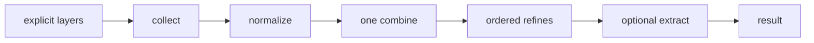
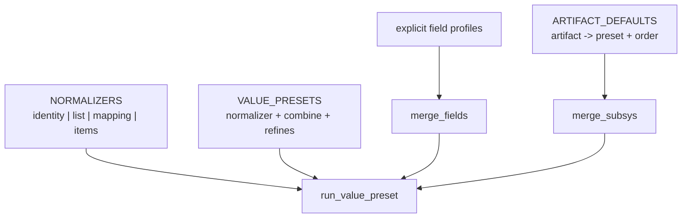

# merge-star draft3 — fixed merge pipeline with a shape-normalization stage

## 1. Decision

The fixed pipeline needs one more stage. The codebase has enough real shape
conversion to justify it:

- `arrayitize` / `_as_list`: optional value -> list;
- `dictify`: optional mapping or tool-version shorthand -> mapping;
- `listify`: mapping -> `{key, value}` records;
- Ansible `dict2items`: the same mapping -> records conversion appears in
  three live tasks;
- the merge combines already normalize their inputs ad hoc.

Hiding these conversions in combines or delegating one of them to an
unrelated filter does not reduce the conceptual surface. A bounded,
first-class normalizer stage does.



> **Governing principle: one explicit vocabulary, not fewer words at any
> cost.** Compfuzor should have one place for list, mapping, and item-record
> shape conversion, one place for merge semantics, and one explicit syntax
> for choosing each. We migrate the finite call surface instead of retaining
> aliases, positional parsing, or locally inconsistent helpers.

This is still a fixed-shape pipeline. It does **not** allow arbitrary pass
chains: every value preset selects exactly one normalizer, exactly one
combine, zero or more ordered refines, then optional extraction.

## 2. Vocabulary and ownership

| term | role | owner |
|---|---|---|
| **layer** | one whole merge contribution; collect never looks inside it | caller |
| **normalizer** | one registered conversion from a raw layer to the shape its combine accepts | shape core |
| **combine** | one registered fold over normalized layers | merge core |
| **refine** | one registered post-combine transform | merge core |
| **value preset** | normalizer + combine + ordered refines + result kind | merge core |
| **field profile** | explicit `{field: preset-spec}` map, recursively nestable | caller |
| **artifact policy** | lookup-specific `{artifact: preset + order}` policy | `merge_subsys` |
| **nuclear opt-out** | caller-side decision to skip an entire operation | caller |



`NORMALIZERS` and `VALUE_PRESETS` are the central semantic registries.
They are distinct by role, but live together in one module. Field profiles
and artifact policies reference value presets; they do not restate merge
mechanics.

## 3. Public API: explicit and intentionally breaking

```python
normalize(value, *, to="list", **options)
merge_list(layers, *, preset="append", skip_layers=("none", "undefined"), get=None)
merge_dict(layers, *, preset="overlay", skip_layers=("none", "undefined"), get=None)
merge_fields(records, *, profile, get=None)
```

### 3.1 `normalize`: one public shape-conversion filter

`normalize` is keyword-only after its value. `to` selects a bounded shape:

```jinja
{{ EXTRA_DOMAINS | normalize(to='list') }}
{{ TOOL_VERSIONS | normalize(to='mapping', shorthand=true) }}
{{ LINKS | normalize(to='items', key_name='dest', value_name='src') }}
```

It replaces `arrayitize`, `listify`, `dictify`, local arrayitize copies, and
direct `dict2items` use. This does not invent a generic transform framework:
the only choices are the registered normalizers in §5.

### 3.2 Merge receives explicit layers and a keyword-only preset

```jinja
{# default, subsystem, author are three layers #}
{{ [DEFAULT_HELPERS, item.base_helpers, item.helpers]
   | merge_list(
       preset='append_unique',
       skip_layers=['none', 'undefined', 'false']) }}

{# removed: X | merge_list('append_unique') #}
{{ X | merge_list(preset='append_unique') }}

{# removed: merge_list(default, base, author, strategy='append_unique') #}
{{ [default, base, author] | merge_list(preset='append_unique') }}
```

There is no variadic `*extra`, `single=`, `strategy=`, positional strategy,
`op` envelope, `dict_overlay`, or `env_overlay` alias. A removed spelling
raises an argument error and cannot silently become output data.

Configured presets are explicit data:

```jinja
{{ [current_bins, incoming_bins]
   | merge_list(preset={
       'name': 'merge_keyed',
       'key': 'name',
       'concat_fields': ['early', 'generated', 'run_all'],
     }) }}
```

### 3.3 Field profiles are explicit data

`merge_fields` replaces `merge_with_strategy` and accepts prepared records.
Its profile grammar does not overload dictionaries:

```jinja
{{ merge_fields(
     [base_contrib, incoming_contrib],
     profile={
       'BINS': {'preset': 'bins_generated'},
       'ENV': {'preset': 'overlay'},
       'PKGS': {'preset': 'append_unique'},
       'artifacts': {'fields': {
         'LINKS': {'preset': 'append'},
       }},
     }) }}
```

`{'preset': ...}` is a leaf and `{'fields': ...}` is recursion. Old record
preparation options (`aggregate`, `include_aggregate`, `payload_path`,
`into`, `single`) are removed. Callers construct the records they mean.

`mergeKeyed` is removed. Its two in-repository callers migrate to the
explicit configured `merge_keyed` preset.

## 4. Collect: layers, absence, suppression, nuclear

```text
collect(layers, skip_layers) -> surviving raw layers
```

Collect only admits or rejects top-level layers. It never inspects values
inside an admitted layer.

| predicate | exact test | default | meaning |
|---|---|---|---|
| `none` | `value is None` | yes | absent contribution |
| `undefined` | Ansible undefined | yes | absent contribution |
| `false` | `value is False` | no | explicit suppression of this layer |
| `empty` | empty text, sequence, or mapping | no | explicit empty-layer policy |

`false` is literal identity, not truthiness:

| declared layer | `false` enabled | outcome |
|---|---|---|
| `False` | yes | suppress the layer |
| `False` | no | keep it as an identity-normalized data layer |
| `[False]` | yes | keep one layer containing `False` |
| `['env', False, 'loud']` | yes | keep inner `False` as data |
| `None` / undefined | default | suppress as absence |

Three operations remain deliberately separate:

| class | example | location |
|---|---|---|
| absence | missing `base_helpers` | default layer skip |
| suppression | `base_helpers: False` | opt-in `false` layer skip |
| nuclear | `helpers: False` | caller-side branch before pipeline |

`no_header` is removed. There is one nuclear helpers signal:
`helpers: False`.

## 5. Normalization: one bounded dictionary and list vocabulary

Normalizers apply to every surviving layer, one level at a time. Each has an
explicit input and output shape.

| normalizer | absent / `False` | accepted ordinary input | output | options |
|---|---|---|---|---|
| `identity` | unchanged | any | same value | — |
| `list` | `[]` | list/tuple/set/non-string Sequence -> list; other scalar -> one-item list | list | — |
| `mapping` | `{}` | mapping -> copy | mapping | `shorthand=true` also accepts a sequence of strings and mappings |
| `items` | `[]` | mapping -> item records; list/tuple/set -> list | item list | `key_name`, `value_name` |

### 5.1 `list`

```text
normalize(undefined | None | False, to='list') -> []
normalize(sequence, to='list') -> list(sequence)
normalize(other scalar, to='list') -> [scalar]
```

This is the canonical optional-value-to-list conversion. `False` is a
deliberate no-contribution signal here, aligning normalizer behavior with the
established Compfuzor False pattern. `True`, `0`, strings, mappings, and
other non-absent scalars remain data.

### 5.2 `mapping`

```text
normalize(undefined | None | False, to='mapping') -> {}
normalize(mapping, to='mapping') -> copy(mapping)
normalize(sequence, to='mapping', shorthand=true) -> dictify shorthand
normalize(other input, to='mapping') -> error
```

With `shorthand=true`, strings become `{name: True}` and mapping entries
overlay left-to-right. This is the current `dictify` capability, renamed and
given the same explicit False/absence treatment as `list`.

`overlay` uses strict `mapping`; `tool_versions_overlay` uses
`mapping(shorthand=true)`. Thus dictionary processing is visible in the
preset, rather than hidden in an exceptional `dictify_union` combine.

### 5.3 `items`

```text
normalize(undefined | None | False, to='items') -> []
normalize({a: 1, b: 2}, to='items') -> [{key: a, value: 1}, {key: b, value: 2}]
normalize(records, to='items') -> list(records)
normalize(other scalar, to='items') -> error
```

`key_name` and `value_name` rename emitted record keys:

```jinja
{{ LINKS | normalize(to='items', key_name='dest', value_name='src') }}
```

This replaces both `listify`'s unique mapping branch and direct
`dict2items`. Existing mapping-to-items consumers already prove the need:
`LINKS` converts to `dest`/`src`, kernel module mappings become default
`key`/`value` records, and repository mappings iterate the same record shape.

`items` is a normalizer, not a combine: it changes one layer's shape; it
does not resolve conflicts between layers. A caller that wants to merge item
lists normalizes first, then uses an ordinary list preset.

## 6. Combines and refines

### 6.1 Combines

Combines receive already-normalized layers.

| combine | normalized layers | identity | behavior |
|---|---|---|---|
| `concat` | lists | `[]` | append normalized lists in layer order |
| `keyed_fold` | list of keyed records | `[]` | pairwise record merge by configured key |
| `union` | mappings | `{}` | later mappings win |
| `replace` | any | `None` | last surviving layer wins |

There is no `dictify_union`: the normalizer stage now expresses the same
intent without an exceptional combine.

`keyed_fold` has one implementation: retain the tag-preserving version in
[`merge.py`](/library/filter_plugins/merge.py) and delete the untagged
`merge_strategy.py` duplicate. Its contract preserves first keyed position,
last record values, configured list/string concatenation, and last
non-keyed occurrence.

### 6.2 Refines

| refine | behavior |
|---|---|
| `dedupe` | stable first-seen Python equality; linear comparison supports unhashable values |
| `dedupe_by(key)` | first key position remains; last record for the key supplies value |
| `implicate(graph)` | transitive closure; registered cycles fail; unknown selected values pass through |
| `canonicalize(registry, drop_unknown)` | registry ordering and explicit unknown policy |

`dedupe` now has a clear, conventional contract:

```text
dedupe([1, '1']) -> [1, '1']
dedupe([{'a': 1, 'b': 2}, {'b': 2, 'a': 1}]) -> [{'a': 1, 'b': 2}]
dedupe([1, True]) -> [1]  # Python equality
```

Refines return new values and do not mutate their input.

## 7. Value presets, artifact policy, and helpers

Each preset selects one normalizer and one combine:

| preset | normalizer | combine | refines | result |
|---|---|---|---|---|
| `append` | `list` | `concat` | — | list |
| `append_unique` | `list` | `concat` | `dedupe` | list |
| `append_unique_by` | `list` | `concat` | `dedupe_by` | list-record |
| `merge_keyed` | `list` | `keyed_fold` | — | list-record |
| `bins_generated` | `list` | `keyed_fold` | — | list-record |
| `overlay` | `mapping` | `union` | — | mapping |
| `tool_versions_overlay` | `mapping(shorthand=true)` | `union` | — | mapping |
| `replace` | `identity` | `replace` | — | any |
| `helpers` | `list` | `concat` | `dedupe`, `implicate`, `canonicalize` | list |

`bins_generated` lives once, configured as `key=name` with
`concat_fields=[early, generated, run_all]`. The narrower untagged old
definition is removed.

`ARTIFACT_DEFAULTS` remains lookup-specific policy but references central
presets:

```python
ARTIFACT_DEFAULTS = {
    "BINS": {"preset": "bins_generated", "order": "current-first"},
    "PKGS": {"preset": "append_unique", "order": "current-first"},
    "ENV": {"preset": "overlay", "order": "incoming-first"},
    "TOOL_VERSIONS": {
        "preset": "tool_versions_overlay",
        "order": "incoming-first",
    },
}
```

The lookup derives result kind and identity from preset metadata and owns only
artifact-specific order.

Helpers demonstrate local policy feeding generic merge:

```jinja



```

`files/_bin` owns bypass and nuclear policy. The merge pipeline owns neither
field name.

## 8. Delivery plan

### Stage 0 — target contracts and migration inventory

Write target tests for all fixed stages and classify every old caller against
one target operation:

1. collect: absence, top-level False suppression, `[False]`, inner False,
   and opt-in empty layers;
2. normalizers: `identity`, `list`, `mapping`, shorthand mapping, and
   `items` with renamed output fields;
3. combines: identities, invalid normalized inputs, keyed-fold ordering,
   tag propagation, union, and replace;
4. refines: equality dedupe, key dedupe, implication graph, canonicalization;
5. presets: `bins_generated`, tool versions, field profiles, artifact order;
6. helpers: bypass layer, base suppression, only `helpers: False` nuclear;
7. removed APIs: positional strategy, `strategy=`, `single=`, aliases,
   `no_header`, and variadic payloads reject.

**Exit:** each legacy use has one target replacement; the target semantics,
not accidental old behavior, are executable tests.

### Stage 1 — shape and value core

1. Implement the five fixed stages and `run_value_preset`.
2. Add `NORMALIZERS`: `identity`, `list`, `mapping`, and `items`.
3. Replace `arrayitize.py`, `dictify.py`, and `listify.py` with one
   normalization module exporting `normalize`.
4. Register combines, refines, and `VALUE_PRESETS`.
5. Replace merge entrypoints with explicit-layer, keyword-only APIs.
6. Implement equality dedupe and retain one tag-preserving keyed fold.

**Exit:** every pipeline preset has exactly one normalizer and one combine;
no value entrypoint parses legacy shapes.

### Stage 2 — repository migration and deletion

Migrate every call site, documentation example, and test:

| old | new |
|---|---|
| `X | arrayitize` | `X | normalize(to='list')` |
| `X | dictify` | `X | normalize(to='mapping', shorthand=true)` |
| `mapping | dict2items` | `mapping | normalize(to='items')` |
| `mapping | dict2items(key_name='dest', value_name='src')` | `mapping | normalize(to='items', key_name='dest', value_name='src')` |
| `X | listify` | `X | normalize(to='list')` for scalar/list use; `to='items'` for mapping-record use |
| `A | concat(B)` | `[A, B] | merge_list(preset='append')` |
| `X | merge_list('append_unique')` | `X | merge_list(preset='append_unique')` |
| `no_header: true` | `helpers: false` |

Delete `arrayitize.py`, `dictify.py`, `listify.py`, local `_arrayitize`,
`mergeKeyed.py`, `merge_with_strategy`, aliases, and their old docs once
their callers are migrated.

**Exit:** repository search finds no old filter names or compatibility forms.

### Stage 3 — consumers and scope cleanup

1. Implement `merge_fields` over `run_value_preset` and delete stale global
   field-profile registries.
2. Convert `ARTIFACT_DEFAULTS` to preset plus order.
3. Have `_bin` build the bypass helper layer before resolving helpers.
4. Liveness-check `subsys_publish` and subsystem adapters.
5. Exclude `_deep_merge_dicts` / subsystem publishing from this pipeline;
   delete it if unused, otherwise give it an explicit publish boundary.

**Exit:** all surviving merge and shape behavior has one named home; deep
subsystem publication is either gone or visibly separate.

## 9. Author's commentary

Adding `normalize` is not retreating from the fixed-pipeline thesis. It is
making an already real stage visible. The previous design had normalization
hidden in `_as_list`, `_as_dict`, `dictify_union`, `arrayitize`, `listify`,
and direct `dict2items` calls. Pretending those were all unrelated kept the
tool sprawl while making the merge table look cleaner than the code.

The constraint that keeps this addition healthy is fixed cardinality:
one normalizer per preset, not a free-form chain. `tool_versions_overlay`
is now plainly `mapping(shorthand=true) + union`; `append_unique` is plainly
`list + concat + dedupe`; mapping-to-item conversion is plainly `items`.

The main risk is growing `NORMALIZERS` casually. The rule should be the same
as for combines: add one only when a distinct shape conversion has at least
one real consumer and cannot be expressed by the existing bounded set. This
draft earns `items` from the existing `listify` mapping branch plus three
live `dict2items` consumers. It does not earn JSON, YAML, or arbitrary parser
normalizers just because the stage now exists.

The end state is more unified than draft2: no local list helper, no local
dict helper, no external dict-to-items escape hatch, no exceptional
`dictify_union`, and no hidden input conversion in combines. There is one
normalization vocabulary, one value-preset vocabulary, and one fixed way to
compose them.

## 10. References

- [`draft2.gpt56t.md`](/.design/merge-star/draft2.gpt56t.md)
- [`merge.py`](/library/filter_plugins/merge.py)
- [`merge_strategy.py`](/library/filter_plugins/merge_strategy.py)
- [`dictify.py`](/library/filter_plugins/dictify.py)
- [`listify.py`](/library/filter_plugins/listify.py)
- [`merge_subsys.py`](/library/lookup_plugins/merge_subsys.py)
- [`vars_base.tasks`](/tasks/compfuzor/vars_base.tasks)
- [`gen_kernel.tasks`](/tasks/compfuzor/gen_kernel.tasks)
- [`repo_git.tasks`](/tasks/compfuzor/repo_git.tasks)
