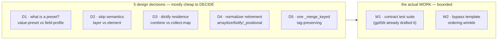

# review0-syn0 — merge-star: 25 findings → 5 decisions + 1 test suite

## 0. The morale reframe (read this first)

Three reviews produced **25 findings** and it reads like a wall. It is not
a wall. The findings are highly correlated — most of them are *different
symptoms of the same five decisions*. Once those five are made, the
symptom-count collapses:



- **5 decisions** (D1–D5): design choices, mostly cheap to *settle* even
  where implementation is non-trivial. **17 of the 25 items dissolve into
  these.**
- **1 workstream** (W1 = Stage 0): a characterization test suite that
  pins current behavior before any extraction. gpt56t already wrote the
  matrix. This is the *only* large piece, and it's bounded — and it's
  precisely the thing that makes everything else safe. **7 items.**
- **1 template wrinkle** (W2): the bypass-block render order. **1 item.**

That's the whole wall. The table below is sorted by **bang (value ÷
difficulty), descending** — so the cheap wins are at the top and the
real work is a small cluster at the bottom. The single most important
finding (the `ARTIFACT_DEFAULTS` reframe, item 1) is **high value *and*
low difficulty** because the lookup already dispatches through
`merge.py`'s profiles — it's a doc/reframe, not a rewrite. Nothing in the
whole list is harder than ~0.5 difficulty. The scariest-looking item is
one of the easiest.

## 1. Common themes across all three reviews

Three independent reviews, drawn from the same source, converged hard
where it matters and diverged in only one place:

**Unanimous (3/3) — treat as settled:**
- The fixed-shape pipeline thesis is correct. Accept.
- The two `_merge_keyed` diverge on **Ansible datatag preservation**
  (`merge.py:296` preserves, `merge_strategy.py:46` drops). Unify onto the
  tag-preserving copy as a *fix*, not a dedupe.
- `replace` is **type-polymorphic** and has no home in a list/dict split.
- `dedupe_by` belongs in **refine**; `keyed_fold` belongs in **combine**.
- The `arrayitize`→`merge_list` migration is **not mechanical** (bool /
  non-list-Sequence handling differs).

**Majority (2/3):**
- "No strategy switch remains" is a **weak exit criterion** (glm52,
  gpt56t) — registry lookup still dispatches.
- `_dedupe_preserve` keys on `str(value)` (ds4f, gpt56t) — a latent wart
  that promoting `dedupe` to first-class makes load-bearing.

**The one genuine split — dictify residence:**
- glm52: per-payload `map=` slot in `collect`.
- ds4f + gpt56t: a dedicated combine / value-preset
  (`dictify_union` / `tool_versions_overlay`).
- **Synthesis lean: ds4f+gpt56t.** Keeps the combine contract pure, keeps
  `collect` as mechanism-only, and the §5 preset table stays honest. I'm
  flipping my earlier lean; details in D3.

**The complementary-coverage pattern (why the wall is smaller than it
looks):** the three reviews looked at *different rings* of the system and
therefore hardly overlapped on the unique catches.

| review | looked at | biggest unique catch |
|---|---|---|
| glm52 | inside `library/filter_plugins/` (the implementation) | `mergeKeyed.py`, `_positional_strategy`, validator collapse |
| ds4f | outward at call sites + the lookup plugin (the consumer) | **`ARTIFACT_DEFAULTS` is the live 3rd registry**; `subsystem_*` profiles have no internal callers |
| gpt56t | at the contracts and migration edges (what breaks) | **layer-vs-element skip conflation**; bypass template ordering; the pre-migration test matrix |

That's why the union looks huge and the intersection is small: they
partitioned the problem space almost perfectly. The synthesis is
essentially "take glm52's inside-view + ds4f's outside-view + gpt56t's
contracts-view and the wall becomes a plan."

## 2. The master table

**Column key**
- `val` — value (0–1): impact on making draft1 correct & executable.
- `diff` — difficulty (0–1): 0.1 trivial, 0.3 easy-mod, 0.5 mod, 0.7 hard.
- `bang` — `val / diff`, rounded. **Sorted descending** so cheap wins sit
  on top.
- `cl` — cluster: `D1–D5` (decisions), `W1` (contracts), `W2` (template),
  `SC` (scope), `PR` (process).
- `stage` — revised stage it lands in (see §4). `0` = new Stage 0.
- `resv` — other item `#`s this resolves / subsumes once decided.
- `who` — G=glm52, D=ds4f, T=gpt56t.

| # | item | cl | val | diff | bang | who | stage | resv | suggested approach |
|---|---|---|---|---|---|---|---|---|---|
| 19 | arrayitize count reconciled (45 pipe-form / 37 yaml) | D4 | 0.5 | 0.05 | **10.0** | G,D | F | — | one-line prose fix in draft0 §1/§F |
| 22 | `_positional_strategy` shim | D4 | 0.6 | 0.10 | **6.0** | G | G | — | **bless as permanent** back-compat shim; document; don't migrate ~45 callers |
| 24 | Stage H liveness check | SC | 0.6 | 0.10 | **6.0** | D | H | 20 | grep callers of subsys_*/merge_*; decide per #20 |
| 8 | `dedupe_by` ordering pin | W1 | 0.8 | 0.15 | **5.3** | G,D,T | 0 | — | characterization test: first-key position, last value; one-line spec |
| 13 | `replace` type-agnostic home | D1 | 0.8 | 0.15 | **5.3** | G,D,T | G | 6 | own row, "any-type" combine (falls out of D1) |
| 14 | list/dict split is decorative | D1 | 0.7 | 0.15 | **4.7** | G | G | 6 | redraw §4 combines by *what they fold over*, not list-vs-dict |
| 17 | `subsystem_*` profiles — dead? | D1 | 0.7 | 0.15 | **4.7** | D | G | 1 | re-derive from ARTIFACT_DEFAULTS **or** deprecate-to-docs (your call — see §5 Q2) |
| 5 | `_merge_keyed` tag asymmetry | D5 | 0.9 | 0.20 | **4.5** | G,D,T | D | — | delete merge_strategy copy; add AnsibleTagHelper-propagation test |
| 21 | exit criteria → invariants | PR | 0.65 | 0.15 | **4.3** | G,T | all | — | "only the preset table interprets strategy names" |
| 1 | **`ARTIFACT_DEFAULTS` is the live 3rd registry** | D1 | 1.0 | 0.25 | **4.0** | D | G | 6,17 | promote to first-class field-profile registry; it's already dispatching through merge.py — mostly a doc/reframe |
| 15 | dictify residence | D3 | 0.8 | 0.20 | **4.0** | G-vs-D,T | G | — | dedicated value-preset `tool_versions_overlay=(dictify_union,[])`; `collect` stays pure |
| 16 | `mergeKeyed.py` migration | D1 | 0.8 | 0.20 | **4.0** | G,D | E | 6 | rewrite as one-line preset dispatch; keep public filter name |
| 20 | `_deep_merge_dicts`/`subsys_publish` scope | SC | 0.6 | 0.15 | **4.0** | G | H | 24 | **explicitly EXCLUDE** from pipeline (publish/mutate semantic); keep `_deep_merge_dicts` internal |
| 12 | `keyed_fold` order rules | W1 | 0.65 | 0.20 | **3.3** | T,D | 0 | — | pin: keyed→first-key pos; non-keyed→last occurrence; tag-preserving concat |
| 9 | `_dedupe_preserve` `str(value)` keying | W1 | 0.75 | 0.30 | **2.5** | D,T | 0 | — | **document as intentional** (lean) + tests for `[1,"1"]` & dict-order; or fix-to-equality (harder) |
| 2 | `helpers: False` nuclear opt-out broken by §6 | D2 | 1.0 | 0.40 | **2.5** | D,T | D | 3 | keep the caller-side `helpers is False` guard (helpers.py:68); pipeline never models "poison" |
| 11 | combine identities + leniency | W1 | 0.7 | 0.30 | **2.3** | T | 0 | — | per-combine identity + coercion table in §4; `replace`=latest-non-None |
| 18 | `listify.py` 4th normalizer | D4 | 0.65 | 0.30 | **2.2** | D | F | 4 | retire alongside arrayitize; same `as_list` migration |
| 7 | bypass-block template ordering | W2 | 0.85 | 0.40 | **2.1** | T | D | — | `_bin` builds `helper_layers` (incl `[report,guard]`) **before** calling resolver |
| 4 | arrayitize migration non-mechanical | D4 | 0.9 | 0.45 | **2.0** | G,T | F | 18,19 | ship `as_list` normalizer w/ arrayitize's exact bool/None/Sequence contract first; classify+ migrate each site |
| 6 | value-preset vs field-profile split | D1 | 0.9 | 0.45 | **2.0** | T | G | 1,13,14,16,17,23 | two typed registries: `VALUE_PRESETS` (combine+refine) + `FIELD_PROFILES` (`{field: preset}`) |
| 10 | `implicate` spec | W1 | 0.7 | 0.35 | **2.0** | T | 0 | — | transitive-to-fixpoint; cycles=error; unknown=ignored; non-mutating |
| 3 | skip layer/element conflation | D2 | 0.95 | 0.50 | **1.9** | T | 0,D | 2 | `skip` filters **layers only**; remove element-spread-filter from `_collect_payloads`; element-filter = named refine |
| 25 | pre-migration test matrix | W1 | 0.75 | 0.40 | **1.9** | T | 0 | 8–12 | adopt gpt56t's matrix verbatim as the Stage 0 deliverable |
| 23 | validator collapse | D1 | 0.6 | 0.35 | **1.7** | G | G | 6 | one preset validator post-Stage-G; behavior-change care + tests |

**Read this table twice — once top-down (cheap wins), once by cluster.**
The top 13 rows (bang ≥ 4.0) are almost all "edit the doc" or "delete a
duplicate + add a test." The bottom 5 rows (bang < 2.0) are the real
work, and they are: the contract test suite (#25, already drafted), the
skip-semantics separation (#3), the implicate spec (#10), the
arrayitize/listify migration (#4), and the registry-shape decision (#6).
That's the whole mountain.

## 3. Resolved decisions

### D1 — what is a "preset"? (resolves #1, 6, 13, 14, 16, 17, 23)

Two typed registries, not one:

```python
VALUE_PRESETS = {
    # name:          (combine,        refine,            folds-over)
    "append":        ("concat",       [],                 "list-scalar"),
    "append_unique": ("concat",       ["dedupe"],         "list-scalar"),
    "append_unique_by": ("concat",    ["dedupe_by"],      "list-record"),
    "merge_keyed":   ("keyed_fold",   [],                 "list-record"),
    "overlay":       ("union",        [],                 "dict"),
    "tool_versions_overlay": ("dictify_union", [],        "dict"),
    "replace":       ("replace",      [],                 "any"),
}

FIELD_PROFILES = {
    # name → {field: value_preset_name}; references, never re-defines
    "bins_generated": {"BINS": "merge_keyed"},     # field-profile
    # ARTIFACT_DEFAULTS (merge_subsys.py:111) is ALSO a field-profile
    # registry — promote it to first-class here, or keep as the lookup's
    # projection. Either way: ONE value-preset for "merge_keyed".
}
```

- `bins_generated` (the value-preset) lives once: `keyed_fold` with
  `concat_fields=[early, generated, run_all]` (the superset — low-risk,
  ds4f confirmed only `merge_subsys` names it live).
- The `bins_generated` *field-profile* references it. The disagreement
  dissolves: there was only ever one value-preset; the two old definitions
  were a value-preset and a field-profile wearing the same name.
- `replace` is `"any"`-type. The list/dict partition is replaced by
  *folds-over* (list-scalar / list-record / dict / any) — which is what
  the combine vocabulary actually cared about.
- `mergeKeyed.py` becomes a one-line field-profile dispatch (keep the
  public filter name).
- `subsystem_contrib`/`subsystem_artifacts`: re-derive from
  `ARTIFACT_DEFAULTS`, or deprecate-to-docs. **Needs your call** (§5 Q2).

### D2 — skip semantics (resolves #2, 3)

- `skip` filters **layers (sources)** only.
- Remove the element-level spread-filter from `_collect_payloads` (it's
  the thing that makes `False`-layer indistinguishable from
  `[False]`-content). Element filtering, if ever needed, becomes a named
  refine.
- The `helpers: False` nuclear opt-out stays a **caller-side guard**
  before the pipeline runs (it already is — `helpers.py:68`). The
  pipeline itself never models a "poison layer." This is the smallest
  change that preserves the documented behavior.

### D3 — dictify residence (resolves #15)

**Decision: dedicated value-preset `tool_versions_overlay =
(dictify_union, [])`.** I'm flipping my review0 lean (was: `map=` slot in
collect). Reasons:

1. Keeps the combine contract `(payloads) → value` pure — the §9
   rejection of "a combine is a list of ops" holds.
2. `collect` stays mechanism-only (gather + layer-skip), matching its
   role.
3. The §5 preset table reads honestly: `tool_versions_overlay` is a
   named preset, not magic inside `union`.

Cost: one extra combine (`dictify_union`). Worth it.

### D4 — normalizer retirement (resolves #4, 18, 19, 22)

1. Ship a public `as_list` normalizer whose contract **exactly matches
   `arrayitize`** for bool/`None`/undefined/`Sequence`/string/number.
   This is the keystone — until it exists, no migration is safe.
2. Migrate `arrayitize` (~45 pipe sites) and `listify` (~30 hits)
   *individually*, each classified against a characterization test.
3. `_positional_strategy`: **bless as permanent** back-compat shim. ~45
   callers depend on `X | merge_list('append_unique')`; migrating to
   `strategy=` is real work for no architectural gain. Document it as
   permanent and the string-payload ambiguity becomes a known, owned
   property.

### D5 — one `_merge_keyed` (resolves #5)

Keep `merge.py`'s (tag-preserving). Delete `merge_strategy.py`'s. Add a
test that asserts `AnsibleTagHelper` propagation on `concat_fields`
string joins. Done.

## 4. Suggested draft1 outline + revised staging

**draft1 outline** (deltas from draft0):

- **§2 duplication map** — add rows: `mergeKeyed.py`, `listify.py`,
  `ARTIFACT_DEFAULTS` (merge_subsys.py:111). Retitle the `_merge_keyed`
  row "diverges on tag preservation," not "byte-near-identical."
- **§4 pipeline map** — replace the list/dict combine tables with a
  single *folds-over*-grouped table; add `replace` (any) and
  `dictify_union` (dict); drop the pretend type-split.
- **§5 strategy map** — split into `VALUE_PRESETS` table + `FIELD_PROFILES`
  table; fold `ARTIFACT_DEFAULTS` in as the live projection.
- **§6 helpers preset** — add the caller-side `helpers is False` guard;
  note the bypass-layer must be contributed *before* resolution (W2).
- **§7 staging** — see below (insert Stage 0).
- **§8/§9** — replace with the resolved-decisions table (§3 of this syn).

**Revised staging** — the load-bearing change is inserting **Stage 0**
(contracts + characterization tests) before D. Everything else is
draft0's order with invariant-based exit criteria.

| stage | content | exit criterion (invariant) |
|---|---|---|
| **0 (new)** | characterization test suite pinning current behavior (gpt56t's matrix: normalizer, skip layer-vs-element, dedupe_by ordering, keyed_fold order + tags, implicate, helpers opt-outs). Decide the `str(value)` question here. | green suite captures today's behavior; any later change asserted against it |
| **D** | register value-presets + refines; one tag-preserving `_merge_keyed`; recast `resolve_helpers` (caller-side nuclear guard + bypass-layer-before-resolution via W2); separate `skip` to layers-only (#3) | only the preset table interprets strategy names; `resolve_helpers` knows no field names; one `_merge_keyed` |
| **E** | `merge_with_strategy` as field-profile dispatch over value-presets; `mergeKeyed.py` → preset dispatch; resolve `bins_generated` to the superset | one merge surface; `merge_with_strategy` composes on the pipeline |
| **F** | ship `as_list` normalizer; classify + migrate `arrayitize`/`listify` sites; retire both; bless `_positional_strategy` permanent | one normalizer; no migrated site changes behavior on `False`/`None`/`undefined` |
| **G** | unify registries (`VALUE_PRESETS` + `FIELD_PROFILES` + `ARTIFACT_DEFAULTS` projection); collapse validators (#23); decide `subsystem_*` fate (#17) | single source of truth per name across both entry points + the lookup |
| **H** | liveness-check `subsys_publish`/`merge_*_subsys`; explicitly exclude `_deep_merge_dicts` from the pipeline (#20) | every public merge surface either rides the pipeline or is documented as excluded |

**The order is still load-bearing**, and Stage 0 is what makes D safe: by
the time you extract refines and delete the duplicate `_merge_keyed`, the
behavior is already pinned by tests, so a regression is a red light, not
a silent render change.

## 5. Two questions that need you before draft1

These are the only two I'd rather not decide unilaterally:

1. **`subsystem_contrib` / `subsystem_artifacts` (#17)** — ds4f calls
   them dead (no internal `.tasks`/`.pb` callers; only README/arch.md/INDEX
   docs + merge_strategy + its tests). But they're *documented public API*
   in the README, and compfuzor is a framework others may consume. **Re-
   derive from `ARTIFACT_DEFAULTS`, or deprecate-to-docs?** My lean:
   re-derive (cheap, preserves the public surface, and removes the
   BINS-strategy disagreement #1's cousin for free).
2. **`_positional_strategy` (#22)** — bless as permanent shim (my lean,
   bang 6.0), or stage the `strategy=` kwarg migration across ~45 sites?
   Blessing is ~0.1 difficulty; migration is ~0.4 for no architectural
   gain. I'd bless.

Everything else I've taken a lean on in §3; say the word and I'll fold
both answers into draft1.

## 6. Cross-comparison of the three reviews

| review | strength | most notable contribution | relative weakness | characterization |
|---|---|---|---|---|
| **glm52** | tightest on in-module inventory & staging rigor (`mergeKeyed`, `_positional_strategy`, validator collapse, exit-criteria critique) | the arrayitize-migration `single=`/`skip=` bug; the `_deep_merge_dicts` gap | looked inward only — missed the consumer (`merge_subsys`) and the `helpers: False` opt-out bug | the implementation critic: "what's inside the module isn't the whole module" |
| **ds4f** | the only one that read the *consumer*; highest single-catch value | **`ARTIFACT_DEFAULTS` is the live 3rd registry** + the dead-`subsystem_*` reframe — changes Stage G more than any other finding | under-weighted contract/migration-safety (didn't catch the layer/element skip conflation or the bypass ordering) | the outside-in critic: "the map is drawn from the wrong ring" |
| **gpt56t** | the contracts/migration-safety lens; thought hardest about *what breaks* | **layer-vs-element skip distinction**; bypass template ordering; the value-preset/field-profile split with a concrete code sketch; the test matrix | didn't size the consumer surface (no `ARTIFACT_DEFAULTS`, no `mergeKeyed`/`listify` inventory) | the safety engineer: "define the contracts before you move anything" |

**Where they agree** is where draft1 should not relitigate: thesis,
tag-preservation fix, `replace` type-agnosticism, `dedupe_by`→refine /
`keyed_fold`→combine, weak exit criterion. **Where they disagree** is
exactly one architectural point (dictify residence, resolved in D3 to
ds4f+gpt56t's lean). The complementarity is almost suspicious — the three
biases (inside / outside / edges) tiled the space.

**Net characterization of draft0:** right thesis, leaky inventory, one
binned incorrectly (`replace`), one sketched wrong (the §6 preset). All
fixable in draft1 without touching the architecture. The plan is
executable; it just needs Stage 0 in front of it and the five decisions
above written down.

## 7. References

- [`draft0.md`](/home/rektide/src/compfuzor/.design/merge-star/draft0.md) — design under review
- [`review0.glm52.md`](/home/rektide/src/compfuzor/.design/merge-star/review0.glm52.md) — inventory/staging critique
- [`review0.ds4f.md`](/home/rektide/src/compfuzor/.design/merge-star/review0.ds4f.md) — consumer-surface critique
- [`review0.gpt56t.md`](/home/rektide/src/compfuzor/.design/merge-star/review0.gpt56t.md) — contracts/migration-safety critique
- [`merge_subsys.py`](/home/rektide/src/compfuzor/library/lookup_plugins/merge_subsys.py) — `ARTIFACT_DEFAULTS:111` (the live registry ds4f found)
- [`merge.py`](/home/rektide/src/compfuzor/library/filter_plugins/merge.py) — `_merge_keyed:259`, `_concat_strings_preserving_tags:296`, `_collect_payloads:425`, `_deep_merge_dicts:725`
- [`merge_strategy.py`](/home/rektide/src/compfuzor/library/filter_plugins/merge_strategy.py) — duplicate `_merge_keyed:16` (untagged concat `:46`), `bins_generated:82`, `replace:301`
- [`helpers.py`](/home/rektide/src/compfuzor/library/filter_plugins/helpers.py) — nuclear guard `:68`, bypass-as-layer `:78`
- [`mergeKeyed.py`](/home/rektide/src/compfuzor/library/filter_plugins/mergeKeyed.py) — compat shim, now accounted for
