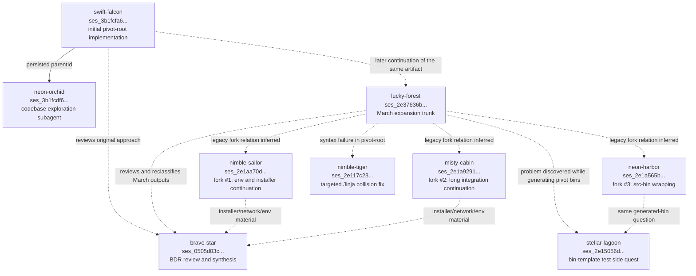
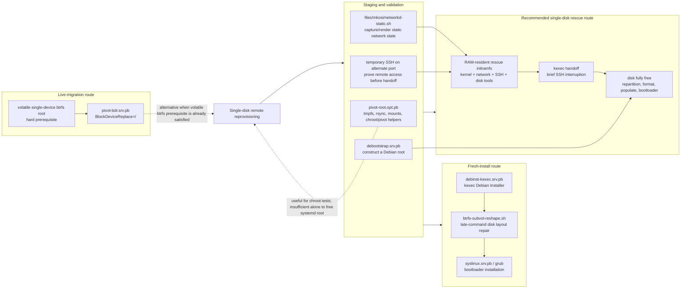

# Pivot-root session history and relationship map

This document reconstructs the family of OpenCode sessions concerned with moving a running Compfuzor-managed host away from its current root, preparing a replacement Debian system, and preserving remote access while doing so. It is a map of the conversations and their relationships, not an assertion that every design discussed in them is currently safe or complete.

The history has three broad eras:

1. The February session created a literal tmpfs plus `pivot_root` toolkit.
2. The March session cluster expanded that seed into several related but distinct paths: tmpfs staging, debootstrap, Debian Installer through kexec, static networking, BIOS boot support, generated-bin infrastructure fixes, and shell environment precedence fixes.
3. The July review reconsidered the original goal in light of `systemd-repart` `BlockDeviceReplace=`, distinguished fresh-install and live-migration strategies, and returned to the hard single-disk VPS requirement. That review is where the earlier experiments were interpreted as a graph rather than one linear implementation.

## How this map was reconstructed

The session set was found with `cotail search` queries for `pivot-root`, `pivot_root`, debootstrap, kexec, tmpfs, and BDR, restricted to `/home/rektide/src/compfuzor`. Session metadata and persisted parent IDs came from `cotail get-session -s <id> --json`. The long descriptions below were reconstructed from the session text, the current playbooks, and repository history.

## Session index

All nine sessions were run against the same working directory, `/home/rektide/src/compfuzor`.

| Session ID | Slug | Title | Directory | Created |
|---|---|---|---|---|
| `ses_3b1fcfa61ffeODwMCB5eng6Uc8` | `swift-falcon` | Pivot-root with tmpfs mount and debootstrap workflow | `/home/rektide/src/compfuzor` | 2026-02-11 |
| `ses_3b1fcdf6cffexYeUfQpGiS07l8` | `neon-orchid` | Explore codebase structure (@explore subagent) | `/home/rektide/src/compfuzor` | 2026-02-11 |
| `ses_2e37636bcffetblvJp35Any5Lm` | `lucky-forest` | Debootstrap and Debian netinst pivot-root options | `/home/rektide/src/compfuzor` | 2026-03-23 |
| `ses_2e1aa70daffeAh0wJbWAIH4Ec0` | `nimble-sailor` | Debootstrap and Debian netinst pivot-root options (fork #1) | `/home/rektide/src/compfuzor` | 2026-03-24 |
| `ses_2e1a92917ffe5mSK8MNatACS8H` | `misty-cabin` | Debootstrap and Debian netinst pivot-root options (fork #2) | `/home/rektide/src/compfuzor` | 2026-03-24 |
| `ses_2e1a565beffehpFvaFhJTWpwSR` | `neon-harbor` | Debootstrap and Debian netinst pivot-root options (fork #3) | `/home/rektide/src/compfuzor` | 2026-03-24 |
| `ses_2e15056d2ffel2Yt3bQrgquF35` | `stellar-lagoon` | Ansible _bin.header interpolation test case | `/home/rektide/src/compfuzor` | 2026-03-24 |
| `ses_2e117c231ffeId2rhhku5qmkbE` | `nimble-tiger` | Fixing missing comment tag in pivot-root.opt.pb | `/home/rektide/src/compfuzor` | 2026-03-24 |
| `ses_0505d03c8ffeOwgLUw165ZgMDJ` | `brave-star` | BDR playbook review & usage walkthrough | `/home/rektide/src/compfuzor` | 2026-07-29 |

There is an important evidence limitation: only the February exploration subagent retains an explicit `parentId`. The March sessions titled `(fork #1)`, `(fork #2)`, and `(fork #3)` all currently report `parentId: null`. Their relationship is nevertheless strongly supported by their titles, nearly identical inherited opening prompt, overlapping transcript material, timestamps, and edits to the same files. The graph therefore distinguishes **persisted parent edges** from **inferred continuation or side-quest edges**.

## Session graph

Solid arrows are relationships persisted in the session database. Dashed arrows are conceptual or historical relationships inferred from content and chronology.

## Session-by-session rundown

The cells are intentionally verbose. Each row records not only what happened inside the session, but also what role that session plays in the larger graph.

| Session | Scope and work performed | Broad relationship to the other sessions | Lasting artifacts, conclusions, and caveats |
|---|---|---|---|
| **`ses_3b1fcfa61ffeODwMCB5eng6Uc8`**  Slug: `swift-falcon` Title: **Pivot-root with tmpfs mount and debootstrap workflow** Created: 2026-02-11 | This is the originating implementation session. The request was narrowly framed: create `pivot-root.opt.pb` as a collection of scripts that mounts tmpfs, lets another workflow populate it, and performs `pivot_root`. The session delegated repository reconnaissance to an exploration subagent, then created a playbook with helpers for mounting tmpfs, preparing the new root, mounting virtual filesystems, pivoting, inspecting status, cleaning the relocated old root, and attempting to unpivot. The model at this point treated `pivot_root` as the main mechanism and assumed the staged root could become a usable replacement environment. | This is the root of the whole family. The March trunk does not have a persisted parent edge to it, but clearly resumes work on the artifact created here. The July BDR review later calls this approach abandoned for the original in-place-reformat objective, while retaining it as useful staging and chroot machinery. Its explicit child is the `neon-orchid` exploration session. | Created the first version of [`/pivot-root.opt.pb`](/pivot-root.opt.pb). The durable value is the decomposition into observable, manually invokable preparation steps. The central later-discovered limitation is more important than the implementation itself: moving the mount tree does not move or re-exec PID 1 and disk-backed daemons, so the old root remains pinned on a normal systemd host. The current playbook header now documents that limitation explicitly. |
| **`ses_3b1fcdf6cffexYeUfQpGiS07l8`**  Slug: `neon-orchid` Title: **Explore codebase structure (@explore subagent)** Created: 2026-02-11 Persisted parent: `ses_3b1fcfa61ffeODwMCB5eng6Uc8` | This was the read-only reconnaissance child for the initial implementation. It surveyed Compfuzor's purpose, playbook suffix conventions, generated directory structure, `BINS` conventions, shell wrapper behavior, and existing mount-related material. It returned a long architecture summary so the parent could make `pivot-root.opt.pb` look like a native Compfuzor playbook rather than an isolated shell script bundle. | This is the only relationship in the set that remains explicit in the database. It supports the initial session rather than introducing a competing technical direction. Later generated-bin and `_bin` sessions revisit some of the same framework questions, but with concrete failures that this broad survey did not expose. | No direct product artifact was intended. Its lasting contribution was contextual: generated scripts belong under the type-derived subsystem directory, playbook variables feed shared tasks, and inline `BINS.content` follows different implementation paths from source-backed `BINS.src`. The latter distinction became crucial in fork #3 and the template-testing session. |
| **`ses_2e37636bcffetblvJp35Any5Lm`**  Slug: `lucky-forest` Title: **Debootstrap and Debian netinst pivot-root options** Created: 2026-03-23 | This is the large March trunk and the main expansion point. It began by adding debootstrap and Debian netinstaller ideas directly to `pivot-root.opt.pb`, then deliberately split responsibilities into separate playbooks. It created `debootstrap.srv.pb`, `debinst-kexec.srv.pb`, and `systemd-iface-static.etc.pb`; created a new BIOS-focused `syslinux.srv.pb`; added rsync seeding, size estimation, and a temporary alternate-port sshd helper; moved `PKGS`/`PKGSET` into debootstrap target-package configuration; investigated BIOS versus UEFI evidence; and developed a rich Debian Installer cmdline generator for console-only, static-network, network-console operation. A substantial later portion diagnosed why `nasu.env` did not override generated defaults, leading into `envdefault`, `_bin.header`, Bash/Zsh portability, and cmdline tokenization work. | It is best understood as a trunk with several branches, not one feature. It continues the February artifact, but also creates a parallel fresh-install strategy through Debian Installer and kexec. The three sessions titled as forks inherit or duplicate this trunk and specialize different unresolved areas. The Jinja syntax-fix and generated-bin template sessions are side quests caused by concrete failures in artifacts from this trunk. The July review later separates its outputs into reusable staging tools, a fresh-install path, and infrastructure fixes. | Major commits recorded in the transcript include `273894b` for Debian Installer kexec/debootstrap/static-network foundations, `3688a83` for rsync seeding, `8524304` for debootstrap package-set semantics, `f6d5169` and `748a128` for `arrayitize`, `d56d6f2` for console-only installer options, `6bbf212` for profile precedence and shell portability, and `40f9e18` for generic cmdline token splitting. The trunk also wandered deeply into the separate `envdefault` repository. Its key conceptual result is that `debinst-kexec` is not simply "more pivot-root": it is a fresh-install handoff strategy that can replace the need to preserve the old userspace at all. |
| **`ses_2e1aa70daffeAh0wJbWAIH4Ec0`**  Slug: `nimble-sailor` Title: **Debootstrap and Debian netinst pivot-root options (fork #1)** Created: 2026-03-24 | Despite its metadata showing the same creation and update instant, this session contains substantial inherited and continued work. Its visible thread starts around the null `ENV` rendering failure, hardens `arrayitize`, and continues through keyboardless Debian Installer operation, static networking, host-specific `nasu` settings, the map-driven cmdline generator, shell-local versus exported environment variables, and `envdefault` semantics. It preserves much of the March trunk's installer and environment discussion. | This is an inferred fork of `lucky-forest`; the database has lost or never imported its parent edge. It overlaps heavily with the trunk rather than representing a clean independent branch. Relative to the other forks, its center of gravity is environment handling and installer configuration rather than generated-bin source wrapping. It supplies much of the context later reviewed in the BDR session when assessing whether `debinst-kexec.srv.pb` belonged to the same effort. | Its lasting ideas are the opt-in unattended installer flags, explicit static profile files, map-driven `netcfg` generation, and the realization that generated script headers must respect shell-local overrides. It also records the caution that sourcing executable Bash scripts from Zsh bypasses the shebang and exposes shell-specific syntax. Because the transcript is inherited/duplicated and its metadata is anomalous, it should not be treated as a separate chronological implementation phase without checking commits. |
| **`ses_2e1a92917ffe5mSK8MNatACS8H`**  Slug: `misty-cabin` Title: **Debootstrap and Debian netinst pivot-root options (fork #2)** Created: 2026-03-24 | This is another long continuation of the March trunk. It carries the same debootstrap, kexec, network profile, and `envdefault` material, then reaches a specific follow-up: after `envdefault` had been redesigned, review and simplify the changes made to `files/_bin.header` in commit `6bbf212`. The session concluded that a compact current-shell invocation was desirable, but that blindly restoring process substitution would recreate the non-exported-variable precedence bug. | Inferred fork of `lucky-forest`, again with `parentId: null`. It is closest to fork #1 in subject matter and transcript overlap. Its distinguishing edge is toward generated wrapper semantics: it asks how the improved `envdefault` should simplify Compfuzor's generated-bin header. This connects it conceptually to `stellar-lagoon`, though the latter investigated a different wrapper failure. | The durable lesson is about process boundaries rather than one exact one-liner. A defaults loader executed in a child cannot inspect shell-local variables in the caller. A generated bin that promises "defaults only" must either operate in the current shell or have an explicit profile-input contract. Any later attempt to simplify `_bin.header` should preserve that semantic invariant, not merely reproduce the shortest historical syntax. |
| **`ses_2e1a565beffehpFvaFhJTWpwSR`**  Slug: `neon-harbor` Title: **Debootstrap and Debian netinst pivot-root options (fork #3)** Created: 2026-03-24 | This fork concentrated on why some `BINS` did not receive the common `files/_bin` wrapper. Initial tests mistakenly used inline `content` entries, which already worked. The corrected investigation identified the actual split: source-backed `BINS.src` entries were copied or templated directly and bypassed `_bin`, while inline `BINS.content` entries were wrapped. An initial `BINS_WRAP_ALL` feature flag was rejected as an unnecessary forked execution path. The final direction was to make every non-raw source-backed bin pass through the same wrapper unconditionally, leaving only explicitly `raw` bins unwrapped. | Inferred fork of the March trunk, but much more clearly a Compfuzor framework branch than an installer branch. It relates directly to the `stellar-lagoon` test session, which began with an incorrect focus on include-path interpolation and then moved toward pivot-style fixtures. It also explains why `pivot-root` was initially a confusing reproducer: most of its scripts were inline and already wrapped; only `src` entries exposed the missing path. | The lasting architectural conclusion is a normalization rule: inline and source-backed non-raw bins should converge before rendering and use one wrapper path. Avoid opt-in compatibility branches such as `BINS_WRAP_ALL` when the intended invariant is universal. `raw: true` remains the explicit escape hatch. This work is broader than pivot-root and affects every playbook that supplies source-backed bins. |
| **`ses_2e15056d2ffel2Yt3bQrgquF35`**  Slug: `stellar-lagoon` Title: **Ansible `_bin.header` interpolation test case** Created: 2026-03-24 | This was a focused test-building side quest. The first attempt changed include paths in `files/_bin`, but the user correctly rejected it because hundreds of existing playbooks already rendered correctly and the test did not emulate the failing shape. The work then built a pivot-style sandbox playbook with inline scripts, raw Jinja blocks, and heavy bypasses. That test proved inline content was already wrapped. Continued investigation, coordinated conceptually with fork #3, narrowed the real failure to `BINS.src`. | It branches from the March work because errors were observed while trying to make pivot-root and debinst-kexec use the shared wrapper. It is not itself a pivot mechanism design. Its strongest relation is to fork #3: this session supplied test methodology and corrected a bad reproducer; fork #3 supplied the architectural diagnosis and unconditional wrapping rule. | The durable output is methodological. Reproductions must match the relevant item shape, not merely the same playbook suffix or subsystem. An inline `content` fixture cannot test a `src`-path bug. Explicit include-path rewrites were mistargeted because include interpolation already worked for the established path. The useful fixture pattern belongs under `.test-agent/` and should exercise inline, source-backed, and raw bins side by side. |
| **`ses_2e117c231ffeId2rhhku5qmkbE`**  Slug: `nimble-tiger` Title: **Fixing missing comment tag in pivot-root.opt.pb** Created: 2026-03-24 | This short debugging session explained an Ansible/Jinja parse error reported near a shell block. Bash array length syntax `${#dirs[@]}` contains the character sequence `{#`, which Jinja interprets as the start of a template comment. Because there was no Jinja `#}` terminator, parsing failed with "Missing end of comment tag." The fix wrapped the full affected shell `if` blocks in targeted `` and `` regions. | This is a direct corrective side quest from the March additions of rsync and size-estimation scripts. It is independent of the broader `_bin.header` and `BINS.src` wrapper issue even though both involve Jinja rendering. Conflating them would be misleading: this failure occurs inside embedded shell content; the wrapper issue occurs in task-path selection and template composition. | The lasting rule is to scan embedded shell for Jinja delimiter collisions, especially `${#...}`, whenever a playbook reports a misleading comment-tag error. Raw regions should cover a coherent line or block, not escape individual characters. The current [`/pivot-root.opt.pb`](/pivot-root.opt.pb) retains targeted raw blocks around the array-length tests. |
| **`ses_0505d03c8ffeOwgLUw165ZgMDJ`**  Slug: `brave-star` Title: **BDR playbook review & usage walkthrough** Created: 2026-07-29 | This is the retrospective synthesis and strategic redirection. It reviewed `pivot-root.opt.pb` and `pivot-bdr.srv.pb`, traced repository history back to `debinst-kexec.srv.pb`, and initially considered Debian Installer kexec the missing lead-in to BDR. Further reasoning corrected that interpretation: Debian Installer plus the btrfs reshape script is a competing fresh-install route, while BDR needs a running single-device btrfs filesystem backed by volatile storage. The session then explored ways to kexec into a raw image, clarified that kexec accepts a kernel and initramfs rather than a disk image, evaluated RAM-disk/initramfs/QEMU options, and finally centered the actual operational constraint: a single-disk VPS with no attachable rescue media. It recommended a RAM-resident rescue initramfs with networking and SSH, briefly dropping the connection during kexec, rather than relying on a live `pivot_root` to release a systemd-managed disk. It also produced and committed `files/mkosi/networkd-static.sh` as a static networkd profile generator with IPv4, IPv6, route, DNS fallback, predicted interface naming, and JSON status output. | This session reviews every earlier branch and supplies the clearest high-level graph. It demotes literal pivot-root from the main in-place-reformat solution to staging/testing; classifies `debinst-kexec` as the established fresh-install route; classifies BDR as an unvalidated live-migration route with a difficult volatile-btrfs prerequisite; and proposes a rescue-initramfs route as the best fit for the single-disk VPS. It also reconnects the temporary-sshd and static-network work to the actual safety requirement: prove remote access before crossing the point of no return. | The current [`/pivot-bdr.srv.pb`](/pivot-bdr.srv.pb) remains explicitly marked `SKETCH / UNVALIDATED`. Its online path requires systemd v261+, single-device btrfs, and a volatile source block device. The current [`/debinst-kexec.srv.pb`](/debinst-kexec.srv.pb) remains the concrete Debian Installer handoff. The session's most important conclusion is that these are not stages of one automatic pipeline. They are alternative reprovisioning strategies sharing network, SSH, image-building, bootloader, and validation tools. The committed static-network generator was reported as jj change `knrsmywt` / Git commit `b4e73e68`. |

## Technical work graph

The sessions are easier to understand when the artifacts are grouped by responsibility rather than chronology.

## The broad relationships

### The February implementation is a staging toolkit, not a complete disk-release mechanism

The original playbook remains useful because it names and automates the preparation steps: allocate RAM, prepare a root tree, populate it, mount virtual filesystems, inspect it, and exercise it as a chroot. Those are prerequisites for several later routes. The error was treating `pivot_root` itself as sufficient to free the old disk while the original systemd and daemons remained alive.

That distinction explains why the project did not simply delete `pivot-root.opt.pb` after discovering the limitation. The staging half remains valuable; the claim that it enables in-place formatting does not.

### The March trunk split one vague goal into multiple subsystems

The March work began as "add debootstrap and netinst options to pivot-root" but quickly exposed separate domains:

| Domain | Resulting artifact | Why it split out |
|---|---|---|
| RAM-root mechanics | [`/pivot-root.opt.pb`](/pivot-root.opt.pb) | Mount, seed, inspect, and attempt root handoff without owning Debian installation policy. |
| Root filesystem construction | [`/debootstrap.srv.pb`](/debootstrap.srv.pb) | Package selection, suite, mirror, and target-root construction are useful beyond pivot-root. |
| Installer handoff | [`/debinst-kexec.srv.pb`](/debinst-kexec.srv.pb) | Kexecing Debian Installer is a complete fresh-install strategy with its own network and console requirements. |
| Host networking | [`/systemd-iface-static.etc.pb`](/systemd-iface-static.etc.pb) and [`/files/mkosi/networkd-static.sh`](/files/mkosi/networkd-static.sh) | Static addressing must survive a rescue or installer handoff independently of how the final root is built. |
| Bootability | `syslinux.srv.pb`, GRUB helpers, btrfs reshape | BIOS/UEFI uncertainty and final disk layout are separate from root population. |
| Compfuzor framework | `files/_bin.header`, `tasks/compfuzor/bins.tasks`, `arrayitize` | Real playbooks exposed generic rendering, null handling, source-wrapper, and shell-precedence defects. |

The forks are therefore not merely duplicate attempts at one file. They are where these domains were teased apart.

### Debian Installer kexec and BDR are alternatives, not consecutive stages

The July review initially drew an attractive but incorrect line from `debinst-kexec` into `pivot-bdr`: kexec into something in RAM, then BDR the root onto disk. The correction is that Debian Installer normally installs onto and reformats the target disk. Combined with preseed and the btrfs reshape script, it is already a fresh-install path. It does not naturally leave the system running from a single-device volatile btrfs root for `BlockDeviceReplace=`.

BDR instead requires that narrow source state to exist before migration begins. If such a source root can be constructed in RAM, BDR can live-copy it to a newly partitioned target. On a single-disk VPS, however, constructing and booting that source safely is nearly the whole problem. That is why `pivot-bdr.srv.pb` is still a sketch rather than the culmination of the March installer work.

### The single-disk VPS constraint favors a rescue initramfs

The later synthesis makes the operational goal precise: no second block device, no provider rescue media, and the only disk must become fully unreferenced before it can be repartitioned. A RAM-resident initramfs satisfies that more directly than a mount-tree pivot:

1. Build a kernel/initramfs containing networking, SSH, host keys or a consciously managed rescue identity, disk tools, and the installation payload or fetch logic.
2. Validate as much as possible beforehand: render the static network profile, verify the SSH configuration and keys, boot the image in a VM, and test destructive operations against a scratch image.
3. Load it with kexec while the old system is healthy.
4. Cross the point of no return with a short SSH interruption.
5. Let the initramfs configure the known interface and address, start SSH on the known alternate port, and permit reconnection.
6. Repartition and populate the now-unused only disk, install the bootloader, and reboot.

This route reuses substantial March material without pretending the old pivot mechanism works: kexec preflight and lifecycle, static host profiles, console settings, authorized-key handling, debootstrap or image population, btrfs layout repair, and bootloader scripts.

### The template and shell side quests are infrastructural consequences of the same work

The `_bin.header`, `BINS.src`, `arrayitize`, raw-Jinja, and Bash/Zsh sessions can look unrelated if read only by title. They are connected by generated rescue scripts being unusually sensitive to hidden defaults and rendering paths:

- A null installer option exposed `arrayitize`'s treatment of `None`.
- A sourced host profile exposed the distinction between shell-local variables and exported environment variables.
- Source-backed scripts exposed a second `BINS` rendering path that bypassed the common wrapper.
- `${#array[@]}` exposed a lexical collision between embedded Bash and Jinja comments.
- Space-separated console lists exposed different word-splitting semantics when a Bash script was sourced by Zsh.

These fixes matter beyond pivot work. The pivot sessions were simply the pressure test that found them.

## Current interpretation of the artifacts

| Artifact | Current role | Relationship to the goal |
|---|---|---|
| [`/pivot-root.opt.pb`](/pivot-root.opt.pb) | Staging, rsync sizing, chroot preparation, mount experiments, and historical record. | Useful before a handoff, but not sufficient to free the live system disk under the original systemd userspace. |
| [`/debootstrap.srv.pb`](/debootstrap.srv.pb) | Build a Debian filesystem tree with Compfuzor package-set configuration. | Reusable population tool for either a rescue-built final disk or a test root. |
| [`/debinst-kexec.srv.pb`](/debinst-kexec.srv.pb) | Fetch and kexec Debian Installer with static networking, console, preseed, and network-console options. | Most concrete fresh-install strategy from the March work; parallel to, not prerequisite for, BDR. |
| [`/pivot-bdr.srv.pb`](/pivot-bdr.srv.pb) | Experimental online btrfs migration using `BlockDeviceReplace=`. | Potentially elegant when already running from volatile single-device btrfs; currently unvalidated and not by itself a solution for an ext4 single-disk VPS. |
| [`/files/mkosi/networkd-static.sh`](/files/mkosi/networkd-static.sh) | Gather or render static networkd configuration, including routes and IPv6. | Building block for a rescue initramfs that must restore connectivity deterministically after kexec. |
| Temporary alternate-port SSH work | Validate auth, host identity, listening address, and the rescue root before handoff. | Safety gate. It proves userspace contents, but only a RAM-resident post-kexec sshd proves access after the disk is freed. |
| Generated-bin framework fixes | Make non-raw inline and source-backed scripts share wrapper behavior and preserve environment precedence. | Cross-cutting reliability work required so rescue scripts behave the same when generated from either source form. |

## Open questions left by the graph

1. What exact initramfs builder should own the single-disk rescue environment: mkosi-initrd, dracut/dropbear, Debian Installer network-console, or a smaller custom initramfs?
2. Should the rescue environment contain the full final filesystem payload, fetch it after networking comes up, or run debootstrap against the freshly formatted disk?
3. What is the tested failure and recovery policy when networking or SSH does not return after kexec and the provider truly offers no console?
4. Which host identity should the rescue SSH server present: copied production host keys for continuity, or a dedicated rescue key pinned separately?
5. Is BIOS-only support sufficient for the target VPS fleet, or must the final disk layout and bootloader path support both BIOS and UEFI?
6. Can the full kexec-to-rescue, static-network, SSH, repartition, population, and reboot sequence be exercised in QEMU with the same generated artifacts before any live VPS attempt?
7. Does `pivot-bdr` have a real target environment where its volatile-btrfs prerequisite is naturally available, or should it remain an isolated research sketch while the rescue-initramfs route becomes the primary design?

## Suggested reading order

For reconstructing intent, read the sessions in this order:

1. `ses_3b1fcfa61ffeODwMCB5eng6Uc8` for the original mental model and script decomposition.
2. `ses_2e37636bcffetblvJp35Any5Lm` for the large March expansion and subsystem split.
3. `ses_2e1aa70daffeAh0wJbWAIH4Ec0` and `ses_2e1a92917ffe5mSK8MNatACS8H` for installer profiles, environment precedence, and shell semantics.
4. `ses_2e1a565beffehpFvaFhJTWpwSR` together with `ses_2e15056d2ffel2Yt3bQrgquF35` for the generated-bin source-wrapper issue.
5. `ses_2e117c231ffeId2rhhku5qmkbE` for the isolated embedded-shell/Jinja collision.
6. `ses_0505d03c8ffeOwgLUw165ZgMDJ` for the retrospective strategy map, BDR reassessment, and single-disk rescue-initramfs direction.

The shortest summary is: **the original pivot-root implementation generated useful staging tools; the March work produced a viable Debian Installer fresh-install branch and several framework fixes; the later BDR work is a separate live-migration experiment; and the single-disk VPS constraint ultimately points toward a tested RAM-resident rescue initramfs with deterministic network and SSH recovery.**
