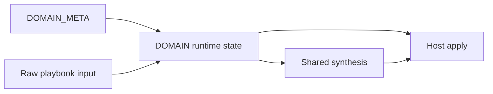

# Compfuzor architecture

Compfuzor is a compile-and-apply system for host configuration.

Users declare intent in playbooks. Compfuzor compiles that intent into explicit
domain state, explicit domain artifacts, and explicit shared-artifact
contributions. Then it applies the result to repositories, filesystems,
services, packages, kernels, and other host-facing targets.

This document is the architecture for that system. It should answer five core
questions:

- what are the main layers of the system?
- how does a domain move from input to host changes?
- where does domain state live?
- where do shared artifacts live?
- what naming and file conventions make the system legible?

If you are entering quickly:

- read `1. System model` for the high-level picture
- read `2. Domain model` if you are adding or reshaping a domain
- read `3. Phases and lifecycle` if you are working on execution flow
- read `4. Prefix and form reference` if you are naming files or facts
- read `6. Worked examples` if you want a concrete pattern to copy

## 1. System model

The architecture has four main layers.

| Layer | Purpose | Main outputs |
|---|---|---|
| domain registry | describe what a domain is and how it is gated | `DOMAIN_META.*` |
| domain control and compile | validate input, compute activity, model intent | `DOMAIN.*` with `norm`, `spec`, `syn` fields by convention |
| shared synthesis | aggregate domain contributions into shared artifacts | `BINS`, `ETC_FILES`, `ENV`, hierarchy-scoped outputs |
| apply | perform host-side changes | repositories, files, links, services, packages, kernel state |

The most important architectural seam is between compile and apply.

- compile work decides what should happen
- apply work makes it happen on the host

That seam matters because it keeps reasoning local. Compile tasks should not
quietly do host work. Apply tasks should not have to rediscover domain intent.

### Core rule

Phase is when. Intent is what.

- `phase` describes runtime ordering
- prefixes, forms, and facets describe semantic responsibility

Do not conflate them. A domain can appear in several phases. A phase can host
several kinds of work.

### The model in one diagram



## 2. Domain model

The architecture now centers domain state in two containers:

- `DOMAIN_META.<domain>` for static metadata
- `DOMAIN.<domain>` for requested runtime state

This is the main control-plane model for the system.

### `DOMAIN_META`

`DOMAIN_META.<domain>` describes static facts about a domain.

Minimum intended fields:

| Field | Purpose |
|---|---|
| `apply` | target family or apply surface |
| `bypass_vars` | list of bypass variables used to gate the domain |

Example:

```yaml
DOMAIN_META:
  get_urls:
    apply: get-urls
    bypass_vars:
      - GET_URLS_BYPASS

  kernel:
    apply: kernel
    bypass_vars:
      - KERNEL_BYPASS
```

Default bypass rule:

- if `bypass_vars` is omitted, the default is `<DOMAIN>_BYPASS`
- for `get_urls`, that means `GET_URLS_BYPASS`
- for `kernel`, that means `KERNEL_BYPASS`

### `DOMAIN`

`DOMAIN.<domain>` is the runtime container for a requested domain.

Important rule:

- create `DOMAIN.<domain>` only if the domain is requested
- absence of `DOMAIN.<domain>` means the domain was not requested

This makes domain presence itself meaningful and avoids cluttering runtime state
with inactive shells.

Minimum control fields:

| Field | Meaning |
|---|---|
| `status` | short state label such as `active`, `bypassed`, `invalid` |
| `requested` | meaningful input exists for the domain |
| `bypassed` | effective bypass state |
| `valid` | contract validation passed |
| `active` | domain should continue through transform, synthesis, and apply |
| `reasons` | optional list explaining inactive or invalid state |

Recommended artifact fields by convention:

| Field | Meaning |
|---|---|
| `norm` | normalized domain values |
| `spec` | authoritative domain contract |
| `syn` | synthesized apply-facing handoff |

Example:

```yaml
DOMAIN:
  get_urls:
    status: active
    requested: true
    bypassed: false
    valid: true
    active: true
    reasons: []
    spec:
      - url: https://example.invalid/file.tar.gz
        dest: /opt/file.tar.gz
```

### Why `DOMAIN` is preferred

Using `DOMAIN.<domain>` gives compfuzor one obvious place to look for runtime
domain state.

Preferred runtime access looks like this:

- `DOMAIN.get_urls.status`
- `DOMAIN.get_urls.active`
- `DOMAIN.kernel.bypassed`
- `DOMAIN.kernel.spec`

### Domain helper contract

The architecture needs a helper that resolves domain gating and initializes the
runtime container.

That helper should:

1. identify the domain id
2. determine whether the domain is requested
3. resolve bypass vars from `DOMAIN_META.<domain>.bypass_vars`
4. default to `<DOMAIN>_BYPASS` if no bypass list is declared
5. compute `requested`, `bypassed`, `valid`, `active`, `status`, and `reasons`
6. create `DOMAIN.<domain>` only if the domain is requested

The helper belongs to the control-plane side of the architecture.

## 3. Phases and lifecycle

Phases describe runtime ordering. Lifecycle describes how a domain moves through
that ordering.

### Top-level phases

| Phase | Purpose |
|---|---|
| `phase:compile` | all pre-apply reasoning and artifact construction |
| `phase:user-context` | user and execution-context setup |
| `phase:repo-apply` | repository-side changes |
| `phase:fs-apply` | files, links, downloads, and script materialization |
| `phase:extras-apply` | domain-specific host changes such as packages, kernel, sysctl |
| `phase:post-run` | delayed or deferred follow-up work |

### Compile subphases

| Phase | Purpose | Typical producers |
|---|---|---|
| `phase:compile.foundation` | validate input, set defaults, compute activity | `vars_*` |
| `phase:compile.discovery` | read host state into explicit snapshots | `probe_*` |
| `phase:compile.transform` | normalize input and build domain contracts | `fn_*` |
| `phase:compile.synthesis` | build apply-facing handoffs and merge shared artifacts | `gen_*` |

### Default lifecycle

The default lifecycle for a non-trivial domain is:

`raw -> norm -> spec -> syn -> apply`

In the current model, those steps normally map to `DOMAIN.<domain>` fields.

| Step | Meaning | Preferred location |
|---|---|---|
| `raw` | playbook input or probe snapshot before normalization | input vars or `_probe_*` |
| `norm` | normalized values with ambiguity removed | `DOMAIN.<domain>.norm` |
| `spec` | authoritative ordered domain contract | `DOMAIN.<domain>.spec` |
| `syn` | apply-facing handoff and domain contribution fragments | `DOMAIN.<domain>.syn` |
| `apply` | concrete host-side effects | apply tasks and executors |

### Optional intermediate shapes

Use these only when they improve clarity.

| Shape | Use when |
|---|---|
| `drv` | you want derivation steps visible and testable |
| `out` | transform logic produces a completed payload before synthesis |
| `merge` | synthesis wants one explicit merge-ready structure |
| `_tmp_*` | you need scratch values local to one task |

Within `DOMAIN.<domain>`, these can appear as optional fields such as `drv`,
`out`, or `merge`. Internal `_tmp_*` values are still local scratch, not public
domain contract.

### Entry and exit expectations

Each phase should reduce ambiguity for the next one.

| Phase | Entry expectation | Exit expectation |
|---|---|---|
| `compile.foundation` | raw input exists | `DOMAIN.<domain>` exists for requested domains, with control fields populated |
| `compile.discovery` | requested domains are known | discovery snapshots exist when required |
| `compile.transform` | active domains are known | `DOMAIN.<domain>.norm` and `.spec` exist for active domains |
| `compile.synthesis` | specs exist | `DOMAIN.<domain>.syn` and shared-artifact fragments exist |
| `*-apply` | synthesized outputs are ready | host changes are applied only for active domains |
| `post-run` | apply phases completed | deferred work is complete |

### Failure and skip behavior

Current intended behavior:

- requested + not bypassed + invalid: fail in compile phase
- bypassed: domain may still have a runtime container, but it should not continue
- not requested: the domain has no `DOMAIN.<domain>` entry at all

The full policy matrix is still pending, but these are the governing cases.

## 4. Prefix and form reference

Prefixes still matter. They are the semantic vocabulary for the system even when
runtime domain data is nested under `DOMAIN.<domain>`.

### Facet catalog

| Facet | Example | Meaning |
|---|---|---|
| `kind` | `kind:fn` | primary semantic family |
| `form` | `form:prefix` | naming or transport shape |
| `record` | `record:_syn_get_urls` | optional record-key pattern |
| `origin` | `origin:task-file` | where the entity lives |
| `phase` | `phase:compile.transform` | when it runs or is consumed |
| `role` | `role:transform` | behavioral responsibility |
| `apply` | `apply:get-urls` | target domain or artifact family |
| `effect` | `effect:host.fs` | effect profile |
| `matcher` | `matcher:regex(^_syn_[a-z0-9_]+$)` | optional lint or review rule |

### File-intent prefixes

| Entity pattern | Kind | Form | Role | Typical phase | Effect | Purpose |
|---|---|---|---|---|---|---|
| `vars_` | `kind:vars` | `form:prefix` | `role:foundation` | `compile.foundation` | `effect:none` | validation, defaults, activity |
| `probe_` | `kind:probe` | `form:prefix` | `role:discovery` | `compile.discovery` | `effect:none` | host-state snapshots |
| `fn_` | `kind:fn` | `form:prefix` | `role:transform` | `compile.transform` | `effect:none` | normalization and spec building |
| `gen_` | `kind:syn` | `form:prefix` | `role:synthesis` | `compile.synthesis` | `effect:none` | handoffs and shared-artifact merges |
| `repo_` | `kind:repo` | `form:prefix` | `role:execution` | `repo-apply` | `effect:host.repo` | repository changes |
| `fs_` | `kind:fs` | `form:prefix` | `role:execution` | `fs-apply` | `effect:host.fs` | files, links, downloads |
| `bins` / `bins_*` | `kind:bins` | `form:prefix` | `role:execution` | `fs-apply` or `extras-apply` | `effect:host.fs` | scripts and helpers |
| `links` / `links_*` | `kind:links` | `form:prefix` | `role:execution` | `fs-apply` or `post-run` | `effect:host.fs` | symlink materialization |
| `_*.tasks` | `kind:orchestrator` | `form:internal` | `role:orchestration` | any | `effect:mixed` | fanout and control-flow helpers |

### Domain artifact fields

Inside `DOMAIN.<domain>`, these are the main artifact kinds.

| Field | Conceptual kind | Meaning |
|---|---|---|
| `norm` | `kind:norm` | normalized domain values |
| `spec` | `kind:spec` | authoritative domain contract |
| `drv` | `kind:drv` | explicit derivations |
| `out` | `kind:out` | completed transform payload |
| `merge` | `kind:merge` | merge-ready domain contribution |
| `syn` | `kind:syn` | apply-facing synthesized handoff |

When a standalone fact is needed outside the domain container, use the same
prefix-before-domain convention:

- `spec_get_urls`
- `syn_kernel`

But the preferred public runtime path is through `DOMAIN.<domain>`.

### Transport forms

These forms describe cross-phase or cross-file transport shapes.

| Entity pattern | Kind | Form | Purpose |
|---|---|---|---|
| `_probe_<domain>` | `kind:probe` | `form:envelope` | discovery transport record |
| `_fn_<domain>_out` | `kind:fn` | `form:envelope` | transform transport record when a standalone envelope is helpful |
| `_syn_<domain>` | `kind:syn` | `form:envelope` | synthesis transport record |

The distinction is simple:

- prefixes describe semantics
- envelope names describe transport shape

### Naming rules

Use lowercase domain ids such as `get_urls` and `kernel` inside `DOMAIN` and
`DOMAIN_META`.

Prefer:

- `DOMAIN.get_urls.spec`
- `DOMAIN.kernel.syn`
- `fn_get_urls.tasks`
- `gen_systemd.tasks`

Avoid:

- `DOMAIN.GET_URLS`
- `get_urls_spec`
- `systemd_gen.tasks`

## 5. Shared artifacts and synthesis

Per-domain state and shared pipeline outputs are different things.

- `DOMAIN.<domain>` holds domain-scoped runtime state
- shared artifacts such as `BINS` and `ETC_FILES` are cross-domain outputs

Do not force shared artifacts under one domain container. They belong to the
pipeline as a whole.

### Why synthesis exists

Many domains contribute to the same artifact families:

- `BINS`
- `ENV`
- `ETC_FILES`
- hierarchy-scoped `*_FILES`, `*_DIRS`, `*_D`

Without a synthesis layer, each domain would mutate those structures on its own
terms, and precedence would become hard to reason about.

### Mutation authority

| Producer kind | May write | Should not write |
|---|---|---|
| `vars_*` | validation and activity fields in `DOMAIN.<domain>` | shared artifact merges, host changes |
| `probe_*` | probe snapshots and discovery fields | host changes |
| `fn_*` | `DOMAIN.<domain>.norm/spec/drv/out/merge` | shared artifact merges, host changes |
| `gen_*` | `DOMAIN.<domain>.syn` and shared-artifact fragments | host changes |
| apply tasks | host changes and apply-local scratch values | compile-phase domain contracts |

Two strong rules follow:

- prefer one explicit merge block over many tiny mutations
- do not hide synthesis work inside `vars_*`

### Merge policy

Default precedence recommendation:

`user > existing-global > synthesized`

That default protects explicit user intent and keeps synthesized values
additive unless a domain says otherwise.

### Configurable merge direction

Merge behavior likely needs to vary by domain and by artifact family.

Suggested future shape:

```yaml
MERGE_POLICY_DEFAULT: user-existing-syn
MERGE_POLICY_DOMAIN:
  get_urls:
    BINS: user-existing-syn
  kernel:
    ETC_FILES: user-existing-syn
    BINS: user-existing-syn
```

Possible strategies include:

- `user-existing-syn`
- `user-syn-existing`
- `existing-user-syn`
- `syn-user-existing`
- `append-dedup`

### Shared-artifact rule

For heavily shared artifacts such as `ETC_FILES`, treat merging as two separate
steps:

1. each active domain produces explicit contribution fragments
2. synthesis aggregates those fragments and resolves final precedence

Aggregation first, precedence second.

### Hierarchy and fanout interaction

Hierarchy and fanout are part of the architecture because they bridge compiled
domain intent to concrete apply-time materialization.

Relevant files today:

- [`/tasks/compfuzor/vars_hierarchy.tasks`](/tasks/compfuzor/vars_hierarchy.tasks)
- [`/tasks/compfuzor/fs_hierarchy.tasks`](/tasks/compfuzor/fs_hierarchy.tasks)
- [`/tasks/compfuzor/_multi.tasks`](/tasks/compfuzor/_multi.tasks)

Together they do three jobs:

- resolve hierarchy roots and base paths
- fan work out across hierarchy families or key groups
- materialize synthesized declarations into directories, files, links, and `.d`
  assemblies

Example bridge:

| Domain or synthesis output | Fanout/orchestration | Apply result |
|---|---|---|
| `ETC_FILES` contribution | `_multi.tasks` and hierarchy keys | concrete `/etc`-style files |
| `BINS` contribution | bins tasks | generated or linked scripts |
| hierarchy file declarations | hierarchy expansion | files and assembled drop-ins |

## 6. Worked examples

### GET_URLS

Current files:

- [`/tasks/compfuzor/vars_get_urls.tasks`](/tasks/compfuzor/vars_get_urls.tasks)
- [`/tasks/compfuzor/fs_get_urls.tasks`](/tasks/compfuzor/fs_get_urls.tasks)

Recommended shape:

```yaml
DOMAIN_META:
  get_urls:
    apply: get-urls
    bypass_vars:
      - GET_URLS_BYPASS

DOMAIN:
  get_urls:
    status: active
    requested: true
    bypassed: false
    valid: true
    active: true
    reasons: []
    norm:
      - url: https://example.invalid/file.tar.gz
        dest: /opt/file.tar.gz
    spec:
      - url: https://example.invalid/file.tar.gz
        dest: /opt/file.tar.gz
        owner: root
        group: root
        validate_certs: true
    syn:
      schema: compfuzor.syn.v1
      domain: get_urls
      apply: get-urls
      entries:
        - url: https://example.invalid/file.tar.gz
          dest: /opt/file.tar.gz
```

Recommended task split:

- `vars_get_urls.tasks` validates input and creates `DOMAIN.get_urls`
- `fn_get_urls.tasks` computes `DOMAIN.get_urls.norm` and `.spec`
- `gen_get_urls.tasks` computes `DOMAIN.get_urls.syn` and shared `BINS`
  contribution fragments
- `fs_get_urls.tasks` consumes `DOMAIN.get_urls.spec` or `.syn.entries`

Lifecycle view:

| Step | Location | Meaning |
|---|---|---|
| raw | `GET_URLS` | playbook input |
| norm | `DOMAIN.get_urls.norm` | normalized URL entries |
| spec | `DOMAIN.get_urls.spec` | authoritative download contract |
| syn | `DOMAIN.get_urls.syn` | apply-facing handoff and helper synthesis |
| apply | `fs_get_urls.tasks` | downloads and `.url` sidecars |

### kernel and zswap

Current files:

- [`/tasks/compfuzor/vars_kernel.tasks`](/tasks/compfuzor/vars_kernel.tasks)
- [`/tasks/compfuzor/kernel_modules.tasks`](/tasks/compfuzor/kernel_modules.tasks)
- [`/zswap.etc.pb`](/zswap.etc.pb)

Recommended shape:

```yaml
DOMAIN_META:
  kernel:
    apply: kernel
    bypass_vars:
      - KERNEL_BYPASS

DOMAIN:
  kernel:
    status: active
    requested: true
    bypassed: false
    valid: true
    active: true
    reasons: []
    spec:
      domains:
        - key: modules
          enabled: true
          json_path: /some/path/kernel.modules.json
        - key: sysctl
          enabled: false
          json_path: /some/path/kernel.sysctl.json
    syn:
      schema: compfuzor.syn.v1
      domain: kernel
      apply: kernel
      entries: []
```

Recommended task split:

- `vars_kernel.tasks` validates input and creates `DOMAIN.kernel`
- `fn_kernel.tasks` computes `DOMAIN.kernel.norm` and `.spec`
- `gen_kernel.tasks` computes `DOMAIN.kernel.syn` plus `ETC_FILES` and `BINS`
  contribution fragments
- bins and extras apply tasks consume those results to perform module, sysctl,
  and sysfs changes

### What the examples are showing

Both examples follow the same rule set:

- one static registry entry in `DOMAIN_META`
- one runtime container in `DOMAIN`
- one clear spec owned by the domain itself
- shared artifacts emitted as contributions, not stuffed into domain state as if
  they belonged only to that domain

## 7. Domain patterns worth preserving

### Config

- `fn_config.tasks` for parameterized config assembly
- `gen_config.tasks` for default batteries-included behavior

This keeps simple config cases easy while allowing richer multi-config schemes.

### GET_URLS

- `vars_get_urls.tasks` for validation and activity
- `fn_get_urls.tasks` for normalization and spec building
- `gen_get_urls.tasks` for helper synthesis and shared-artifact contributions
- `fs_get_urls.tasks` for actual download behavior

### Systemd

- `probe_systemd.tasks` for discovery snapshots
- transform tasks for unit modeling as needed
- `gen_systemd.tasks` for generated units and merge payloads

Systemd remains the strongest case for treating probe as first-class.

### Kernel and zswap

- `vars_kernel.tasks` for validation and activity
- `fn_kernel.tasks` for explicit domain tables and contracts
- `gen_kernel.tasks` for shared-artifact assembly and handoff records
- bins and extras apply tasks for execution

## 8. Pending work

- TODO: formal failure/skip policy matrix
- TODO: formal verification contract for domain migrations
- TODO: stricter naming registry for artifact families beyond prefix seeds
- TODO: normative, testable phase entry and exit guarantees
- TODO: refine merge-policy implementation shape for per-domain and per-artifact control
