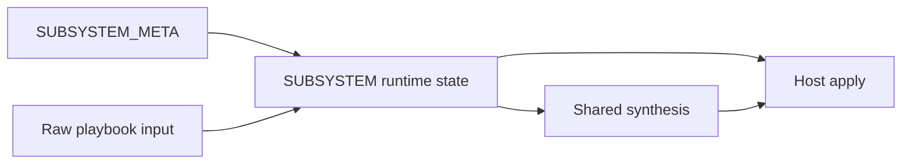

# Compfuzor architecture

Compfuzor is a compile-and-apply system for host configuration.

Users declare intent in playbooks. Compfuzor compiles that intent into explicit
subsystem state, explicit subsystem contracts, and explicit shared-artifact
contributions. Then it applies the result to repositories, filesystems,
services, packages, kernels, and other host-facing targets.

This document defines that model.

If you are entering quickly:

- read `1. System shape` for the high-level picture
- read `2. Subsystem model` if you are adding or reshaping a subsystem
- read `3. Phases and lifecycle` if you are working on pipeline flow
- read `4. Labels, prefixes, and forms` if you are naming files or facts
- read `5. Shared artifacts and merge policy` if you are debugging synthesis
- read `6. Worked examples` if you want a concrete pattern to copy

## 1. System shape

The architecture has four layers.

| Layer | Purpose | Main outputs |
|---|---|---|
| type registry | describe subsystem types and gating behavior | `SUBSYSTEM_META.*` |
| runtime subsystem state | validate input, compute activity, build contracts | `SUBSYSTEM.*` |
| shared synthesis | aggregate subsystem contributions into shared artifacts | `BINS`, `ETC_FILES`, `ENV`, hierarchy outputs |
| apply | perform host-side changes | repositories, files, links, services, packages, kernel state |

The most important seam is between compile and apply.

- compile work decides what should happen
- apply work makes it happen on the host

Compile tasks should not quietly do host work. Apply tasks should not have to
rediscover subsystem intent.

### Core rule

Phase is when. Intent is what.

- `phase` describes runtime ordering
- labels, prefixes, forms, and facets describe semantic responsibility

Do not conflate them. A subsystem can appear in several phases. A phase can host
several kinds of work.

### The model in one diagram



## 2. Subsystem model

The architecture centers runtime state in two containers:

- `SUBSYSTEM_META.<id>` for subsystem type definitions
- `SUBSYSTEM.<name>` for requested runtime subsystem instances

This gives the system one clear place for control-plane state and one clear
place for runtime subsystem artifacts.

### Subsystem types: `SUBSYSTEM_META`

`SUBSYSTEM_META.<id>` describes a reusable subsystem type.

It defines labels, effect profile, and bypass behavior. It does not hold runtime
values.

Minimum intended fields:

| Field | Category | Meaning |
|---|---|---|
| `labels` | metadata | classification labels for the subsystem type |
| `bypass_vars` | metadata | bypass resolution behavior |

Recommended labels:

| Label | Meaning | Example |
|---|---|---|
| `domain` | broad family label | `kernel` |
| `apply` | apply surface or executor family | `sysctl` |
| `effect` | effect profile | `host.fs`, `host.kernel`, `network` |
| `role` | optional higher-level responsibility | `orchestration`, `discovery` |

Example:

```yaml
SUBSYSTEM_META:
  get_urls:
    labels:
      domain: fetch
      apply: get-urls
      effect:
        - network
        - host.fs
    bypass_vars: true

  kernel_sysctl:
    labels:
      domain: kernel
      apply: sysctl
      effect:
        - host.fs
        - host.kernel
    bypass_vars: true
```

### Runtime instances: `SUBSYSTEM`

`SUBSYSTEM.<name>` is the runtime container for a requested subsystem instance.

Important rules:

- create `SUBSYSTEM.<name>` only if that subsystem is requested
- absence of `SUBSYSTEM.<name>` means it was not requested
- `SUBSYSTEM.<name>.subsystem` optionally names the subsystem type definition to
  use from `SUBSYSTEM_META`
- if `subsystem` is omitted, it defaults to the same name as the subsystem key

That lets runtime instances usually map 1:1 to their type definitions while
leaving space for multiple instances of one subsystem type later.

Example:

```yaml
SUBSYSTEM:
  get_urls:
    status: active
    requested: true
    bypassed: false
    valid: true
    active: true
    reasons: []
    spec:
      - url: https://example.invalid/file.tar.gz
        dest: /opt/file.tar.gz

  downloads_for_bootstrap:
    subsystem: get_urls
    status: active
    requested: true
    bypassed: false
    valid: true
    active: true
    reasons: []
    spec:
      - url: https://example.invalid/bootstrap.tar.gz
        dest: /opt/bootstrap.tar.gz
```

### Subsystem fields

This is the main runtime field contract.

| Field | Category | Required | Meaning |
|---|---|---|---|
| `subsystem` | metadata | no | subsystem type id from `SUBSYSTEM_META`; defaults to same-name |
| `status` | control | yes | short state label such as `active`, `bypassed`, `invalid` |
| `requested` | control | yes | meaningful input exists for the subsystem |
| `bypassed` | control | yes | effective bypass state |
| `valid` | control | yes | contract validation passed |
| `active` | control | yes | subsystem should continue through transform and apply |
| `reasons` | control | recommended | explanations for inactive or invalid state |
| `probe` | artifact | no | discovery snapshot or probe result |
| `norm` | artifact | no | normalized subsystem values |
| `spec` | artifact | recommended | primary subsystem contract |
| `contrib` | artifact | no | contributions to shared synthesized artifacts |
| `drv` | artifact | no | explicit derivations when useful |
| `out` | artifact | no | completed transform payload when useful |
| `merge` | artifact | no | one explicit merge-ready structure when useful |

This control-vs-artifact split is intentional.

- control fields decide whether the subsystem should continue
- artifact fields describe what the subsystem means and what it contributes

### Why `spec` is primary

`spec` should be the main durable contract for a subsystem.

It tells you what the subsystem means after normalization and validation. In
most cases, that is enough for apply work.

`contrib` is different:

- `spec` is subsystem-owned meaning
- `contrib` is subsystem output for shared synthesis

That is why `contrib` is better than a default `syn` field. It tells you exactly
what the subsystem is contributing without implying that every subsystem needs a
standalone synthesized handoff object.

### Probe is optional

`probe` is optional globally, but it is encouraged for subsystems whose behavior
depends on current host state.

Examples:

- `probe_systemd` is a strong candidate
- a pure input-to-file subsystem may not need `probe` at all

### Subsystem helper contract

The architecture assumes a helper that resolves control-plane state and creates
runtime subsystem objects.

That helper should:

1. identify the subsystem instance name
2. resolve the subsystem type id from `subsystem`, defaulting to the same name
3. determine whether the subsystem is requested
4. resolve effective bypass vars from `SUBSYSTEM_META.<id>.bypass_vars`
5. compute `requested`, `bypassed`, `valid`, `active`, `status`, and `reasons`
6. create `SUBSYSTEM.<name>` only if requested

## 3. Phases and lifecycle

Phases describe runtime ordering. Lifecycle describes how one subsystem moves
through that ordering.

### Top-level phases

| Phase | Purpose |
|---|---|
| `phase:compile` | all pre-apply reasoning and artifact construction |
| `phase:user-context` | user and execution-context setup |
| `phase:repo-apply` | repository-side changes |
| `phase:fs-apply` | files, links, downloads, and script materialization |
| `phase:extras-apply` | domain-specific host changes such as packages, kernel, sysctl |
| `phase:post-run` | delayed or deferred follow-up work |

### Compile subphases

| Phase | Purpose | Typical producers |
|---|---|---|
| `phase:compile.foundation` | validate input, set defaults, compute activity | `vars_*` |
| `phase:compile.discovery` | read host state into explicit snapshots | `probe_*` |
| `phase:compile.transform` | normalize input and build subsystem contracts | `fn_*` |
| `phase:compile.synthesis` | build shared-artifact contributions and merge outputs | `gen_*` |

### Default lifecycle

The default lifecycle for a non-trivial subsystem is:

`raw -> probe? -> norm -> spec -> contrib? -> apply`

This is the main subsystem contract.

| Step | Meaning | Preferred location |
|---|---|---|
| `raw` | playbook input before normalization | input vars |
| `probe` | optional discovery snapshot | `SUBSYSTEM.<name>.probe` |
| `norm` | normalized values with ambiguity removed | `SUBSYSTEM.<name>.norm` |
| `spec` | authoritative subsystem contract | `SUBSYSTEM.<name>.spec` |
| `contrib` | optional shared-artifact contribution | `SUBSYSTEM.<name>.contrib` |
| `apply` | concrete host-side effects | apply tasks and executors |

### Optional intermediate shapes

Use these only when they improve clarity.

| Shape | Use when |
|---|---|
| `drv` | you want derivation steps visible and testable |
| `out` | transform logic produces a completed payload before shared synthesis |
| `merge` | one explicit merge-ready structure clarifies synthesis |
| `_tmp_*` | you need scratch values local to one task |

### Entry and exit expectations

Each phase should reduce ambiguity for the next one.

| Phase | Entry expectation | Exit expectation |
|---|---|---|
| `compile.foundation` | raw input exists | `SUBSYSTEM.<name>` exists for requested subsystems, with control fields populated |
| `compile.discovery` | requested subsystems are known | `probe` exists where discovery is needed |
| `compile.transform` | active subsystems are known | `norm` and `spec` exist for active subsystems |
| `compile.synthesis` | specs exist | `contrib` exists where shared synthesis is needed; merged shared artifacts are prepared |
| `*-apply` | subsystem contracts and shared outputs are ready | host changes are applied only for active subsystems |
| `post-run` | apply phases completed | deferred work is complete |

### Failure and skip behavior

Current intended behavior:

- requested + not bypassed + invalid: fail in compile phase
- bypassed: subsystem may still have a runtime container, but should not continue
- not requested: the subsystem has no `SUBSYSTEM.<name>` entry at all

The full policy matrix is still pending.

## 4. Labels, prefixes, and forms

The runtime container model does not replace the label and prefix system.

Both are needed:

- `SUBSYSTEM_META` and `SUBSYSTEM` organize runtime state
- labels, prefixes, forms, and facets classify the producers and artifacts in
  that state

### Facet catalog

| Facet | Example | Meaning |
|---|---|---|
| `kind` | `kind:fn` | primary semantic family |
| `form` | `form:prefix` | naming or transport shape |
| `record` | `record:_probe_systemd` | optional record-key pattern |
| `origin` | `origin:task-file` | where the entity lives |
| `phase` | `phase:compile.transform` | when it runs or is consumed |
| `role` | `role:transform` | behavioral responsibility |
| `apply` | `apply:get-urls` | target subsystem or artifact family |
| `effect` | `effect:host.fs` | effect profile |
| `matcher` | `matcher:regex(^_probe_[a-z0-9_]+$)` | optional lint or review rule |

### File-intent prefixes

| Entity pattern | Kind | Form | Role | Typical phase | Effect | Purpose |
|---|---|---|---|---|---|---|
| `vars_` | `kind:vars` | `form:prefix` | `role:foundation` | `compile.foundation` | `effect:none` | validation, defaults, activity |
| `probe_` | `kind:probe` | `form:prefix` | `role:discovery` | `compile.discovery` | `effect:none` | host-state snapshots |
| `fn_` | `kind:fn` | `form:prefix` | `role:transform` | `compile.transform` | `effect:none` | normalization and contract building |
| `gen_` | `kind:syn` | `form:prefix` | `role:synthesis` | `compile.synthesis` | `effect:none` | shared-artifact merges and transport records |
| `repo_` | `kind:repo` | `form:prefix` | `role:execution` | `repo-apply` | `effect:host.repo` | repository changes |
| `fs_` | `kind:fs` | `form:prefix` | `role:execution` | `fs-apply` | `effect:host.fs` | files, links, downloads |
| `bins` / `bins_*` | `kind:bins` | `form:prefix` | `role:execution` | `fs-apply` or `extras-apply` | `effect:host.fs` | scripts and helpers |
| `links` / `links_*` | `kind:links` | `form:prefix` | `role:execution` | `fs-apply` or `post-run` | `effect:host.fs` | symlink materialization |
| `_*.tasks` | `kind:orchestrator` | `form:internal` | `role:orchestration` | any | `effect:mixed` | fanout and control-flow helpers |

### Transport forms

Transport forms are the secondary global naming and addressing scheme for the
pipeline.

The preferred place for runtime state is the subsystem container:

- `SUBSYSTEM.<name>.probe`
- `SUBSYSTEM.<name>.norm`
- `SUBSYSTEM.<name>.spec`
- `SUBSYSTEM.<name>.contrib`

But some pipeline steps still need standalone globally addressable fact names.
That usually happens when work crosses task-file boundaries through `set_fact`-
style global keys, when fanout/orchestration helpers need stable external names,
or when a producer and consumer are not both operating directly on the same
subsystem object.

That is what transport forms are for. They are not the primary home of meaning.
They are the global transport and addressing layer.

Use them when you need one of these properties:

- a globally named handoff key
- a stable external address for orchestration or fanout
- a transport record that can move between files without requiring direct
  subsystem-object access

Avoid them when a direct subsystem field is sufficient.

| Entity pattern | Kind | Form | Purpose |
|---|---|---|---|
| `_probe_<domain>` | `kind:probe` | `form:envelope` | discovery transport record |
| `_fn_<domain>_out` | `kind:fn` | `form:envelope` | transform transport record when a standalone envelope is helpful |
| `_syn_<domain>` | `kind:syn` | `form:envelope` | synthesis transport record when a standalone handoff is helpful |

The distinction is:

- prefixes describe semantics
- envelope names describe transport shape

Examples:

- prefer `SUBSYSTEM.get_urls.spec` over `_fn_get_urls_out` when the producer and
  consumer are both working inside the subsystem model
- use `_probe_systemd` when discovery output needs a stable globally named
  record that other task files can consume without navigating a subsystem object
- use `_syn_<domain>` only when a standalone synthesized handoff record is more
  useful than reading the subsystem's `contrib` or `spec` fields directly

### Naming rules

Use lowercase ids in `SUBSYSTEM_META` and `SUBSYSTEM`.

Prefer:

- `SUBSYSTEM.get_urls.spec`
- `SUBSYSTEM.kernel_sysctl.probe`
- `SUBSYSTEM.kernel_all.contrib`
- `fn_get_urls.tasks`
- `gen_systemd.tasks`

Avoid:

- `SUBSYSTEM.GET_URLS`
- `get_urls_spec`
- `systemd_gen.tasks`

## 5. Shared artifacts and merge policy

Per-subsystem state and shared pipeline outputs are different things.

- `SUBSYSTEM.<name>` holds subsystem-scoped runtime state
- shared artifacts such as `BINS` and `ETC_FILES` are cross-subsystem outputs

Do not force shared artifacts under one subsystem container. They belong to the
pipeline as a whole.

### Why shared synthesis exists

Many subsystems contribute to the same artifact families:

- `BINS`
- `ENV`
- `ETC_FILES`
- hierarchy-scoped `*_FILES`, `*_DIRS`, `*_D`

Without a synthesis layer, each subsystem would mutate those structures on its
own terms, and precedence would become hard to reason about.

### Mutation authority

| Producer kind | May write | Should not write |
|---|---|---|
| `vars_*` | control fields and defaults in `SUBSYSTEM.<name>` | shared artifact merges, host changes |
| `probe_*` | `probe` fields and discovery data | host changes |
| `fn_*` | `norm`, `spec`, `drv`, `out`, `merge` in `SUBSYSTEM.<name>` | shared artifact merges, host changes |
| `gen_*` | `contrib` fields and global shared-artifact merges | host changes |
| apply tasks | host changes and apply-local scratch values | compile-phase subsystem contracts |

Two strong rules follow:

- prefer one explicit merge block over many tiny mutations
- do not hide shared synthesis work inside `vars_*`

### Merge policies

Supported strategy names should be explicit and finite.

| Strategy | Priority order |
|---|---|
| `user-existing-syn` | user > existing-global > synthesized |
| `user-syn-existing` | user > synthesized > existing-global |
| `existing-user-syn` | existing-global > user > synthesized |
| `syn-user-existing` | synthesized > user > existing-global |
| `append-dedup` | append list-like values and deduplicate |

Recommended default:

- default strategy name: `user-existing-syn`
- desired default priority: `user > existing-global > synthesized`

That default protects explicit user intent and keeps synthesized values
additive unless a subsystem says otherwise.

### Configurable merge direction

Merge behavior likely needs to vary by subsystem type and by artifact family.

Suggested future shape:

```yaml
MERGE_POLICY_DEFAULT: user-existing-syn
MERGE_POLICY_SUBSYSTEM:
  get_urls:
    BINS: user-existing-syn
  kernel_sysctl:
    ETC_FILES: user-existing-syn
  kernel_all:
    BINS: user-existing-syn
```

### Shared-artifact rule

For heavily shared artifacts such as `ETC_FILES`, treat synthesis as two
separate steps:

1. each active subsystem produces explicit contribution fragments
2. shared synthesis aggregates those fragments and resolves final precedence

Aggregation first, precedence second.

### Hierarchy and fanout interaction

Hierarchy and fanout are part of the architecture because they bridge compiled
subsystem intent to apply-time materialization.

Relevant files today:

- [`/tasks/compfuzor/vars_hierarchy.tasks`](/tasks/compfuzor/vars_hierarchy.tasks)
- [`/tasks/compfuzor/fs_hierarchy.tasks`](/tasks/compfuzor/fs_hierarchy.tasks)
- [`/tasks/compfuzor/_multi.tasks`](/tasks/compfuzor/_multi.tasks)

Together they do three jobs:

- resolve hierarchy roots and base paths
- fan work out across hierarchy families or key groups
- materialize synthesized declarations into directories, files, links, and `.d`
  assemblies

Example bridge:

| Subsystem or synthesis output | Fanout/orchestration | Apply result |
|---|---|---|
| `ETC_FILES` contribution | `_multi.tasks` and hierarchy keys | concrete `/etc`-style files |
| `BINS` contribution | bins tasks | generated or linked scripts |
| hierarchy file declarations | hierarchy expansion | files and assembled drop-ins |

## 6. Worked examples

### GET_URLS

Current files:

- [`/tasks/compfuzor/vars_get_urls.tasks`](/tasks/compfuzor/vars_get_urls.tasks)
- [`/tasks/compfuzor/fs_get_urls.tasks`](/tasks/compfuzor/fs_get_urls.tasks)

Recommended shape:

```yaml
SUBSYSTEM_META:
  get_urls:
    labels:
      domain: fetch
      apply: get-urls
      effect:
        - network
        - host.fs
    bypass_vars: true

SUBSYSTEM:
  get_urls:
    status: active
    requested: true
    bypassed: false
    valid: true
    active: true
    reasons: []
    norm:
      - url: https://example.invalid/file.tar.gz
        dest: /opt/file.tar.gz
    spec:
      - url: https://example.invalid/file.tar.gz
        dest: /opt/file.tar.gz
        owner: root
        group: root
        validate_certs: true
    contrib:
      BINS:
        - name: get-urls.sh
```

Recommended task split:

- `vars_get_urls.tasks` validates input and creates `SUBSYSTEM.get_urls`
- `fn_get_urls.tasks` computes `SUBSYSTEM.get_urls.norm` and `.spec`
- `gen_get_urls.tasks` computes `SUBSYSTEM.get_urls.contrib`
- `fs_get_urls.tasks` consumes `SUBSYSTEM.get_urls.spec`

Lifecycle view:

| Step | Location | Meaning |
|---|---|---|
| raw | `GET_URLS` | playbook input |
| norm | `SUBSYSTEM.get_urls.norm` | normalized URL entries |
| spec | `SUBSYSTEM.get_urls.spec` | authoritative download contract |
| contrib | `SUBSYSTEM.get_urls.contrib` | helper and shared-artifact contributions |
| apply | `fs_get_urls.tasks` | downloads and `.url` sidecars |

### Kernel

Current files:

- [`/tasks/compfuzor/vars_kernel.tasks`](/tasks/compfuzor/vars_kernel.tasks)
- [`/tasks/compfuzor/kernel_modules.tasks`](/tasks/compfuzor/kernel_modules.tasks)
- [`/zswap.etc.pb`](/zswap.etc.pb)

Recommended subsystem types:

- `kernel_modprobe`
- `kernel_sysctl`
- `kernel_sysfs`
- `kernel_all`

Recommended shape:

```yaml
SUBSYSTEM_META:
  kernel_modprobe:
    labels:
      domain: kernel
      apply: modprobe
      effect:
        - host.fs
        - host.kernel
    bypass_vars: true

  kernel_sysctl:
    labels:
      domain: kernel
      apply: sysctl
      effect:
        - host.fs
        - host.kernel
    bypass_vars: true

  kernel_sysfs:
    labels:
      domain: kernel
      apply: sysfs
      effect:
        - host.fs
        - host.kernel
    bypass_vars: true

  kernel_all:
    labels:
      domain: kernel
      apply: kernel-all
      role:
        - orchestration
      effect:
        - host.fs
        - host.kernel
    bypass_vars: true

SUBSYSTEM:
  kernel_sysctl:
    status: active
    requested: true
    bypassed: false
    valid: true
    active: true
    reasons: []
    spec:
      vm.swappiness: "180"
    contrib:
      ETC_FILES:
        - name: kernel.sysctl.json

  kernel_all:
    status: active
    requested: true
    bypassed: false
    valid: true
    active: true
    reasons: []
    spec:
      parts:
        - kernel_modprobe
        - kernel_sysctl
        - kernel_sysfs
    contrib:
      BINS:
        - name: build.sh
        - name: install.sh
```

What this split buys you:

- `kernel_modprobe`, `kernel_sysctl`, and `kernel_sysfs` stay clean and focused
- `kernel_all` owns aggregate orchestration such as final `build.sh` and
  `install.sh`
- `domain: kernel` remains a label instead of being overloaded as the only
  runtime object name

## 7. Bypass resolution rules

`bypass_vars` supports three modes.

| Value | Meaning |
|---|---|
| omitted | use automatic default bypass discovery |
| `true` | use automatic default bypass discovery |
| list of strings | use exactly those bypass vars |
| list containing `true` | use automatic defaults plus any additional listed vars |

Automatic default discovery should include:

1. subsystem-specific bypass var derived from the subsystem type id
2. domain-level bypass var derived from the `labels.domain` value, if present

Examples:

| Subsystem type | Automatic bypass vars |
|---|---|
| `get_urls` | `GET_URLS_BYPASS` |
| `kernel_sysctl` with `domain: kernel` | `KERNEL_SYSCTL_BYPASS`, `KERNEL_BYPASS` |
| `kernel_all` with `domain: kernel` | `KERNEL_ALL_BYPASS`, `KERNEL_BYPASS` |

Example of supplementation:

```yaml
SUBSYSTEM_META:
  kernel_sysctl:
    labels:
      domain: kernel
      apply: sysctl
    bypass_vars:
      - true
      - MY_BYPASS
```

Expected effective bypass sources:

- `KERNEL_SYSCTL_BYPASS`
- `KERNEL_BYPASS`
- `MY_BYPASS`

Example of full replacement:

```yaml
SUBSYSTEM_META:
  kernel_sysctl:
    labels:
      domain: kernel
      apply: sysctl
    bypass_vars:
      - ONLY_THIS_BYPASS
```

Expected effective bypass source:

- `ONLY_THIS_BYPASS`

## 8. Pending work

- TODO: formal failure/skip policy matrix
- TODO: formal verification contract for subsystem migrations
- TODO: stricter naming registry for artifact families beyond the current seed tables
- TODO: normative, testable phase entry and exit guarantees
- TODO: exact `contrib` schema conventions for major shared artifact families
