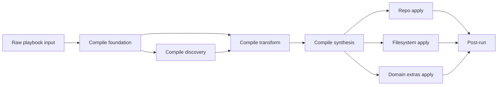

# Compfuzor architecture

Compfuzor is a compile-and-apply system for host configuration.

Users declare intent in playbooks. Compfuzor turns that intent into explicit
facts, specs, and synthesized payloads. Then it applies those payloads to the
host through repositories, filesystem changes, scripts, packages, services, and
other domain executors.

This document explains that model from two angles at once:

- as a mental model for someone new to the codebase
- as a technical reference for naming, phases, contracts, and worked examples

If you are trying to enter quickly:

- start with `1. Mental model` if you need the big picture
- start with `3. Domain lifecycle` if you are adding or refactoring a domain
- start with `5. Prefix and facet reference` if you are naming files or facts
- start with `6. Shared artifacts and synthesis` if you are debugging merges
- start with `8. Worked examples` if you want a concrete pattern to copy

## 1. Mental model

The shortest useful description of compfuzor is this:

1. read raw playbook intent
2. compile that intent into explicit domain contracts
3. synthesize shared artifacts and handoff records
4. apply those outputs to the host

The central architectural seam is between compile work and apply work.

- compile work decides what should happen
- apply work makes it happen on the host

That seam matters because it keeps reasoning local. A compile task should not
silently perform host-side changes. An apply task should not have to rediscover
or reinterpret domain intent from scratch.

### The three layers

Compfuzor is easiest to understand as three layers.

| Layer | Responsibility | Typical outputs |
|---|---|---|
| input and compile | validate input, discover state, normalize values, build specs, synthesize handoffs | `norm_*`, `spec_*`, `_probe_*`, `_syn_*`, shared-artifact fragments |
| synthesis boundary | aggregate domain contributions and resolve merge behavior | merged `BINS`, `ETC_FILES`, `ENV`, other shared artifacts |
| apply | execute repository, filesystem, package, service, kernel, and post-run changes | host-side changes |

### The core invariant

Phase is when. Intent is what.

- `phase` describes runtime ordering
- prefixes and facets describe semantic responsibility

Do not conflate them. A domain can appear in several phases. A phase can host
several kinds of work.

### Vocabulary bridge

Compfuzor should now speak in the following terms:

| Use this | Instead of | Meaning |
|---|---|---|
| `phase` | `stage` | runtime ordering |
| `role` | `class` | behavioral responsibility |
| `effect` | `side-effect` | side-effect profile |
| `form` | ad hoc envelope naming language | naming or transport shape |

### The architecture in one diagram



## 2. Phase architecture

Phases explain runtime flow. They do not replace prefixes or facets; they are
the timeline those other concepts live inside.

### Top-level phases

| Phase | Purpose |
|---|---|
| `phase:compile` | all pre-apply reasoning and artifact construction |
| `phase:user-context` | user and execution-context setup |
| `phase:repo-apply` | repository-side changes |
| `phase:fs-apply` | filesystem, links, downloads, and script materialization |
| `phase:extras-apply` | domain-specific host changes such as packages, database, kernel, sysctl |
| `phase:post-run` | deferred cleanup, delayed links, or follow-up hooks |

### Compile subphases

Most architectural precision lives inside compile.

| Phase | Purpose | Typical producers |
|---|---|---|
| `phase:compile.foundation` | validate inputs, set defaults, compute activation | `vars_*` |
| `phase:compile.discovery` | read host state into explicit snapshots | `probe_*` |
| `phase:compile.transform` | normalize raw input, build explicit specs | `fn_*` |
| `phase:compile.synthesis` | build handoff records and merge shared artifacts | `gen_*` |

### Entry and exit expectations

Each phase should leave the next one with less ambiguity.

| Phase | Entry expectation | Exit expectation |
|---|---|---|
| `compile.foundation` | raw inputs exist | defaults, validation, and activation facts exist |
| `compile.discovery` | foundation facts exist | explicit `_probe_*` snapshots exist when needed |
| `compile.transform` | active domains are known | `norm_*` and `spec_*` exist for active domains |
| `compile.synthesis` | `spec_*` exists | `_syn_*` records and merged artifacts exist |
| `*-apply` | synthesized outputs are ready | host changes are applied only for active domains |
| `post-run` | apply phases completed | deferred work is complete |

Examples:

- if `GET_URLS_ACTIVE` is true, `spec_get_urls` should exist before
  `fs_get_urls.tasks` runs
- if kernel synthesis is active, `_syn_kernel*` records should exist before
  install scripts or extras apply work consume them

## 3. Domain lifecycle

The default lifecycle for a non-trivial domain is:

`raw -> norm -> spec -> syn -> apply`

This is the main architectural contract for domain work.

### Core lifecycle steps

| Step | Meaning | Preferred output |
|---|---|---|
| `raw` | user-declared or discovered input before normalization | domain input vars or `_probe_*` |
| `norm` | normalized values with ambiguity removed | `norm_<domain>` |
| `spec` | ordered explicit domain contract | `spec_<domain>` |
| `syn` | apply-facing handoff and shared-artifact fragments | `_syn_<domain>` and merge payloads |
| `apply` | concrete host-side effects | files, repos, services, packages, runtime changes |

### Optional intermediate shapes

Use these only when they improve clarity.

| Shape | Use when |
|---|---|
| `drv_<domain>` | you want derivation steps visible and testable |
| `out_<domain>` | transform logic produces a completed payload before synthesis |
| `merge_<domain>` | synthesis wants one explicit merge-ready structure |
| `_tmp_<domain>` | you need scratch values local to one task |

### What the lifecycle is buying you

This lifecycle is not ceremony. It solves real problems.

- `norm_*` prevents every downstream consumer from handling raw edge cases
- `spec_*` gives the domain one authoritative model
- `_syn_*` makes phase boundaries explicit and reduces hidden work in apply code
- `apply` tasks become simpler because they consume explicit contracts

### The implementor recipe

The normal way to author a domain is:

1. validate the contract
2. compute activation
3. normalize input into `norm_<domain>`
4. build one ordered `spec_<domain>`
5. derive optional `drv_*` or `out_*` values if they clarify the transform
6. synthesize one explicit handoff and shared-artifact fragments
7. apply host-side changes in the appropriate apply phase

One stable spec should drive the rest of the domain. That is the main design
goal.

## 4. Domain activation and control flow

Activation answers one operational question cleanly: should this domain keep
going?

### Required activation facts

Every domain should expose these facts.

| Fact | Meaning |
|---|---|
| `<DOMAIN>_REQUESTED` | meaningful input exists for the domain |
| `<DOMAIN>_BYPASSED` | the effective bypass state resolved for the domain |
| `<DOMAIN>_VALID` | contract validation passed |
| `<DOMAIN>_ACTIVE` | the domain should continue through transform, synthesis, and apply |

The default formula is:

`<DOMAIN>_ACTIVE = <DOMAIN>_REQUESTED and not <DOMAIN>_BYPASSED and <DOMAIN>_VALID`

### Recommended diagnostic facts

These are not mandatory, but they are strongly useful while shaping domains.

| Fact | Purpose |
|---|---|
| `<DOMAIN>_STATUS` | maps `requested`, `bypassed`, `valid`, `active`, and `reasons` |
| `_trace_<domain>` | lightweight lifecycle/debug snapshot |

Example:

```yaml
GET_URLS_STATUS:
  requested: true
  bypassed: false
  valid: true
  active: true
  reasons: []
```

### Mapping existing bypass flags

Compfuzor already has many `*_BYPASS` flags. The activation contract does not
replace them; it gives them one consistent meaning.

| Existing flag | Suggested activation fact |
|---|---|
| `GET_URLS_BYPASS` | `GET_URLS_BYPASSED` |
| `KERNEL_BYPASS` | `KERNEL_BYPASSED` |
| `SYSTEMD_INSTALL_BYPASS` | `SYSTEMD_BYPASSED` or a narrower systemd apply gate |
| `FS_BYPASS` | subsystem-level apply gate, not necessarily one domain fact |

Important nuance:

- some bypass flags are semantic-domain gates such as `GET_URLS_BYPASS`
- some bypass flags are subsystem gates such as `FS_BYPASS` or `BINS_BYPASS`

Domain activation should model semantic intent. Broader subsystem gates can
still short-circuit large apply regions.

### Failure and skip behavior

The intended behavior is:

- requested + not bypassed + invalid: fail in compile phase
- bypassed: domain may still compute status, but should not continue
- not requested: domain remains inactive without error

The full policy matrix is still pending, but these are the governing cases.

## 5. Prefix and facet reference

This section is the naming and classification reference. Use it when you are
creating a new file, fact, or handoff record.

### Facet catalog

| Facet | Example | Meaning |
|---|---|---|
| `kind` | `kind:fn` | primary semantic family |
| `form` | `form:prefix` | naming or transport shape |
| `record` | `record:_syn_get_urls` | optional record-key pattern |
| `origin` | `origin:task-file` | where the entity lives |
| `phase` | `phase:compile.transform` | when it runs or is consumed |
| `role` | `role:transform` | behavioral responsibility |
| `apply` | `apply:get-urls` | target domain or artifact family |
| `effect` | `effect:host.fs` | effect profile |
| `matcher` | `matcher:regex(^_syn_[a-z0-9_]+$)` | optional lint or review rule |

### File-intent prefixes

These prefixes classify task files and execution helpers.

| Entity pattern | Kind | Form | Role | Typical phase | Effect | Typical output |
|---|---|---|---|---|---|---|
| `vars_` | `kind:vars` | `form:prefix` | `role:foundation` | `compile.foundation` | `effect:none` | defaults, validation, activation facts |
| `probe_` | `kind:probe` | `form:prefix` | `role:discovery` | `compile.discovery` | `effect:none` | `_probe_<domain>` snapshots |
| `fn_` | `kind:fn` | `form:prefix` | `role:transform` | `compile.transform` | `effect:none` | `norm_*`, `spec_*`, optional `drv_*`, `out_*` |
| `gen_` | `kind:syn` | `form:prefix` | `role:synthesis` | `compile.synthesis` | `effect:none` | `_syn_*` and explicit merge payloads |
| `repo_` | `kind:repo` | `form:prefix` | `role:execution` | `repo-apply` | `effect:host.repo` | repository changes |
| `fs_` | `kind:fs` | `form:prefix` | `role:execution` | `fs-apply` | `effect:host.fs` | files, links, downloads, environment files |
| `bins` / `bins_*` | `kind:bins` | `form:prefix` | `role:execution` | `fs-apply` or `extras-apply` | `effect:host.fs` | scripts, helpers, install drivers |
| `links` / `links_*` | `kind:links` | `form:prefix` | `role:execution` | `fs-apply` or `post-run` | `effect:host.fs` | symlinks and delayed link passes |
| `_*.tasks` | `kind:orchestrator` | `form:internal` | `role:orchestration` | any | `effect:mixed` | fanout and control-flow helpers |

### Data-intent prefixes

These prefixes classify facts and intermediate payloads.

| Entity pattern | Kind | Form | Role | Effect | Purpose |
|---|---|---|---|---|---|
| `raw_` | `kind:raw` | `form:prefix` | `role:input` | `effect:none` | unnormalized values |
| `norm_` | `kind:norm` | `form:prefix` | `role:normalization` | `effect:none` | validated and normalized values |
| `spec_` | `kind:spec` | `form:prefix` | `role:model` | `effect:none` | ordered explicit domain contract |
| `drv_` | `kind:drv` | `form:prefix` | `role:derivation` | `effect:none` | intermediate computed values |
| `out_` | `kind:out` | `form:prefix` | `role:output` | `effect:none` | completed transform payload |
| `merge_` | `kind:merge` | `form:prefix` | `role:synthesis-input` | `effect:none` | merge-ready payload |
| `syn_` | `kind:syn` | `form:prefix` | `role:synthesis-output` | `effect:none` | synthesized payload ready for merge |
| `_tmp_` | `kind:tmp` | `form:internal` | `role:scratch` | `effect:none` | short-lived internal values |

### Transport and handoff forms

These forms describe how data moves across phase seams.

| Entity pattern | Kind | Form | Role | Purpose |
|---|---|---|---|---|
| `_probe_<domain>` | `kind:probe` | `form:envelope` | `role:discovery` + `role:handoff` | discovery transport record |
| `_fn_<domain>_out` | `kind:fn` | `form:envelope` | `role:transform` + `role:handoff` | exceptional transform transport record |
| `_syn_<domain>` | `kind:syn` | `form:envelope` | `role:synthesis` + `role:handoff` | synthesis transport record |

The important distinction is:

- prefixes such as `spec_*` or `norm_*` communicate semantics
- envelope names such as `_syn_<domain>` communicate transport shape

That is why `_syn_<domain>` is still `kind:syn`, not a new kind.

### Naming rules

Use prefix-before-domain naming for canonical public facts and task files.

- `spec_get_urls`, not `get_urls_spec`
- `fn_get_urls.tasks`, not `get_urls.fn.tasks`
- `gen_systemd.tasks`, not `systemd_gen.tasks`

Further rules:

- prefer visible prefixes for externalized facts: `norm_*`, `spec_*`, `syn_*`
- use leading underscores for transport records or internal values
- keep `_tmp_*` local to the producing task unless there is a strong reason not to
- allow `_fn_<domain>_out` only when it truly helps orchestration; otherwise use
  `spec_<domain>` as the main transform contract

## 6. Shared artifacts and synthesis

Synthesis exists because many domains contribute to the same artifacts.

Common shared artifacts include:

- `BINS`
- `ENV`
- `ETC_FILES`
- hierarchy-scoped `*_FILES`, `*_DIRS`, `*_D`

Without a synthesis layer, every domain would try to mutate these structures on
its own terms. That makes precedence hard to reason about and apply behavior
hard to predict.

### Mutation authority

This is the default write-authority model.

| Producer kind | May write | Should not write |
|---|---|---|
| `vars_*` | defaults, validation, activation/status facts | synthesized global artifacts, host changes |
| `probe_*` | discovery records | host changes |
| `fn_*` | `norm_*`, `spec_*`, optional `drv_*`, `out_*`, `merge_*` | global apply artifacts, host changes |
| `gen_*` | `_syn_*`, explicit merge payloads, global artifact merges | host changes |
| apply tasks | host changes and apply-local scratch values | compile-phase contracts such as `spec_*` |

Two strong rules follow from this model:

- prefer one explicit merge block over many tiny `set_fact` mutations
- do not hide synthesis work inside `vars_*`

### Merge policy

The default merge precedence recommendation is:

`user > existing-global > synthesized`

That default protects explicit user intent and keeps synthesized values
additive unless a domain says otherwise.

### Configurable merge direction

Merge behavior likely needs to vary by domain and by artifact family.

Suggested future shape:

```yaml
MERGE_POLICY_DEFAULT: user-existing-syn
MERGE_POLICY_DOMAIN:
  get_urls:
    BINS: user-existing-syn
  kernel:
    ETC_FILES: user-existing-syn
    BINS: user-existing-syn
```

Possible strategies include:

- `user-existing-syn`
- `user-syn-existing`
- `existing-user-syn`
- `syn-user-existing`
- `append-dedup`

### Shared-artifact rule

For heavily shared artifacts such as `ETC_FILES`, treat merging as two separate
steps:

1. each active domain produces explicit contribution fragments
2. synthesis aggregates those fragments and resolves final precedence

Aggregation first, precedence second. Without that split, cross-domain merges
become opaque.

### Hierarchy and fanout interaction

Hierarchy and fanout are part of the architecture because they are the bridge
between compile-time contributions and apply-time materialization.

Relevant files today:

- [`/tasks/compfuzor/vars_hierarchy.tasks`](/tasks/compfuzor/vars_hierarchy.tasks)
- [`/tasks/compfuzor/fs_hierarchy.tasks`](/tasks/compfuzor/fs_hierarchy.tasks)
- [`/tasks/compfuzor/_multi.tasks`](/tasks/compfuzor/_multi.tasks)

Together they do three things:

- resolve hierarchy roots and include-scoped base paths
- fan work out across declared hierarchy families or key groups
- materialize synthesized declarations into directories, files, links, and `.d`
  assemblies

Example bridge:

| Compile output | Fanout/orchestration | Apply result |
|---|---|---|
| `ETC_FILES` contribution | `_multi.tasks` and hierarchy keys | concrete `/etc`-style files under instance roots |
| `BINS` contribution | bins tasks | generated or linked scripts |
| `*_FILES` / `*_D` declarations | hierarchy expansion | files and assembled drop-in payloads |

## 7. Architecture patterns

These patterns are meant to be copied. They describe recurring subproblems and
the architecture response to each one.

### Pattern: pure transform domain

Problem:

- input is messy, but no discovery is required and the apply target is direct

Solution:

- `vars_<domain>` validates and activates
- `fn_<domain>` emits `norm_<domain>` and `spec_<domain>`
- `gen_<domain>` exists only if shared artifacts need synthesis
- apply tasks consume `spec_<domain>` or `_syn_<domain>`

### Pattern: discovery-first domain

Problem:

- desired behavior depends on current host state

Solution:

- `probe_<domain>` emits `_probe_<domain>`
- `fn_<domain>` consumes raw input plus probe output
- `gen_<domain>` synthesizes the apply-facing handoff

Systemd is the clearest example of this pattern.

### Pattern: shared-artifact contributor

Problem:

- many domains write to the same artifact family

Solution:

- each domain emits explicit contribution fragments
- synthesis owns the final merge block
- apply tasks consume the merged artifact rather than per-domain side effects

`ETC_FILES` and `BINS` are the most important examples.

### Pattern: mixed-responsibility task

Problem:

- one task mixes foundation, transform, and synthesis work

Solution:

1. reduce `vars_<domain>` to validation and activation
2. extract `fn_<domain>` for `norm_*` and `spec_*`
3. move merges into `gen_<domain>`
4. narrow apply tasks to consumption only

This is the standard split for an overgrown domain task.

## 8. Worked examples

The examples below show how the architecture should look in real domains.

### Example: GET_URLS

Current files:

- [`/tasks/compfuzor/vars_get_urls.tasks`](/tasks/compfuzor/vars_get_urls.tasks)
- [`/tasks/compfuzor/fs_get_urls.tasks`](/tasks/compfuzor/fs_get_urls.tasks)

Target decomposition:

- `vars_get_urls.tasks` for validation and activation only
- `fn_get_urls.tasks` for normalization and spec building
- `gen_get_urls.tasks` for helper synthesis and shared-artifact merges
- `fs_get_urls.tasks` for downloads and `.url` sidecars

Lifecycle view:

| Step | Producer | Input | Output | Phase | Role | Effect |
|---|---|---|---|---|---|---|
| raw | playbook | `GET_URLS` | `GET_URLS` | `compile.foundation` | `foundation` | `none` |
| norm | `fn_get_urls.tasks` | `GET_URLS` | `norm_get_urls` | `compile.transform` | `transform` | `none` |
| spec | `fn_get_urls.tasks` | `norm_get_urls` | `spec_get_urls` | `compile.transform` | `transform` | `none` |
| syn | `gen_get_urls.tasks` | `spec_get_urls` | `_syn_get_urls`, `BINS` contribution | `compile.synthesis` | `synthesis` + `handoff` | `none` |
| apply | `fs_get_urls.tasks` | `spec_get_urls` or `_syn_get_urls.entries` | downloads and `.url` sidecars | `fs-apply` | `execution` | `host.fs` + `network` |

Lineage view:

| Producer | Artifact | Consumer |
|---|---|---|
| `fn_get_urls.tasks` | `spec_get_urls` | `gen_get_urls.tasks`, `fs_get_urls.tasks` |
| `gen_get_urls.tasks` | `_syn_get_urls` | `fs_get_urls.tasks` |
| `gen_get_urls.tasks` | `BINS` contribution | bins tasks |

### Example: kernel and zswap

Current files:

- [`/tasks/compfuzor/vars_kernel.tasks`](/tasks/compfuzor/vars_kernel.tasks)
- [`/tasks/compfuzor/kernel_modules.tasks`](/tasks/compfuzor/kernel_modules.tasks)
- [`/zswap.etc.pb`](/zswap.etc.pb)

Target decomposition:

- `vars_kernel.tasks` for contract checks and activation
- `fn_kernel.tasks` for `norm_kernel_*` and `spec_kernel_*`
- `gen_kernel.tasks` for kernel handoffs plus `ETC_FILES` and `BINS`
- bins and extras apply tasks for module, sysctl, and sysfs changes

Lifecycle view:

| Step | Producer | Input | Output | Phase | Role | Effect |
|---|---|---|---|---|---|---|
| raw | playbook | `KERNEL_MODULES`, `KERNEL_SYSCTL`, `KERNEL_SYSFS` | raw kernel vars | `compile.foundation` | `foundation` | `none` |
| norm/spec | `fn_kernel.tasks` | raw kernel vars | `norm_kernel_*`, `spec_kernel_*` | `compile.transform` | `transform` | `none` |
| syn | `gen_kernel.tasks` | `spec_kernel_*` | `_syn_kernel*`, `ETC_FILES` contributions, `BINS` contributions | `compile.synthesis` | `synthesis` + `handoff` | `none` |
| apply | bins and extras | synthesized kernel payloads | module, sysctl, and sysfs host changes | `extras-apply` | `execution` | `host.fs` + `host.kernel` |

Ownership view:

| Artifact | Authoritative producer | Notes |
|---|---|---|
| `spec_kernel_domains` | `fn_kernel.tasks` | stable ordered domain table |
| `_syn_kernel*` | `gen_kernel.tasks` | apply-facing transport records |
| `ETC_FILES` kernel contributions | `gen_kernel.tasks` | shared-artifact aggregation |
| `BINS` kernel contributions | `gen_kernel.tasks` | build/install script registration |

## 9. Domain seams worth preserving

Some domain splits are important enough to call out explicitly.

### Config

- `fn_config.tasks` for parameterized config assembly
- `gen_config.tasks` for default batteries-included behavior

This keeps simple `CONFIG_KEY` cases easy while allowing richer config models.

### GET_URLS

- `vars_get_urls.tasks` for validation and activation
- `fn_get_urls.tasks` for normalization and spec building
- `gen_get_urls.tasks` for helper synthesis and merges
- `fs_get_urls.tasks` for actual download behavior

### Systemd

- `probe_systemd.tasks` for discovery snapshots
- transform tasks for unit modeling as needed
- `gen_systemd.tasks` for generated units and merge payloads

Systemd is the strongest case for treating probe as first-class.

### Kernel and zswap

- `vars_kernel.tasks` for validation and activation
- `fn_kernel.tasks` for explicit domain tables and contracts
- `gen_kernel.tasks` for shared-artifact assembly and handoff records
- bins and extras apply tasks for execution

## 10. Trace and status facts

Trace and status facts make the pipeline inspectable.

Example trace fact:

```yaml
_trace_get_urls:
  lifecycle:
    raw: true
    norm: true
    spec: true
    syn: true
    apply: false
  refs:
    norm: norm_get_urls
    spec: spec_get_urls
    syn: _syn_get_urls
```

These facts are especially useful when a domain is present but inactive, or
when a decomposition is in progress and you need to prove which step produced
what.

## 11. Success criteria

The architecture is doing its job when a contributor or agent can answer
quickly:

- where does this logic belong by phase and kind?
- what artifact should this task produce?
- what task type is allowed to merge that artifact?
- what phase is allowed to apply host-side changes?
- how does this domain become active or inactive?

## 12. Pending work

- TODO: formal failure/skip policy matrix
- TODO: formal verification contract for domain migrations
- TODO: stricter naming registry for artifact families beyond prefix seeds
- TODO: normative, testable phase entry and exit guarantees
- TODO: refine merge-policy implementation shape for per-domain and per-artifact control
