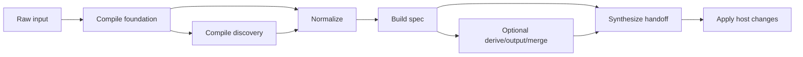

# Compfuzor architecture

This is the canonical architecture document for compfuzor.

It is both an introduction and a reference. It explains why the system is
shaped this way, what problems the shape is solving, and what contracts new
work should follow.

## Status

- This document replaces the old root-level `ARCHITECTURE.md`.
- Supporting docs may remain temporarily while their content is absorbed or
  retired.
- When another doc disagrees with this one, this document wins.

## Why this architecture exists

Compfuzor grew by accumulating successful patterns before it had a full shared
vocabulary for those patterns. That produced a few recurring problems:

- `vars_*.tasks` started doing several jobs at once: defaults, discovery,
  transforms, and synthesis.
- shared artifacts such as `BINS`, `ETC_FILES`, and `ENV` are contributed to by
  many domains, but their merge semantics were not explicit enough.
- `*_BYPASS` flags exist everywhere, but the project lacked one shared contract
  for deciding whether a domain should continue executing.
- some data names communicate semantics, while others communicate transport
  shape, and the two got mixed together.
- hierarchy and fanout machinery bridge compile-time facts to apply-time work,
  but that bridge was not described as part of the architecture.

The goal of this document is to make compfuzor legible for both humans and
agents. A contributor should be able to answer, on first read:

- where does this logic belong?
- what artifact should it produce?
- what kind of task is allowed to merge that artifact?
- what phase is allowed to apply host-side changes?

## Core invariant

Phase is when. Intent is what.

- `phase` describes runtime ordering.
- prefixes and facets describe semantic responsibility.

Do not conflate them. The same domain can appear in multiple phases. The same
phase can contain multiple kinds of work.

## Architecture at a glance

The core lifecycle today is:

`raw -> norm -> spec -> syn -> apply`

Complex domains may insert optional intermediate shapes such as `drv_*`,
`out_*`, or `merge_*`, but the core path above is the default contract.



## Canonical terminology

Use these names in new docs and new work:

| Legacy term | Canonical term | Meaning |
|---|---|---|
| `stage` | `phase` | runtime ordering |
| `class` | `role` | behavioral responsibility |
| `side-effect` | `effect` | side-effect profile |
| envelope taxonomy | `record` plus `form` metadata | transport shape, not a new kind |

## Facet catalog

Compfuzor entities are described with a small set of facets.

| Facet | Example | Purpose | Cardinality |
|---|---|---|---|
| `kind` | `kind:fn` | primary semantic family | `1` |
| `form` | `form:prefix` | naming/transport shape | `1` |
| `record` | `record:_syn_get_urls` | optional handoff-key pattern | `0..1` |
| `origin` | `origin:task-file` | where the entity lives | `1` |
| `phase` | `phase:compile.transform` | when the entity is evaluated or applied | `1..n` |
| `role` | `role:transform` | responsibility tags | `1..n` |
| `apply` | `apply:get-urls` | target domain or artifact family | `0..n` |
| `effect` | `effect:host.fs` | effect model rather than implementation detail | `1..n` |
| `matcher` | `matcher:regex(^_syn_[a-z0-9_]+$)` | optional linting/review rule | `0..1` |

## Prefix registry

This section is the seed naming registry for compfuzor. It is intentionally
explicit. New work should fit this table rather than inventing a parallel
taxonomy.

### File-intent prefixes

| Entity pattern | Kind | Form | Role | Typical phase | Effect | Typical output |
|---|---|---|---|---|---|---|
| `vars_` | `kind:vars` | `form:prefix` | `role:foundation` | `compile.foundation` | `effect:none` | defaults, validation, activation facts |
| `probe_` | `kind:probe` | `form:prefix` | `role:discovery` | `compile.discovery` | `effect:none` | `_probe_<domain>` discovery snapshot |
| `fn_` | `kind:fn` | `form:prefix` | `role:transform` | `compile.transform` | `effect:none` | `norm_*`, `spec_*`, optional `drv_*`, `out_*` |
| `gen_` | `kind:syn` | `form:prefix` | `role:synthesis` | `compile.synthesis` | `effect:none` | `_syn_<domain>`, explicit merge payloads |
| `repo_` | `kind:repo` | `form:prefix` | `role:execution` | `repo-apply` | `effect:host.repo` | checked-out or updated repositories |
| `fs_` | `kind:fs` | `form:prefix` | `role:execution` | `fs-apply` | `effect:host.fs` | files, directories, downloads, env files |
| `bins` / `bins_*` | `kind:bins` | `form:prefix` | `role:execution` | `fs-apply` or `extras-apply` | `effect:host.fs` | managed scripts, generated helpers, install drivers |
| `links` / `links_*` | `kind:links` | `form:prefix` | `role:execution` | `fs-apply` or `post-run` | `effect:host.fs` | symlinks and delayed link passes |
| `_*.tasks` | `kind:orchestrator` | `form:internal` | `role:orchestration` | any | `effect:mixed` | fanout, dispatch, and control-flow helpers |

### Data-intent prefixes

| Entity pattern | Kind | Form | Role | Effect | Purpose |
|---|---|---|---|---|---|
| `raw_` | `kind:raw` | `form:prefix` | `role:input` | `effect:none` | unnormalized values |
| `norm_` | `kind:norm` | `form:prefix` | `role:normalization` | `effect:none` | validated and normalized values |
| `spec_` | `kind:spec` | `form:prefix` | `role:model` | `effect:none` | ordered explicit domain contract |
| `drv_` | `kind:drv` | `form:prefix` | `role:derivation` | `effect:none` | intermediate computed values |
| `out_` | `kind:out` | `form:prefix` | `role:output` | `effect:none` | completed transform payload |
| `merge_` | `kind:merge` | `form:prefix` | `role:synthesis-input` | `effect:none` | merge-ready payload |
| `syn_` | `kind:syn` | `form:prefix` | `role:synthesis-output` | `effect:none` | synthesized payload ready for merge |
| `_tmp_` | `kind:tmp` | `form:internal` | `role:scratch` | `effect:none` | short-lived internal values |

### Transport and handoff forms

| Entity pattern | Kind | Form | Role | Purpose |
|---|---|---|---|---|
| `_probe_<domain>` | `kind:probe` | `form:envelope` | `role:discovery` + `role:handoff` | discovery transport record |
| `_fn_<domain>_out` | `kind:fn` | `form:envelope` | `role:transform` + `role:handoff` | legacy/special transform transport record |
| `_syn_<domain>` | `kind:syn` | `form:envelope` | `role:synthesis` + `role:handoff` | synthesis transport record |

The important rule is this:

- prefixes such as `norm_*` and `spec_*` carry the primary semantics.
- envelope names such as `_syn_<domain>` carry transport shape.

That is why `_syn_<domain>` is still `kind:syn`, not a new kind.

## Naming rules

Use prefix-before-domain names for canonical facts and files:

- `spec_get_urls`, not `get_urls_spec`
- `fn_get_urls.tasks`, not `get_urls.fn.tasks`
- `gen_systemd.tasks`, not `systemd_gen.tasks`

Further naming guidance:

- externalized facts should prefer visible prefixes such as `norm_*`, `spec_*`,
  or `syn_*`
- leading underscore names are for transport records or internal values
- `_tmp_*` should not escape the producing task without a strong reason
- `_fn_<domain>_out` is allowed for compatibility or tightly scoped
  orchestration, but `spec_<domain>` is the preferred transform contract

## Phase model

Compfuzor currently uses these top-level phases:

- `phase:compile`
- `phase:user-context`
- `phase:repo-apply`
- `phase:fs-apply`
- `phase:extras-apply`
- `phase:post-run`

Nested compile phases are first-class and should be used when helpful:

- `phase:compile.foundation`
- `phase:compile.discovery`
- `phase:compile.transform`
- `phase:compile.synthesis`

### Mapping to current include flow

[`/tasks/compfuzor.includes`](/tasks/compfuzor.includes) is still the practical
pipeline entrypoint. The phase names above describe what its regions mean.

| Include region | Phase | Typical work |
|---|---|---|
| `vars_*`, `probe_*`, `fn_*`, `gen_*` imports | `compile.*` | validation, discovery, transforms, synthesis |
| `user.tasks` | `user-context` | user/execution context setup |
| `repo_*` imports | `repo-apply` | repository changes |
| `fs_*`, `bins*`, `links*` imports | `fs-apply` | files, links, downloads, local scripts |
| `apt`, `pkgs`, `pg`, `sysctl`, kernel executors | `extras-apply` | domain-specific apply work |
| delayed links and thunks | `post-run` | deferred cleanup or finalization |

### Entry and exit expectations

These are informative guarantees now and should become stricter over time.

| Phase | Entry expectation | Exit expectation |
|---|---|---|
| `compile.foundation` | raw inputs are available | activation facts and defaults are computed |
| `compile.discovery` | foundation facts are available | optional `_probe_*` records exist |
| `compile.transform` | active domains are known | `norm_*` and `spec_*` facts exist for active domains |
| `compile.synthesis` | `spec_*` facts exist | `_syn_*` records and merge payloads are prepared |
| `*-apply` | synthesis outputs are ready | host changes are applied only for active domains |
| `post-run` | apply phases completed | deferred operations are complete |

Example:

- after `compile.transform`, `spec_get_urls` should exist if `GET_URLS_ACTIVE`
  is true
- after `compile.synthesis`, `_syn_kernel` or related kernel handoff records
  should exist before kernel apply scripts run

## Domain lifecycle contract

The default lifecycle for a non-trivial domain is:

`raw -> norm -> spec -> syn -> apply`

This is the core contract. It is enough for most domains.

### Core lifecycle steps

| Step | Producer kind | Required output shape | Typical phase | Effect |
|---|---|---|---|---|
| `raw` | external input | `<DOMAIN>` input vars | `compile.foundation` entry | `none` |
| `norm` | `kind:fn` | `norm_<domain>` | `compile.transform` | `none` |
| `spec` | `kind:fn` | `spec_<domain>` | `compile.transform` | `none` |
| `syn` | `kind:syn` | `_syn_<domain>` and merge payloads | `compile.synthesis` | `none` |
| `apply` | execution kinds | host-side changes | `*-apply` | host/network |

### Optional intermediate shapes

Complex domains may insert additional transform outputs without changing the
overall pattern.

| Shape | When to use it |
|---|---|
| `drv_<domain>` | you need explicit derivation steps from a stable spec |
| `out_<domain>` | the transform produces a completed payload before synthesis |
| `merge_<domain>` | synthesis needs one explicit merge-ready payload |
| `_tmp_<domain>` | purely local scratch values inside a task |

### Authoring recipe

The default authoring recipe for a non-trivial domain is:

1. validate the contract.
2. compute activation.
3. normalize input into `norm_<domain>`.
4. build one ordered `spec_<domain>`.
5. derive optional `drv_*` or `out_*` values when needed.
6. produce one explicit synthesis payload and `_syn_<domain>`.
7. apply host-side changes in execution phases.

The key goal is determinism. One stable spec should drive everything else.

## Domain activation contract

Every domain should expose one shared activation contract.

Required facts:

- `<DOMAIN>_REQUESTED`
- `<DOMAIN>_BYPASSED`
- `<DOMAIN>_VALID`
- `<DOMAIN>_ACTIVE`

Recommended diagnostic facts:

- `<DOMAIN>_STATUS`
- `_trace_<domain>`

The default formula is:

`<DOMAIN>_ACTIVE = <DOMAIN>_REQUESTED and not <DOMAIN>_BYPASSED and <DOMAIN>_VALID`

### Meaning of each fact

| Fact | Meaning |
|---|---|
| `<DOMAIN>_REQUESTED` | the domain has meaningful input |
| `<DOMAIN>_BYPASSED` | the effective bypass state resolved for the domain |
| `<DOMAIN>_VALID` | contract validation passed |
| `<DOMAIN>_ACTIVE` | the domain should continue through transform, synthesis, and apply |
| `<DOMAIN>_STATUS` | mapping with `requested`, `bypassed`, `valid`, `active`, `reasons` |
| `_trace_<domain>` | optional lifecycle/debug snapshot |

### Mapping existing bypass flags

Existing `*_BYPASS` flags are not wasted. They map into the activation model.

| Existing flag | Suggested activation fact |
|---|---|
| `GET_URLS_BYPASS` | `GET_URLS_BYPASSED` |
| `KERNEL_BYPASS` | `KERNEL_BYPASSED` |
| `SYSTEMD_INSTALL_BYPASS` | `SYSTEMD_BYPASSED` or a narrower systemd apply gate |
| `FS_BYPASS` | subsystem-level apply gate, not necessarily a single domain fact |

Important nuance:

- some bypass flags are semantic-domain gates (`GET_URLS_BYPASS`)
- some are broader subsystem gates (`FS_BYPASS`, `BINS_BYPASS`)

Both are useful. Domain activation should model the semantic domain, while
subsystem gates may still short-circuit whole apply regions.

### Failure and skip behavior

Current intended behavior:

- if a domain is requested, not bypassed, and invalid, fail in compile phase
- if a domain is bypassed, it may still compute status but should not continue
- if a domain is not requested, it should remain inactive without error

A full policy matrix is still pending.

## Handoff records and transport forms

`_syn_<domain>` is the canonical synthesis handoff form.

Minimum schema:

```yaml
_syn_<domain>:
  schema: "compfuzor.syn.v1"
  domain: "<domain>"
  phase: "compile.synthesis"
  source:
    kind: "syn"
    producer: "gen_<domain>.tasks"
    from_spec: "spec_<domain>"
  apply: "<domain-or-target-family>"
  entries: []
  meta:
    generated_at: "<optional timestamp>"
    notes: []
```

Required keys:

- `schema`
- `domain`
- `source.producer`
- `apply`
- `entries`

### Other transport forms

Compfuzor still recognizes these shapes:

- `_probe_<domain>` for discovery handoff
- `_fn_<domain>_out` for legacy or special transform handoff
- `_syn_<domain>` for synthesis handoff

But the preferred external contract is:

- `norm_<domain>`
- `spec_<domain>`
- `_syn_<domain>`

That keeps transform semantics visible and synthesis transport explicit.

## Mutation authority

This is the default write-authority model.

| Producer kind | May write | Should not write |
|---|---|---|
| `vars_*` | defaults, validation results, activation/status facts | synthesized global artifacts, host changes |
| `probe_*` | discovery records | host changes |
| `fn_*` | `norm_*`, `spec_*`, optional `drv_*`, `out_*`, `merge_*` | global apply artifacts, host changes |
| `gen_*` | `_syn_*`, explicit merge payloads, global artifact merges | host changes |
| apply tasks | host changes, apply-local scratch values | compile-phase contracts such as `spec_*` |

Two important rules:

- prefer one explicit merge block over many tiny `set_fact` mutations
- do not hide synthesis work inside `vars_*` unless you are in a temporary
  migration shim

## Merge policy

Shared artifacts are one of the hardest parts of the system because many domains
contribute to them.

Examples:

- `BINS`
- `ENV`
- `ETC_FILES`
- hierarchy-scoped `*_FILES`, `*_DIRS`, `*_D`

### Default precedence

The default recommendation is:

`user > existing-global > synthesized`

This default protects explicit user intent, avoids surprising overwrites, and
keeps synthesized values additive by default.

### Configurable merge direction

Merge behavior likely needs to be configurable per artifact family and per
domain.

Suggested future shape:

```yaml
MERGE_POLICY_DEFAULT: user-existing-syn
MERGE_POLICY_DOMAIN:
  get_urls:
    BINS: user-existing-syn
  kernel:
    ETC_FILES: user-existing-syn
    BINS: user-existing-syn
```

Possible strategies:

- `user-existing-syn`
- `user-syn-existing`
- `existing-user-syn`
- `syn-user-existing`
- `append-dedup`

### Shared-artifact rule

For heavily shared artifacts such as `ETC_FILES`, think in two layers:

1. each active domain produces explicit contribution fragments
2. synthesis aggregates those fragments and resolves final precedence

Aggregation first, precedence second. Without that split, multi-domain merges
become unpredictable.

## Hierarchy and fanout interaction

Compfuzor's hierarchy machinery is part of the architecture, not just a helper.

Relevant files today:

- [`/tasks/compfuzor/vars_hierarchy.tasks`](/tasks/compfuzor/vars_hierarchy.tasks)
- [`/tasks/compfuzor/fs_hierarchy.tasks`](/tasks/compfuzor/fs_hierarchy.tasks)
- [`/tasks/compfuzor/_multi.tasks`](/tasks/compfuzor/_multi.tasks)

What they do together:

- `vars_hierarchy.tasks` resolves hierarchy roots and include-scoped base paths
- `_multi.tasks` fans work across declared hierarchy domains or key families
- `fs_hierarchy.tasks` materializes hierarchy declarations into files,
  directories, links, and assembled `.d` payloads

Architecturally, this means compile-phase data is often not the final output.
Instead it becomes a contribution to a shared hierarchy artifact that is later
applied.

Example bridge:

| Compile output | Fanout/orchestration | Apply result |
|---|---|---|
| `ETC_FILES` contribution | `_multi.tasks` and hierarchy keys | concrete `/etc`-style files under instance roots |
| `BINS` contribution | bins tasks | generated or linked scripts |
| `*_FILES` / `*_D` | hierarchy expansion | files and assembled drop-in payloads |

This is why hierarchy and fanout belong in the architecture model. They are the
bridge between synthesis and apply.

## Architecture patterns for common subproblems

### Pure transform domain

Problem:

- input is messy, but no discovery is required and the apply target is direct

Pattern:

- `vars_<domain>` validates and activates
- `fn_<domain>` emits `norm_<domain>` and `spec_<domain>`
- `gen_<domain>` creates `_syn_<domain>` only if there is a meaningful shared
  artifact to merge
- apply task consumes `spec_<domain>` or `_syn_<domain>`

### Discovery-first domain

Problem:

- behavior depends on the current host state and that state should be modeled
  explicitly before transforms

Pattern:

- `probe_<domain>` emits `_probe_<domain>`
- `fn_<domain>` consumes raw input plus probe output
- `gen_<domain>` synthesizes the final handoff

Systemd is the clearest example of this pattern.

### Shared-artifact contributor

Problem:

- many domains write to the same artifact family

Pattern:

- each domain emits explicit contribution fragments
- synthesis owns the final merge block
- apply tasks consume the merged artifact, not ad hoc per-domain side effects

`ETC_FILES` and `BINS` are the clearest examples here.

### Mixed legacy `vars_*` subsystem

Problem:

- one task mixes foundation, transform, and synthesis responsibilities

Pattern:

1. reduce `vars_<domain>` to validation and activation
2. extract `fn_<domain>` for `norm_*` and `spec_*`
3. move merges into `gen_<domain>`
4. narrow apply tasks to consumption only

This is the standard decomposition path for old domains.

## Domain seams

These seams are worth naming explicitly because they are recurring migration
targets.

### Config

Use:

- `fn_config.tasks` for parameterized config assembly
- `gen_config.tasks` for default batteries-included behavior

This preserves compatibility for simple `CONFIG_KEY` use while allowing richer
multi-config schemes.

### GET_URLS

Use:

- `vars_get_urls.tasks` for validation and activation only
- `fn_get_urls.tasks` for normalization and spec building
- `gen_get_urls.tasks` for helper synthesis and artifact merges
- `fs_get_urls.tasks` for actual downloads and `.url` sidecars

### Systemd

Treat probe as first-class:

- `probe_systemd.tasks` for discovery snapshot
- `fn_systemd*.tasks` for transforms as needed
- `gen_systemd.tasks` for generated artifacts and merge payloads

This removes ambiguity around old `vars_systemd` intent.

### Kernel and zswap

Use:

- `vars_kernel.tasks` for contract checks and activation
- `fn_kernel.tasks` for `norm_kernel_*` and `spec_kernel_*`
- `gen_kernel.tasks` for `ETC_FILES`, `BINS`, and `_syn_kernel*`
- bins/extras apply tasks for module, sysctl, and sysfs host changes

[`/zswap.etc.pb`](/zswap.etc.pb) is a good pilot because the input is compact,
the subsystem is still malleable, and the current task already exposes a mixed
vars/transform/synthesis shape.

## Worked examples

### GET_URLS full lifecycle

Current files:

- [`/tasks/compfuzor/vars_get_urls.tasks`](/tasks/compfuzor/vars_get_urls.tasks)
- [`/tasks/compfuzor/fs_get_urls.tasks`](/tasks/compfuzor/fs_get_urls.tasks)

Target lifecycle:

| Step | Producer | Input | Output | Phase | Role | Effect |
|---|---|---|---|---|---|---|
| raw | playbook | `GET_URLS` | `GET_URLS` | `compile.foundation` | `foundation` | `none` |
| norm | `fn_get_urls.tasks` | `GET_URLS` | `norm_get_urls` | `compile.transform` | `transform` | `none` |
| spec | `fn_get_urls.tasks` | `norm_get_urls` | `spec_get_urls` | `compile.transform` | `transform` | `none` |
| syn | `gen_get_urls.tasks` | `spec_get_urls` | `_syn_get_urls`, `BINS` merge payload | `compile.synthesis` | `synthesis` + `handoff` | `none` |
| apply | `fs_get_urls.tasks` | `spec_get_urls` or `_syn_get_urls.entries` | downloaded files and `.url` sidecars | `fs-apply` | `execution` | `host.fs` + `network` |

Lineage view:

| Producer | Artifact | Consumer |
|---|---|---|
| `fn_get_urls.tasks` | `spec_get_urls` | `gen_get_urls.tasks`, `fs_get_urls.tasks` |
| `gen_get_urls.tasks` | `_syn_get_urls` | `fs_get_urls.tasks` |
| `gen_get_urls.tasks` | `BINS` contribution | bins tasks |

### Kernel and zswap

Current files:

- [`/tasks/compfuzor/vars_kernel.tasks`](/tasks/compfuzor/vars_kernel.tasks)
- [`/tasks/compfuzor/kernel_modules.tasks`](/tasks/compfuzor/kernel_modules.tasks)
- [`/zswap.etc.pb`](/zswap.etc.pb)

Target lifecycle:

| Step | Producer | Input | Output | Phase | Role | Effect |
|---|---|---|---|---|---|---|
| raw | playbook | `KERNEL_MODULES`, `KERNEL_SYSCTL`, `KERNEL_SYSFS` | raw kernel vars | `compile.foundation` | `foundation` | `none` |
| norm/spec | `fn_kernel.tasks` | raw kernel vars | `norm_kernel_*`, `spec_kernel_*` | `compile.transform` | `transform` | `none` |
| syn | `gen_kernel.tasks` | `spec_kernel_*` | `_syn_kernel*`, `ETC_FILES` payloads, `BINS` payloads | `compile.synthesis` | `synthesis` + `handoff` | `none` |
| apply | bins and extras | synthesized kernel payloads | module, sysctl, and sysfs host changes | `extras-apply` | `execution` | `host.fs` + `host.kernel` |

Ownership view:

| Artifact | Authoritative producer | Notes |
|---|---|---|
| `spec_kernel_domains` | `fn_kernel.tasks` | stable ordered domain table |
| `_syn_kernel*` | `gen_kernel.tasks` | apply-facing transport records |
| `ETC_FILES` kernel contributions | `gen_kernel.tasks` | shared artifact aggregation |
| `BINS` kernel contributions | `gen_kernel.tasks` | build/install script registration |

## Migration method

When splitting a mixed legacy domain, use this four-slice method unless there is
a strong reason not to.

1. add explicit transform output.
2. move synthesis out of `vars_*`.
3. narrow execution tasks to consumption only.
4. wire include order intentionally.

This method is simple enough to repeat and strong enough to keep semantics from
drifting.

## Migration guardrails

During migration:

- preserve bypass behavior exactly on the first pass
- do not change host-side semantics on the first pass
- prefer one explicit merge per synthesized artifact target
- keep fallback compatibility only as long as needed to land the split safely
- validate the pattern in a second domain before calling it settled

Compfuzor does not need a heavy legacy-coexistence framework. The bias should be
toward forward migration, but without rewriting behavior blindly.

## Trace and status facts

Trace facts are optional but valuable while refactoring.

Example:

```yaml
_trace_get_urls:
  lifecycle:
    raw: true
    norm: true
    spec: true
    syn: true
    apply: false
  refs:
    norm: norm_get_urls
    spec: spec_get_urls
    syn: _syn_get_urls
```

Status facts should explain why a domain is inactive, not just whether it is.

Example:

```yaml
GET_URLS_STATUS:
  requested: true
  bypassed: false
  valid: true
  active: true
  reasons: []
```

## Success criteria

When this architecture is working, a contributor or agent can answer quickly:

- where does this logic belong by phase and kind?
- what artifact should this task produce?
- what task type is allowed to merge that artifact?
- what phase is allowed to apply host-side changes?
- how does this domain become active or inactive?

## Pending work

- TODO: formal failure/skip policy matrix.
- TODO: formal verification contract for domain migrations.
- TODO: stricter naming registry for artifact families beyond prefix seeds.
- TODO: normative, testable phase entry and exit guarantees.
- TODO: refine merge-policy implementation shape for per-domain and per-artifact
  control.
